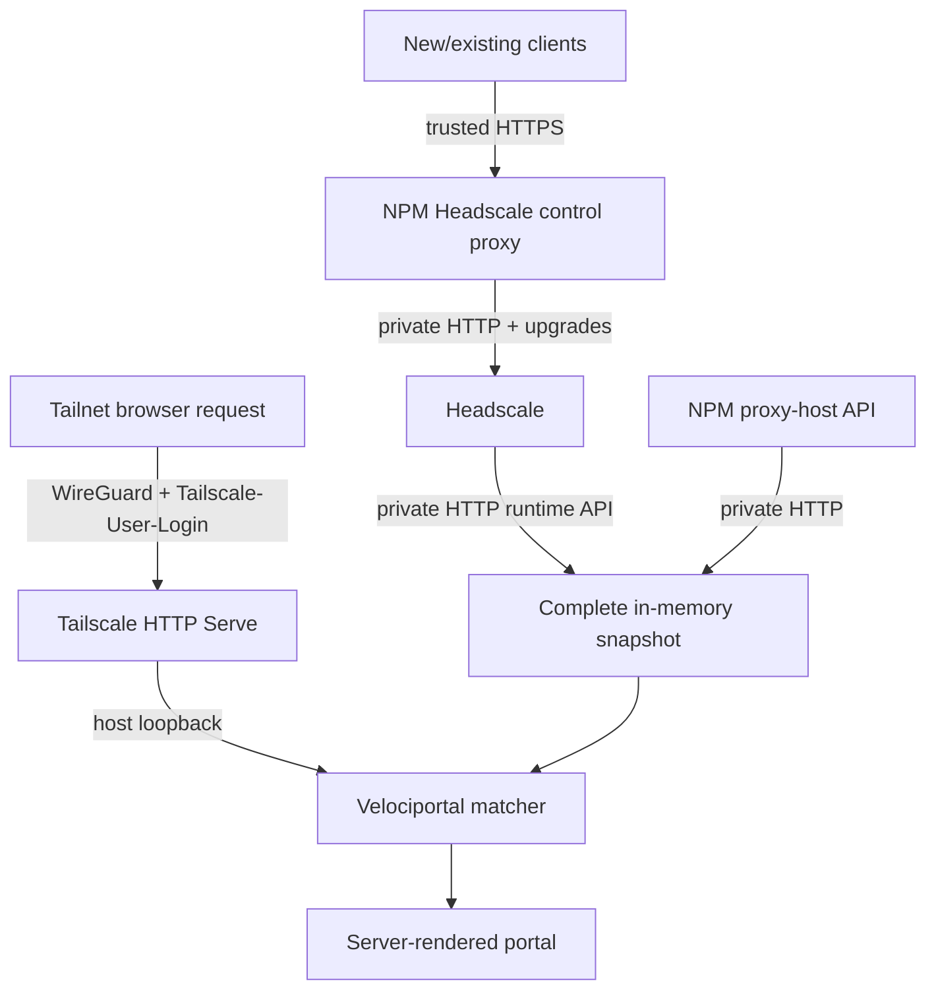

# CLAUDE.md — Velociportal

## What this project is

Velociportal is a self-hosted, identity-aware **visibility layer** for Headscale and Nginx Proxy Manager (NPM). The current implementation reads Headscale legacy ACL rules plus node data, correlates supported destinations with NPM proxy hosts, and renders a per-user portal. It does not authenticate users, proxy service traffic, or enforce access; Tailscale Serve, Headscale ACLs, NPM, and backend applications remain the security boundaries.

## Read before acting

1. `knowledgebase/04-handoff-context.md` — current implementation state, limitations, and next work.
2. `README.md` — concise public scope and roadmap.
3. `docs/reference/known-limitations.md` — exact current policy, matcher, identity, transport, and validation boundary.
4. `docs/guides/truenas-scale.md` — canonical TrueNAS deployment and acceptance path.
5. `docs/guides/private-tls.md` — optional native Headscale HTTPS/private-CA alternative.
6. `knowledgebase/` — stable reasoning:
   - `00-concept-source.md` — problem statement
   - `01-api-research.md` — Headscale + NPM API research
   - `02-design-decisions.md` — locked decisions
   - `03-prior-art.md` — similar tools and lessons
   - `05-deep-research.md` — adversarial research report
   - `06-truenas-deployment.md` and `07-vps-options.md` — pointers to canonical public guides
7. `velociportal.portagenty.toml` — workspace/session config. Do not hand-edit unless changing the workspace layout.

## Current stage

**The RC.1 architecture failed its first live TrueNAS network-attachment gate; RC.2 correction is in progress.** TrueNAS catalog apps replace their implicit default network when any UI-managed network is selected, so the production bundle creates the private, egress-capable Docker bridge `velociportal-upstreams`. Velociportal uses direct HTTP to the exact Headscale and NPM aliases on that bridge, while all other Headscale locations require verified HTTPS. Browser ingress uses the existing host-network TrueNAS Tailscale app with declarative HTTP Serve on tailnet port `8081`, forwarding to the loopback-only Velociportal host port. Existing NPM provides the trusted HTTPS Headscale control/API endpoint before clients join the tailnet and proxies to Headscale over the private bridge. The separate sibling `../headscale-ops` remains workstation-only and HTTPS-only.

No public support claim is justified yet. The first API-key bootstrap, separate operator/runtime key setup, policy and node setup, declarative Serve verification, NPM control-proxy acceptance, and the two-identity plus LAN-negative worksheet remain pending. Fixture coverage is not end-to-end proof.

## Hard constraints (locked)

- **Visibility only.** No login, SSO, OIDC/SAML, session issuance, request proxying, or enforcement.
- **Single Docker container.** One static non-root binary in a minimal image, deployable on TrueNAS SCALE.
- **Current upstreams are Headscale + NPM only.** Runtime refreshes Headscale policy, Headscale nodes, and NPM proxy hosts. There is no application database or persisted cache.
- **Restricted Headscale transport.** `HEADSCALE_URL` may use HTTP only for the exact allowlisted local/internal host forms implemented by configuration validation; the canonical deployment uses `http://headscale.velociportal.internal:8080` on `velociportal-upstreams`. Every other Headscale location requires verified HTTPS. Never disable verification, follow redirects, or use environment proxies.
- **Named private upstream bridge.** Runtime Headscale and NPM traffic uses the egress-capable user-defined bridge `velociportal-upstreams` with aliases `headscale.velociportal.internal` and `npm.velociportal.internal`. TrueNAS catalog apps need that bridge to provide outbound NAT/DNS because selecting a UI-managed network replaces their implicit default network. A normal bridge does not publish container ports to the LAN. Plain HTTP for either credentialed upstream is accepted only for its exact canonical alias or same-host/loopback compatibility routes; every other location requires verified HTTPS. Headscale port `8080` is exposed only to attached containers and is never LAN-published. Keep untrusted containers off the bridge. The base Compose bundle has no CA mount.
- **NPM control proxy is explicit.** Existing NPM terminates the trusted HTTPS endpoint used by clients and `headscale-ops`, then proxies to Headscale over the private Docker bridge with WebSocket/upgrade behavior preserved. Use split-horizon/private DNS and an existing DNS-01 wildcard certificate; do not publish the Headscale hostname/address in public DNS or disclose the exact host through a public leaf certificate. NPM is a trust and availability boundary and can observe operator Bearer API keys. Keep separate operator and Velociportal runtime keys, avoid authorization-header logging, and back up NPM configuration and certificates. Runtime Velociportal bypasses NPM.
- **Read-only runtime.** Headscale administration belongs in the separate workstation-only `headscale-ops` project, never in Velociportal. `headscale-ops` remains HTTPS-only.
- **Optional private TLS only.** Native Headscale HTTPS/private CA remains an optional alternative through the Compose CA overlay. Add no PKI service and no insecure TLS mode.
- **Tailscale identity headers only.** Trust `Tailscale-User-Login` and siblings only from `TRUSTED_PROXY_CIDR`. No direct Authentik, Authelia, `Remote-User`, or `X-Webauth-*` adapter exists.
- **Tailnet-only browser ingress.** Use the existing host-network TrueNAS Tailscale app with declarative HTTP Serve `:8081 -> http://127.0.0.1:18080`. WireGuard protects ordinary on-path LAN/router/ISP transport and Tailscale injects human identity. Endpoint and control-plane compromise remain in scope. NPM is not portal identity.
- **No public raw ports.** The Velociportal host publication remains loopback-only or equivalently private. Never expose the raw app port on the LAN. Headscale's internal API port is never LAN-published.
- **Legacy ACL subset only.** The matcher evaluates `acls` `accept` rules. Grants, protocols, and ports are not modeled for visibility. `autogroup:internet` fails closed.
- **No source-tag inference for humans.** `tagOwners` and tags on a user's nodes do not make the user a `tag:*` source. Tags resolve destinations only.
- **NPM access lists are not visibility inputs.** Do not describe `access_list_id` or access-list API data as part of card authorization.
- **Router resilience.** No CA or application state belongs on pfSense/the router. Router replacement restores ordinary DNS and routing only; durable app, network, NPM, Headscale, and policy state stays on TrueNAS and backups.
- **Simple over clever.** Go standard library, embedded server-rendered HTML, embedded htmx, two upstream clients, and a polling goroutine. Add dependencies only when necessary.
- **No AI attribution in commits.** Never add Claude, Anthropic, or another AI system as co-author or contributor.

## Architecture sketch

A refresh is all-or-nothing: policy, nodes, and proxy hosts must all succeed before replacing the snapshot. A failed refresh keeps the previous in-process snapshot; a restart starts cold. `/healthz` is healthy only when a recent complete snapshot exists.

## Required verification discipline

- Run heavy verification **sequentially and contained** because this host has previously experienced PSI pressure. Do not launch broad test/build/container work in parallel.
- Run `go test -race -count=1 ./...` for Go changes when heavy verification is authorized.
- Run `ENV_FILE=.env.example docker compose -f docker-compose.yml --profile tools config --quiet` for base Compose changes, and validate optional CA overlays separately when they change.
- Run a strict MkDocs build for documentation changes when heavy verification is authorized.
- Do not claim real integration validation until the canonical TrueNAS path has been exercised with at least two identities, LAN-negative tests, NPM control-proxy checks, and card sets compared with actual Headscale reachability.
