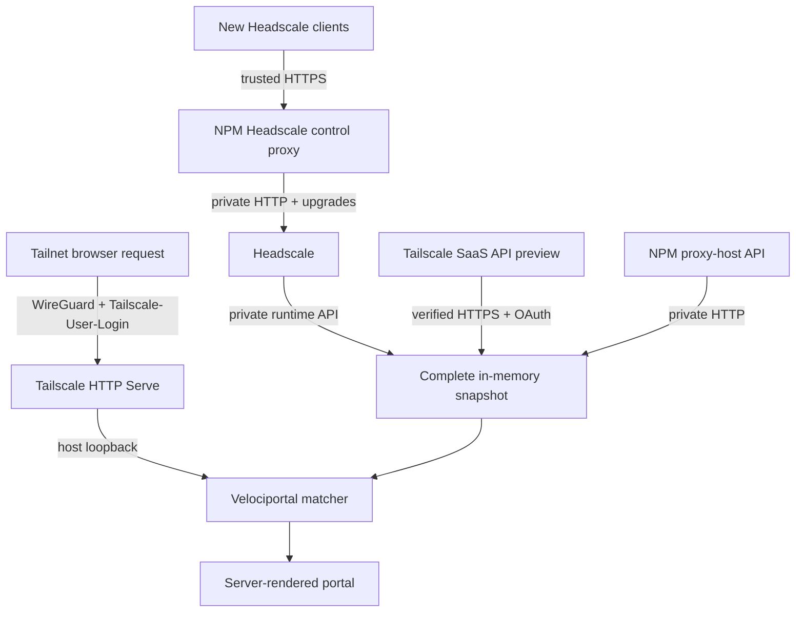

# CLAUDE.md — Velociportal

## What this project is

Velociportal is a self-hosted, identity-aware **visibility layer** for one selected control plane (Headscale or Tailscale SaaS) plus Nginx Proxy Manager (NPM). Headscale uses `legacy_acl_visibility_v1`; the Tailscale SaaS preview also accepts the narrow `network_access_visibility_v1` Grants subset. Velociportal correlates supported destinations with NPM proxy hosts and renders a per-user portal. It does not authenticate users, proxy service traffic, or enforce access; Tailscale Serve, the selected control plane, NPM, and backend applications remain the security boundaries.

## Read before acting

1. `knowledgebase/04-handoff-context.md` — current implementation state, limitations, and next work.
2. `README.md` — concise public scope and roadmap.
3. `docs/reference/known-limitations.md` — exact current policy, matcher, identity, transport, and validation boundary.
4. `docs/guides/truenas-scale.md` — canonical TrueNAS deployment and acceptance path.
5. `docs/guides/tailscale-saas-npm.md` and `docs/reference/tailscale-api.md` — OAuth preview boundary and live acceptance requirements.
6. `docs/guides/private-tls.md` — optional native Headscale HTTPS/private-CA alternative.
7. `knowledgebase/` — stable reasoning:
   - `00-concept-source.md` — problem statement
   - `01-api-research.md` — Headscale, Tailscale SaaS, and NPM API research
   - `02-design-decisions.md` — locked decisions
   - `03-prior-art.md` — similar tools and lessons
   - `05-deep-research.md` — adversarial research report
   - `06-truenas-deployment.md` and `07-vps-options.md` — pointers to canonical public guides
8. `velociportal.portagenty.toml` — workspace/session config. Do not hand-edit unless changing the workspace layout.

## Current stage

**Published `v0.2.0-rc.5` is immutable at `ghcr.io/cybersader/velociportal@sha256:a043e2499c28ce9f66bb2a60c8c0f265e63fc449a0fb9213fd07879508a18402`.** Live TrueNAS use confirmed corrected Owner-to-Admin membership, truthful wildcard cards, separate bounded health labels, a complete snapshot, Serve route, portal health, and 48 cards without changing the live policy. Branch `feature/ephemeral-hostname-suggestions` adds a one-shot private metadata-proposal command without changing authorization, runtime cards, active metadata, or `/healthz`. Every published RC is immutable and must never be replaced or retagged.

NPM always uses the egress-capable private bridge `velociportal-upstreams`. Headscale mode also uses its exact private alias and preserves the existing NPM HTTPS control path plus workstation-only `headscale-ops`. Tailscale SaaS mode uses the preferred default network for fixed-origin verified HTTPS OAuth calls and does not require Headscale or the NPM Headscale control proxy. Browser ingress remains declarative Tailscale HTTP Serve to the loopback-only host port. No public support claim is justified yet. Headscale bootstrap, key separation, policy/node setup, NPM control-proxy acceptance, and the two-identity plus LAN-negative worksheet remain pending. Tailscale SaaS must remain preview until token refresh/revocation, separate owner mapping, unsupported-policy negatives, two identities, card/reachability parity, stale/cold recovery, header replacement, and LAN-negative tests pass. Fixture coverage, API connectivity, RC.4 Owner-role success, and a 48-card render are not end-to-end proof.

## Hard constraints (locked)

- **Visibility only.** No login, SSO, OIDC/SAML, session issuance, request proxying, or enforcement.
- **Single Docker container.** One static non-root binary in a minimal image, deployable on TrueNAS SCALE.
- **One selected control plane + NPM.** `CONTROL_PLANE=headscale|tailscale` selects exactly one provider. Headscale loads policy/nodes; Tailscale loads OAuth/policy/users/devices. NPM remains service discovery. There is no multi-tailnet aggregation, application database, or persisted cache.
- **Provider compatibility and labels.** Absent `CONTROL_PLANE` defaults to Headscale only through v0.2 with a value-free warning; v0.3 requires explicit selection. Headscale is `supported`; Tailscale is `preview` until live acceptance. Inactive known credentials are ignored with key-name-only warnings and must be included in redaction inputs.
- **Restricted Headscale transport.** `HEADSCALE_URL` may use HTTP only for the exact allowlisted local/internal host forms implemented by configuration validation; the canonical deployment uses `http://headscale.velociportal.internal:8080` on `velociportal-upstreams`. Every other Headscale location requires verified HTTPS. Never disable verification, follow redirects, or use environment proxies.
- **Fixed Tailscale SaaS transport.** Production uses OAuth client credentials only, exact scopes `policy_file:read`, `devices:posture_attributes:read`, `devices:core:read`, and `users:read`, fixed origin `https://api.tailscale.com/api/v2`, and the credential's `-` alias. Add no API-key/access-token fallback, configurable origin, explicit tailnet, insecure TLS, redirect, or environment-proxy behavior. Tokens stay in memory, refresh early, coalesce, and retry once after `401`; redact client IDs, secrets, and old/current tokens.
- **Named private upstream bridge.** Runtime NPM traffic and Headscale-mode control-plane traffic use the egress-capable user-defined bridge `velociportal-upstreams` with alias `npm.velociportal.internal` and, when Headscale is selected, `headscale.velociportal.internal`. TrueNAS catalog apps need that bridge to provide outbound NAT/DNS because selecting a UI-managed network replaces their implicit default network. A normal bridge does not publish container ports to the LAN. Plain HTTP for either credentialed upstream is accepted only for its exact canonical alias or same-host/loopback compatibility routes; every other location requires verified HTTPS. Headscale port `8080` is exposed only to attached containers and is never LAN-published. Keep untrusted containers off the bridge. The base Compose bundle has no CA mount.
- **NPM Headscale control proxy is explicit and mode-specific.** In Headscale mode, existing NPM terminates the trusted HTTPS endpoint used by clients and `headscale-ops`, then proxies to Headscale over the private Docker bridge with WebSocket/upgrade behavior preserved. Use split-horizon/private DNS and an existing DNS-01 wildcard certificate; do not publish the Headscale hostname/address in public DNS or disclose the exact host through a public leaf certificate. NPM is a trust and availability boundary and can observe operator Bearer API keys. Keep separate operator and Velociportal runtime keys, avoid authorization-header logging, and back up NPM configuration and certificates. Runtime Headscale-mode Velociportal bypasses the NPM control proxy. Tailscale mode needs no Headscale control proxy.
- **Read-only runtime.** Headscale administration belongs in the separate workstation-only `headscale-ops` project, never in Velociportal. `headscale-ops` remains HTTPS-only.
- **Optional private TLS only.** Native Headscale HTTPS/private CA remains an optional alternative through the Compose CA overlay. Add no PKI service and no insecure TLS mode.
- **Tailscale identity headers only.** Trust `Tailscale-User-Login` and siblings only from `TRUSTED_PROXY_CIDR`. No direct Authentik, Authelia, `Remote-User`, or `X-Webauth-*` adapter exists.
- **Tailnet-only browser ingress.** Use the existing host-network TrueNAS Tailscale app with declarative HTTP Serve `:8081 -> http://127.0.0.1:18080`. WireGuard protects ordinary on-path LAN/router/ISP transport and Tailscale injects human identity. Endpoint and control-plane compromise remain in scope. NPM is not portal identity.
- **No public raw ports.** The Velociportal host publication remains loopback-only or equivalently private. Never expose the raw app port on the LAN. Headscale's internal API port is never LAN-published.
- **Narrow access-rule subset only.** Headscale remains legacy-ACL-only in `legacy_acl_visibility_v1`. Tailscale may combine legacy `acls` `accept` rules with safe network `grants`; non-empty accepted Grants select `network_access_visibility_v1`. Legacy ACL ports/protocols remain unmodeled. A Grant becomes card evidence only when one `ip` capability permits TCP to the exact NPM `forward_port`. Valid non-TCP Grants may load but produce no HTTP card. Posture, non-empty `via`, application capabilities, IP sets, services, unknown fields/actions/sections, malformed capabilities, and unsafe selectors reject the complete refresh. SSH is not card evidence. `autogroup:internet` fails closed.
- **Machine Grant sources do not become humans.** Valid source tags, IPs, CIDRs, host aliases, `autogroup:tagged`, `autogroup:shared`, and other supported machine autogroups may load so machine rules do not block the snapshot, but they never match a browser identity. `tagOwners` and tags on a user's nodes do not make the user a `tag:*` source. Destination tags still resolve through node addresses.
- **Tailscale Grant roles are authoritative and isolated.** The complete Users API response maps each exact `loginName` to Grant-only human-role selectors. A direct `type: member` user receives `autogroup:member` plus `autogroup:<role>` for `owner`, `admin`, `member`, `it-admin`, `network-admin`, `billing-admin`, or `auditor`; the Owner additionally receives `autogroup:admin`, matching Tailscale's automatic membership. A shared user receives none. Specialized roles do not imply one another. There is no case folding, short/bare-login fallback, or membership inference from devices, owners, tags, or `tagOwners`. This mapping never broadens legacy ACLs or `nodeAttrs`; missing, malformed, padded, or unknown user type/role values reject the complete refresh.
- **Node attributes are non-authorization metadata.** Tailscale attr-only `nodeAttrs` may load only for `*`, individual users, defined groups, tags, and `autogroup:member` targets with the `funnel` attribute; they never grant cards. Non-empty `nodeAttrs.app`, malformed section types, and unknown node-attribute semantics reject the refresh.
- **Safe provider switching.** Setup prompts for the provider first and only that credential family. On a switch it lists inactive known keys and requires explicit confirmation before deleting them; refusal or input abort leaves the original file byte-for-byte unchanged. Preserve unknown keys and never create a plaintext credential backup.
- **NPM access lists are not visibility inputs.** Do not describe `access_list_id` or access-list API data as part of card authorization.
- **Service metadata is presentation-only.** For an already matched NPM host, prefer the first concrete NPM domain; a wildcard-only host remains visible but unlinked. Adding the real concrete hostname to the same NPM proxy host is preferred over metadata, and a duplicate NPM host may duplicate the card. Strict optional metadata may override only display name/browser URL by existing positive proxy-host ID after policy matching. It cannot create/enable cards, repair a domainless host, change `forward_host`/`forward_port`, or grant visibility. The base stack stays mount-free; the opt-in read-only overlay uses a fixed target and supplemental numeric group so TrueNAS `950:950`, directory `0750`, and file `0640` remain unchanged. `meta.nginx_online` is NPM route state, never backend health.
- **Hostname suggestions are one-shot and non-authorizing.** `suggest-hostnames` may use only names already returned by the selected provider plus optional bounded hostname-only stdin. Canonical ASCII FQDNs must match exact wildcard suffixes on label boundaries; only one-hostname/one-NPM-ID graph components may produce a strict metadata-v1 proposal. Require private review, explicit browser scheme, and literal confirmation. Add no DNS/log scan, runtime store, portal route, automatic active-metadata mutation, new scope/endpoint, production mount, or tie-breaker for ambiguity.
- **Service health is explicit, bounded, and non-authorizing.** Only positive proxy-host IDs in a strict optional health file are probed. Targets derive solely from current enabled NPM backend fields after a supported identity-independent structural destination match; presentation URLs never become targets. HTTP is credential-free `GET`, TCP connects and closes without payload, DNS names require exact host/suffix plus all-answer CIDR validation, and validated IPs are dialed directly with verified TLS, no redirects/proxies, hard-denied address classes, and protected NPM/control-plane API sockets. A fixed worker pool publishes memory-only coarse results independently of the complete authorization/catalog snapshot. Health never creates, hides, enables, reorders, or authorizes a card and never affects `/healthz`.
- **Router resilience.** No CA or application state belongs on pfSense/the router. Router replacement restores ordinary DNS and routing only; durable app, network, NPM, Headscale, and policy state stays on TrueNAS and backups.
- **Simple over clever.** Go standard library, embedded server-rendered HTML, embedded htmx, two upstream clients, and a polling goroutine. Add dependencies only when necessary.
- **No AI attribution in commits.** Never add Claude, Anthropic, or another AI system as co-author or contributor.

## Architecture sketch

A refresh is all-or-nothing: the complete selected-provider result and NPM proxy hosts must all succeed before replacing the snapshot. A failed refresh keeps the previous in-process snapshot; a restart starts cold. `/healthz` is healthy only when a recent complete snapshot exists.

## Required verification discipline

- Run heavy verification **sequentially and contained** because this host has previously experienced PSI pressure. Do not launch broad test/build/container work in parallel.
- Run `go test -race -count=1 ./...` for Go changes when heavy verification is authorized.
- Run `ENV_FILE=.env.example docker compose -f docker-compose.yml --profile tools config --quiet` for contributor Compose changes. Production Compose verification must render both provider env examples, short-form includes, and optional CA overlays without changing the one-service/two-network contract.
- Run a strict MkDocs build for documentation changes when heavy verification is authorized.
- Do not claim real integration validation until the canonical TrueNAS path has been exercised with at least two identities, LAN-negative tests, NPM control-proxy checks, and card sets compared with actual selected-control-plane reachability. Tailscale additionally requires live OAuth refresh/revocation, authoritative exact-login role mapping, Owner-to-Admin automatic membership, direct-member/shared-user and specialized-role isolation cases, separate device-owner mapping, role-derived Grant evidence, and unsupported-policy negatives before preview can become supported.
