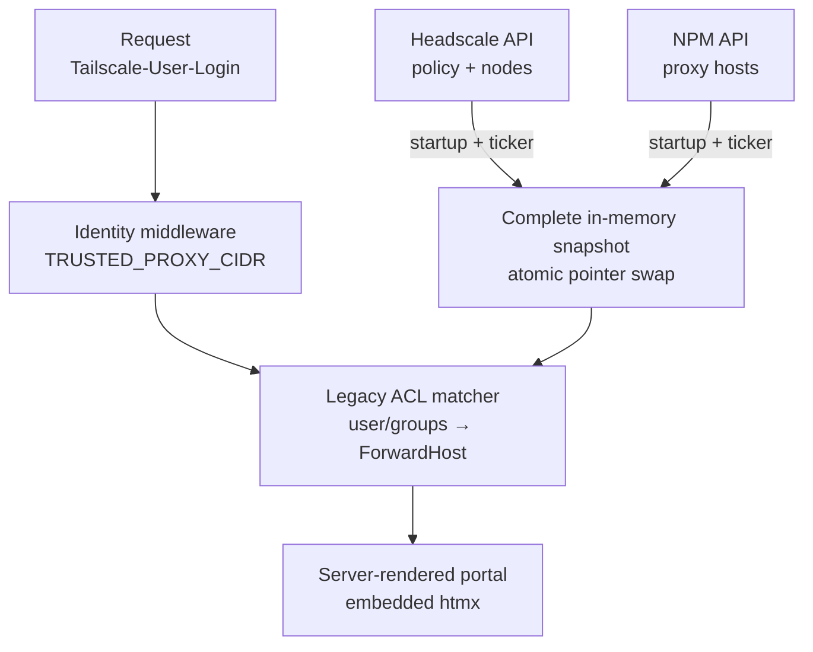

# CLAUDE.md — Velociportal

## What this project is

Velociportal is a self-hosted, identity-aware **visibility layer** for Headscale and Nginx Proxy Manager (NPM). The current implementation reads Headscale legacy ACL rules plus node data, correlates supported destinations with NPM proxy hosts, and renders a per-user portal. It does not authenticate users, proxy service traffic, or enforce access; the IdP, Headscale ACLs, reverse proxy, and backend applications remain the security boundaries.

## Read before acting

1. `knowledgebase/04-handoff-context.md` — current implementation state, limitations, and next work.
2. `README.md` — concise public scope and roadmap.
3. `docs/reference/known-limitations.md` — exact current policy, matcher, identity, and validation boundary.
4. `docs/guides/truenas-scale.md` — canonical deployment guidance.
5. `knowledgebase/` — stable reasoning:
   - `00-concept-source.md` — problem statement
   - `01-api-research.md` — Headscale + NPM API research
   - `02-design-decisions.md` — locked decisions
   - `03-prior-art.md` — similar tools and lessons
   - `05-deep-research.md` — adversarial research report
   - `06-truenas-deployment.md` and `07-vps-options.md` — pointers to canonical public guides
6. `velociportal.portagenty.toml` — workspace/session config. Do not hand-edit unless changing the workspace layout.

## Current stage

**Sprint 5 explainable validation tooling is complete in the working tree.** The Go binary includes interactive local setup, exact trusted-proxy observation, doctor diagnostics, privacy-controlled multi-identity validation reports with build provenance, and a credential-free health client. The repository provides the Docker/TrueNAS journey, health-gated Compose startup, race-enabled tests, branded MkDocs pages, and CI/release verification without publishing. The next milestone is completing the real Headscale + NPM + identity-proxy worksheet and deciding whether the `ForwardHost` join works in production; report generation and fixture coverage are not end-to-end proof.

## Hard constraints (locked)

- **Visibility only.** No login, SSO, OIDC/SAML, session issuance, request proxying, or enforcement.
- **Single Docker container.** One static non-root binary in a minimal image, deployable on TrueNAS SCALE.
- **Current upstreams are Headscale + NPM only.** Runtime refreshes Headscale policy, Headscale nodes, and NPM proxy hosts. There is no application database or persisted cache.
- **Legacy ACL subset only.** The matcher evaluates `acls` `accept` rules. Grants, protocols, and ports are not modeled for visibility. `autogroup:internet` fails closed.
- **No source-tag inference for humans.** `tagOwners` and tags on a user's nodes do not make the user a `tag:*` source. Tags resolve destinations only.
- **NPM access lists are not visibility inputs.** Do not describe `access_list_id` or access-list API data as part of card authorization.
- **Tailscale identity headers only.** Trust `Tailscale-User-Login` and siblings only from `TRUSTED_PROXY_CIDR`. No direct Authentik, Authelia, `Remote-User`, or `X-Webauth-*` adapter exists.
- **Bind safely.** The process may listen on `0.0.0.0` inside a bridged container, but the host publication must remain loopback-only or equivalently private. Never expose the raw app port on the LAN.
- **Simple over clever.** Go standard library, embedded server-rendered HTML, embedded htmx, two upstream clients, and a polling goroutine. Add dependencies only when necessary.
- **No AI attribution in commits.** Never add Claude, Anthropic, or another AI system as co-author or contributor.

## Architecture sketch

A refresh is all-or-nothing: policy, nodes, and proxy hosts must all succeed before replacing the snapshot. A failed refresh keeps the previous in-process snapshot; a restart starts cold. `/healthz` is healthy only when a recent complete snapshot exists.

## Required verification discipline

- Run `go test -race -count=1 ./...` for Go changes.
- Run `ENV_FILE=.env.example docker compose --profile tools config --quiet` for Compose changes.
- Run a strict MkDocs build for documentation changes.
- Do not claim real integration validation until a real deployment has been exercised with multiple identities and its card set compared with actual Headscale reachability.
