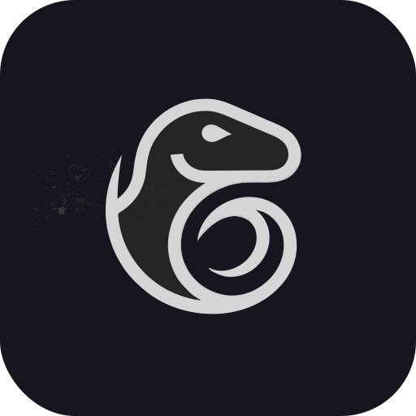

<div align="center">



# Velociportal

### Your network access policy *is* your dashboard policy.

Identity-aware service dashboard that reads Headscale/Tailscale ACLs and Nginx Proxy Manager proxy hosts to render per-user portals. Each user sees only the services their ACL groups grant access to — no separate dashboard permissions to maintain.

**Complements IdPs (Authentik, Authelia, Keycloak) — doesn't replace them.**

[](https://github.com/cybersader/velociportal/actions/workflows/docs.yml)

[Documentation](https://cybersader.github.io/velociportal/) · [How it works](#how-it-works) · [Reference architectures](#reference-architectures) · [Roadmap](#roadmap)

</div>

---

## How it works

```
Headscale ACL ──┐
                 ├──▶ Velociportal ──▶ Per-user portal
NPM proxy hosts─┘     (matches ACLs     (alice sees App1, App3)
                        to services)     (bob sees App1, App2, App4)
```

Velociportal polls two APIs on a background timer:

1. **Headscale** `GET /api/v1/policy` — groups, tag owners, ACL rules
2. **NPM** `GET /api/nginx/proxy-hosts` — services, domains, forward targets

It caches both in memory, then on each request reads the Tailscale identity headers (`Tailscale-User-Login`, `Tailscale-User-Name`) from the trusted proxy, resolves which ACL groups the user belongs to, filters the cached services down to the authorized set, and renders only those as service cards.

The IdP still handles authentication, SSO, and access enforcement. Velociportal just makes the dashboard reflect what the network already permits.

## Tech stack

Single Docker container. Single static Go binary (`FROM scratch`).

| Layer | Choice |
|---|---|
| Language | Go 1.22 (stdlib HTTP, `encoding/json`) |
| Templates | Server-rendered HTML with `html/template` |
| Interactivity | htmx (embedded, no CDN) |
| Identity | Tailscale Serve headers from trusted proxy CIDR |
| Container | Multi-stage build → `FROM scratch` + CA certs |
| Target | TrueNAS Scale, any Docker host |

## Reference architectures

| Architecture | Control Plane | Reverse Proxy | Status |
|---|---|---|---|
| [Headscale + NPM](https://cybersader.github.io/velociportal/guides/headscale-npm/) | Self-hosted | Nginx Proxy Manager | **Primary** |
| [Tailscale SaaS + NPM](https://cybersader.github.io/velociportal/guides/tailscale-saas-npm/) | Managed | Nginx Proxy Manager | Planned |
| [Headscale + Caddy](https://cybersader.github.io/velociportal/guides/headscale-caddy/) | Self-hosted | Caddy | Future |
| [Headscale + Traefik](https://cybersader.github.io/velociportal/guides/headscale-traefik/) | Self-hosted | Traefik | Future |

Works standalone with Tailscale identity headers, or pair with an IdP for SSO and MFA:
[Authentik](https://cybersader.github.io/velociportal/integrations/authentik/) ·
[Authelia](https://cybersader.github.io/velociportal/integrations/authelia/) ·
[No IdP](https://cybersader.github.io/velociportal/integrations/no-idp/)

## Roadmap

- [x] Headscale API client (policy, users, nodes)
- [x] NPM API client (proxy hosts, access lists, JWT auth)
- [x] Background polling cache with atomic swap
- [x] Tailscale identity middleware with trusted proxy CIDR
- [x] ACL-to-service matching engine
- [x] Per-user portal rendering (server-side filtered)
- [x] Service card UI with htmx auto-refresh
- [x] Multi-stage Dockerfile (`FROM scratch`)
- [x] Unit tests (matcher, auth, config)
- [x] Docker Compose deployment example
- [x] Integration tests (API clients, full request flow)
- [x] GitHub Actions CI (vet, test, build, Docker verify)
- [x] Security hardening (non-root container, scheme allowlist, listen addr)
- [x] Structured logging (slog) across all subsystems
- [x] ACL matching: CIDRs, tags, host aliases, autogroups
- [ ] Health check dashboard
- [ ] Custom service metadata (icons, descriptions)
- [ ] Caddy / Traefik adapter support

## License

[MIT](./LICENSE)
