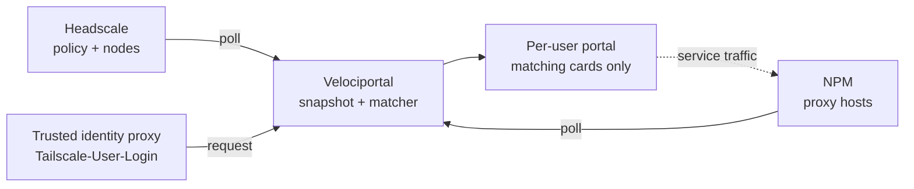

<div align="center">


# Velociportal

### Your network access policy *is* your dashboard policy.

A self-hosted service portal that reads **Headscale legacy ACL rules** and **Nginx Proxy Manager proxy hosts**, then renders only the cards its current matcher can correlate with the trusted viewer identity.

**Visibility layer only — complements identity and enforcement systems; never replaces them.**

[](https://github.com/cybersader/velociportal/actions/workflows/ci.yml)
[](https://github.com/cybersader/velociportal/actions/workflows/docs.yml)

[Start with the docs](https://cybersader.github.io/velociportal/) · [Guided setup](https://cybersader.github.io/velociportal/getting-started/setup/) · [Known limitations](https://cybersader.github.io/velociportal/reference/known-limitations/) · [Roadmap](#roadmap)

</div>

---

## Start here

The canonical operator journey makes the trusted proxy decision explicit before startup. It requires a Git checkout, GNU Make, Docker Engine, and Docker Compose 2.30 or newer:

```bash
make setup
make observe-proxy
make doctor
make up
make health
```

| Step | Purpose |
|---|---|
| `make setup` | Prepare local configuration |
| `make observe-proxy` | Identify the source address allowed to assert identity |
| `make doctor` | Run deployment preflight checks |
| `make up` | Build and start the loopback-published Compose deployment |
| `make health` | Verify that a recent complete snapshot exists |

Follow the full [guided setup](https://cybersader.github.io/velociportal/getting-started/setup/). Before relying on the portal, generate an explainable report with `make validate VALIDATE_ARGS='--identity user-a=alice@example.com --identity user-b=bob@example.com'` and complete the [real-deployment worksheet](https://cybersader.github.io/velociportal/getting-started/validation/).

> [!NOTE]
> The guided targets run the production container image. Setup accepts secrets through hidden terminal input, proxy observation proposes only the exact source it sees, and `make up` waits for the real container healthcheck.

> [!WARNING]
> Fixture and `httptest` coverage is not production proof. The NPM `forward_host` join and complete identity-proxy path have not yet been validated against a real deployment.

## How it works


```mermaid
flowchart LR
    accTitle: Velociportal architecture
    accDescr: Headscale policy and nodes plus NPM proxy hosts form a complete in-memory snapshot. A trusted identity proxy supplies the user login. Velociportal renders matching cards, while service traffic goes directly through NPM rather than Velociportal.

    HS["Headscale<br/>policy + nodes"] -->|poll| VP["Velociportal<br/>snapshot + matcher"]
    NPM["NPM<br/>proxy hosts"] -->|poll| VP
    Proxy["Trusted identity proxy<br/>Tailscale-User-Login"] -->|request| VP
    VP --> Portal["Per-user portal<br/>matching cards only"]
    Portal -. "service traffic" .-> NPM
```

Velociportal polls three current inputs on one ticker:

1. **Headscale** `GET /api/v1/policy` — `groups`, `tagOwners`, legacy `acls`, and `hosts`
2. **Headscale** `GET /api/v1/node` — node owners, IPs, and tags for destination resolution
3. **NPM** `GET /api/nginx/proxy-hosts` — domains, forward targets, enabled state, and online metadata

A refresh replaces the cache only after all three calls succeed. Requests use the last complete in-process snapshot and never wait on an upstream API.

On each request, Velociportal accepts `Tailscale-User-Login` only from `TRUSTED_PROXY_CIDR`, resolves supported identity and group forms, evaluates supported legacy ACL `accept` rules against enabled NPM proxy hosts, and renders matching cards server-side. Headscale ACLs, the reverse proxy, the IdP, and the backend still enforce access.

## What it is — and is not

| Velociportal is | Velociportal is not |
|---|---|
| A visibility layer derived from a supported Headscale policy subset | A login, SSO, OIDC, SAML, or MFA provider |
| A read-only Headscale and NPM API consumer | A reverse proxy or request enforcement point |
| One static Go binary in one minimal container | An ACL editor or service configuration database |
| An in-memory, all-or-nothing polling snapshot | A complete Tailscale policy engine |

## Current support boundary

**Implemented**

- Headscale policy and node API clients
- NPM credential JWT and proxy-host client
- All-or-nothing background snapshot refresh with atomic swap
- Trusted-source `Tailscale-User-*` identity middleware
- Legacy ACL-to-service matching for supported identity and destination forms
- Server-rendered responsive portal, embedded htmx refresh, and NPM status indicators
- Non-root `FROM scratch` image and loopback-only Compose example
- Race-enabled unit and fixture-based request/API tests
- Explainable, privacy-controlled multi-identity validation reports with build provenance

**Not implemented**

- Tailscale SaaS API support
- Grants, SSH, posture, capabilities, or protocol evaluation
- Caddy or Traefik service discovery
- Direct Authentik, Authelia, `Remote-User`, or `X-Webauth-*` adapters
- NPM access-list-driven visibility

**Still requires real deployment validation**

- NPM `forward_host` may contain a Docker DNS name while Headscale destinations resolve to IPs or tags.
- Ports and protocols are ignored for visibility; the real ACL remains the enforcement boundary.
- Card URLs currently reuse NPM's backend `forward_scheme` and must be checked individually.
- Headscale does not currently provide Tailscale's native automatic HTTPS Serve flow.
- The full Headscale + NPM + identity-proxy path has not been proven end-to-end.

Read the complete [Known Limitations](https://cybersader.github.io/velociportal/reference/known-limitations/) before deployment.

## Tech stack

| Layer | Choice |
|---|---|
| Language | Go 1.22, standard library HTTP/JSON/logging |
| Rendering | Embedded server-rendered HTML |
| Interactivity | Embedded htmx; no CDN and no SPA |
| Identity | `Tailscale-User-*` headers from a trusted proxy CIDR |
| State | Atomic in-memory snapshot; no application database |
| Container | Multi-stage build to a non-root `FROM scratch` image |
| Target | TrueNAS SCALE or another Docker host |

## Documentation paths

| Goal | Page | Status |
|---|---|---|
| Configure and launch | [Guided setup](https://cybersader.github.io/velociportal/getting-started/setup/) | Supported workflow |
| Compare identities and joins | [Real deployment validation](https://cybersader.github.io/velociportal/getting-started/validation/) | Tooling implemented; live worksheet pending |
| Deploy on a NAS | [TrueNAS SCALE](https://cybersader.github.io/velociportal/guides/truenas-scale/) | Canonical deployment guide |
| Understand the current adapter | [Headscale + NPM](https://cybersader.github.io/velociportal/guides/headscale-npm/) | Implemented; real validation pending |
| Separate the control plane | [VPS options](https://cybersader.github.io/velociportal/guides/vps-headscale/) | Optional |
| Review trust and spoofing controls | [Tailscale identity headers](https://cybersader.github.io/velociportal/reference/tailscale-headers/) | Required reading |
| Use other discovery adapters | [Architecture overview](https://cybersader.github.io/velociportal/guides/) | Planned only |

## Roadmap

- [x] Headscale policy and node API clients
- [x] NPM JWT auth and proxy-host client
- [x] Complete-snapshot cache with failure retention
- [x] Trusted-proxy identity middleware
- [x] Legacy ACL matcher and server-authorized card rendering
- [x] Responsive light/dark portal with embedded htmx
- [x] Minimal non-root container and loopback-only Compose example
- [x] Race-enabled tests and strict documentation build
- [x] Branded, user-journey documentation with guided setup and CLI reference
- [x] Explainable multi-identity validation reports with summary/private output
- [ ] Complete the worksheet against real Headscale + NPM + identity-proxy data
- [ ] Refine or replace the `forward_host` join
- [ ] Model ports, protocols, and Grants safely
- [ ] Derive browser-facing URLs from NPM frontend fields
- [ ] Add custom service metadata
- [ ] Add Tailscale SaaS, Caddy, and Traefik adapters

## License

[MIT](./LICENSE)
