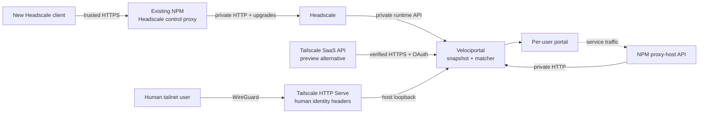

<div align="center">


# Velociportal

### Your network access policy *is* your dashboard policy.

A self-hosted service portal that reads one selected **Headscale or Tailscale SaaS policy source** plus **Nginx Proxy Manager proxy hosts**, then renders only the cards its current matcher can correlate with the trusted viewer identity. Headscale uses the legacy ACL subset; the Tailscale preview also accepts a narrow network-Grants subset.

**Visibility layer only — complements identity and enforcement systems; never replaces them.**

[](https://github.com/cybersader/velociportal/actions/workflows/ci.yml)
[](https://github.com/cybersader/velociportal/actions/workflows/docs.yml)

[TrueNAS Quickstart](https://cybersader.github.io/velociportal/guides/truenas-scale/) · [Tailscale SaaS preview](https://cybersader.github.io/velociportal/guides/tailscale-saas-npm/) · [Documentation](https://cybersader.github.io/velociportal/) · [Optional private TLS](https://cybersader.github.io/velociportal/guides/private-tls/) · [Known limitations](https://cybersader.github.io/velociportal/reference/known-limitations/) · [Roadmap](#roadmap)

</div>

---

## Start here

Follow the [TrueNAS Quickstart](https://cybersader.github.io/velociportal/guides/truenas-scale/). Choose exactly one control plane: Headscale is the supported implementation path, while Tailscale SaaS is an implemented OAuth preview pending live acceptance. The same UI-managed one-service bundle covers both modes:

1. Importing the one-container Compose bundle so the named private upstream bridge exists.
2. Attaching NPM with its exact private Docker alias; Headscale mode also attaches Headscale with preserved outbound DNS and no LAN-published API port.
3. Preserving the existing NPM HTTPS Headscale control workflow in Headscale mode, or configuring a dedicated four-scope OAuth client in Tailscale preview mode.
4. Keeping provider credentials separate, explicit, redacted, and safe to switch without deleting unknown settings.
5. Configuring a real supported-policy exercise and declarative Tailscale HTTP Serve.
6. Deploying Velociportal without a source build or recurring NAS shell.
7. Running two-identity, header-replacement, restart, join, reachability, and LAN-negative acceptance.

The production bundle lives under [`deploy/`](./deploy/). It requires Docker Compose 2.33.1+ and Docker Engine 28+, pulls one immutable published image, creates `velociportal-upstreams`, runs exactly one Velociportal container, and never builds source on the deployment host. The base stack mounts no CA certificate; the private-CA overlay is optional.

> [!IMPORTANT]
> No usable public image, `headscale-ops` release, or support claim is implied until tagged artifacts are actually published, anonymously verified, and the real TrueNAS acceptance matrix passes.

> [!NOTE]
> Published `v0.2.0-rc.3` is immutable and adds authoritative per-`loginName` Grant-role membership. Live acceptance then exposed one narrower compatibility error: Tailscale automatically includes the Owner in `autogroup:admin`, while RC.3 retained only `autogroup:member` and `autogroup:owner`. `v0.2.0-rc.4` is the next preview candidate; the live policy remains unchanged.

> [!WARNING]
> The canonical browser route is tailnet-only HTTP Serve over WireGuard: `:8081 -> http://127.0.0.1:18080`. NPM is not portal identity. Official Tailscale can automate `*.ts.net` certificates, but Headscale automatic HTTPS Serve remains future upstream work tracked by [issue #2527](https://github.com/juanfont/headscale/issues/2527) and [PR #3300](https://github.com/juanfont/headscale/pull/3300). Tailnet HTTP Serve is not a release blocker.

## Approved deployment architecture


```mermaid
flowchart LR
    Client["New Headscale client"] -->|"trusted HTTPS"| NPMControl["Existing NPM<br/>Headscale control proxy"]
    NPMControl -->|"private HTTP + upgrades"| HS["Headscale"]
    HS -->|"private runtime API"| VP["Velociportal<br/>snapshot + matcher"]
    SaaS["Tailscale SaaS API<br/>preview alternative"] -->|"verified HTTPS + OAuth"| VP
    NPM["NPM proxy-host API"] -->|"private HTTP"| VP
    Human["Human tailnet user"] -->|"WireGuard"| Serve["Tailscale HTTP Serve<br/>human identity headers"]
    Serve -->|"host loopback"| VP
    VP --> Portal["Per-user portal"]
    Portal -. "service traffic" .-> NPM
```

The named private Docker bridge is `velociportal-upstreams`:

```text
CONTROL_PLANE=headscale
HEADSCALE_URL=http://headscale.velociportal.internal:8080
NPM_URL=http://npm.velociportal.internal:81
```

Tailscale preview deployments set `CONTROL_PLANE=tailscale`, use dedicated OAuth client credentials against the fixed verified SaaS origin, omit all Headscale keys, and keep the same NPM alias. Headscale and NPM HTTP are accepted only for their exact canonical private aliases or same-host/loopback compatibility routes. Every other location requires verified HTTPS. Credentialed clients refuse redirects, ignore environment proxy variables, and bound response sizes. There is no insecure TLS mode.

Existing NPM provides the trusted HTTPS endpoint that brand-new clients need before they can join the tailnet. The canonical privacy-preserving form uses split-horizon/private DNS and an existing publicly trusted wildcard certificate obtained with DNS-01, without a public Headscale hostname/address record or exact-host certificate-transparency disclosure. This project does not prescribe manual CA creation as the canonical path. If that endpoint is not already trusted by a client, stop rather than disabling verification.

In Headscale mode, NPM is therefore an explicit trust and availability boundary. It can observe Headscale control traffic and workstation operator Bearer API keys. Preserve WebSocket/upgrade behavior, avoid authorization-header logging, back up NPM state, and use separate Headscale operator and Velociportal runtime keys. Runtime Velociportal bypasses the NPM control proxy and uses the private bridge directly. `headscale-ops` remains workstation-only and HTTPS-only. Tailscale SaaS mode needs neither Headscale nor this control proxy; NPM remains service discovery only.

## How the portal works

Velociportal polls one selected control-plane result plus NPM on one ticker:

1. **Headscale mode:** `GET /api/v1/policy` and `GET /api/v1/node`
2. **Tailscale preview mode:** OAuth, then `GET /tailnet/-/acl`, `/users`, and `/devices`
3. **Both modes:** NPM `GET /api/nginx/proxy-hosts`

A refresh replaces the cache only after the complete selected-provider load and NPM call succeed. Requests use the last complete in-process snapshot and never wait on an upstream API.

On each request, Velociportal accepts `Tailscale-User-Login` only from `TRUSTED_PROXY_CIDR`, resolves supported identity and group forms, evaluates normalized supported access rules against enabled NPM proxy hosts, and renders matching cards server-side. In Tailscale mode, `/users` supplies exact `loginName`, `type`, and `role` values for Grant-only role membership. A direct user receives `autogroup:member` plus its API role; the Owner also receives `autogroup:admin`, matching Tailscale's automatic membership. A `shared` user receives none. Role lookup requires exact login equality, and specialized roles do not imply one another. Membership is never inferred from devices, owners, tags, or `tagOwners`; machine/tag/shared selectors remain non-human. Legacy ACL ports/protocols remain unmodeled; accepted Tailscale Grants must permit TCP to the exact NPM backend port. The selected control plane, Tailscale Serve, NPM, and backends still enforce access.

## What it is — and is not

| Velociportal is | Velociportal is not |
|---|---|
| A visibility layer derived from a narrow supported policy subset | A login, SSO, OIDC, SAML, or MFA provider |
| A read-only selected-control-plane and NPM API consumer | A reverse proxy or request enforcement point |
| One static Go binary in one minimal container | An ACL editor or service configuration database |
| An in-memory, all-or-nothing polling snapshot | A complete Tailscale policy engine |

## Current support boundary

**Implemented**

- Explicit `CONTROL_PLANE=headscale|tailscale`; implicit Headscale compatibility warns through v0.2
- Headscale adapter labeled supported and Tailscale OAuth adapter labeled preview
- Exact allowlisted local Headscale HTTP plus verified HTTPS elsewhere
- Fixed verified Tailscale API origin, in-memory token lifecycle, strict Users API identity/type/role validation, exact Grant-role membership, separate strict device-owner mapping, and exact read scopes
- Separate hardened provider and NPM transports with no redirects or environment proxies and bounded responses
- Named private production bridge, exact NPM alias, and exact Headscale alias when selected
- Optional private-CA public-root overlay with no CA mount in the base stack
- NPM credential JWT and proxy-host client
- All-or-nothing background snapshot refresh with atomic swap
- Trusted-source `Tailscale-User-*` identity middleware
- Legacy ACL matching plus a narrow Tailscale Grants network subset with exact TCP/backend-port checks and Users-API-authoritative role-autogroup sources
- Known attr-only Tailscale `nodeAttrs` accepted as non-authorization metadata; the supported `funnel` attribute never becomes card evidence
- Server-rendered responsive portal, embedded htmx refresh, and NPM status indicators
- Non-root `FROM scratch` image and Engine-28+-gated loopback-only publication
- Portable one-service production bundle and declarative Tailscale HTTP Serve template
- Provider-aware setup/doctor UX with atomic confirmed credential switching and complete credential redaction
- Explainable schema-v3 validation reports with access-rule provenance, provider, policy-mode, support-level, selection, and build provenance

**Not implemented**

- General Grants, SSH-as-card-evidence, posture, routing constraints, services, IP sets, or application capabilities
- Caddy or Traefik service discovery
- Direct Authentik, Authelia, `Remote-User`, or `X-Webauth-*` adapters
- NPM access-list-driven visibility
- Headscale automatic HTTPS Serve certificate automation

**Still requires real deployment validation**

- Tailscale SaaS OAuth scopes, token refresh/revocation, exact Users API `loginName`/`type`/`role` mapping, separate device-owner mapping, role-derived card evidence, policy negatives, and live reachability before preview can become supported
- The NPM HTTPS-to-Headscale control path, including WebSocket/upgrade behavior and trusted certificate use by brand-new clients
- The private Docker network and proof that Headscale port `8080` is not reachable from the LAN
- Separate operator/runtime key handling and NPM header-logging posture
- Declarative Serve identity injection, header replacement, and restart persistence
- The NPM `forward_host` join against real tailnet-routable destinations
- At least two human identities with intentionally different card sets
- Every generated link compared with actual selected-control-plane and NPM reachability

Tailnet HTTP over WireGuard prevents ordinary on-path LAN/router/ISP interception. It does not protect against compromised clients, TrueNAS, NPM, Tailscale/Headscale control components, or trusted host workloads.

Read the complete [Known Limitations](https://cybersader.github.io/velociportal/reference/known-limitations/) before deployment.

## Router and backup boundary

No CA state lives on pfSense/the router. Router replacement restores ordinary DNS and routing only. Durable Headscale data and policy, NPM database/configuration/certificates, TrueNAS app settings, Docker network configuration, Serve configuration, and Velociportal environment files stay on TrueNAS and in tested backups.

## Tech stack

| Layer | Choice |
|---|---|
| Language | Go 1.22, standard library HTTP/JSON/logging |
| Rendering | Embedded server-rendered HTML |
| Interactivity | Embedded htmx; no CDN and no SPA |
| Identity | `Tailscale-User-*` headers from trusted Tailscale Serve |
| State | Atomic in-memory snapshot; no application database |
| Container | Multi-stage build to a non-root `FROM scratch` image |
| Target | TrueNAS SCALE or another Docker host with Compose 2.33.1+ and Engine 28+ |

## Documentation paths

| Goal | Page | Status |
|---|---|---|
| Install the full private stack | [TrueNAS Quickstart](https://cybersader.github.io/velociportal/guides/truenas-scale/) | Canonical release-candidate journey |
| Understand Headscale control and runtime paths | [Headscale + NPM](https://cybersader.github.io/velociportal/guides/headscale-npm/) | Implemented architecture; live acceptance pending |
| Use Tailscale SaaS OAuth | [Tailscale SaaS + NPM](https://cybersader.github.io/velociportal/guides/tailscale-saas-npm/) | Implemented preview; live SaaS acceptance pending |
| Compare identities and joins | [Real deployment validation](https://cybersader.github.io/velociportal/getting-started/validation/) | Tooling implemented; live worksheet pending |
| Use native private Headscale TLS | [Optional private TLS](https://cybersader.github.io/velociportal/guides/private-tls/) | Alternative only |
| Build and diagnose from source | [Local-source workflow](https://cybersader.github.io/velociportal/getting-started/setup/) | Contributor/advanced diagnostics only |
| Review trust and spoofing controls | [Tailscale identity headers](https://cybersader.github.io/velociportal/reference/tailscale-headers/) | Required reading |

## Roadmap

- [x] Headscale policy and node API clients
- [x] NPM JWT auth and proxy-host client
- [x] Complete-snapshot cache with failure retention
- [x] Trusted-proxy identity middleware
- [x] Legacy ACL matcher and server-side visibility filtering
- [x] Responsive portal with embedded htmx
- [x] Minimal non-root container and loopback-only Compose examples
- [x] Explainable schema-v3 multi-identity validation reports with access-rule provenance
- [x] Provider-neutral control-plane core and Headscale regression adapter
- [x] Tailscale SaaS OAuth adapter with fixture-tested policy/users/devices conversion
- [x] Provider-aware setup, Doctor, redaction, and atomic credential switching
- [x] Hardened isolated upstream transports and exact Headscale HTTP allowlist
- [x] Named private upstream bridge with direct runtime aliases and required egress
- [x] Optional private-CA Compose overlay without a base-stack CA mount
- [x] Canonical NPM Headscale control-proxy and Tailscale Serve architecture documented
- [x] Publish and anonymously verify immutable Velociportal and `headscale-ops` release-candidate artifacts
- [ ] Complete real NPM control-proxy, bootstrap, key-separation, and backup acceptance
- [ ] Complete Headscale two-identity, LAN-negative, restart, join, link, and reachability acceptance
- [ ] Complete Tailscale OAuth refresh/revocation, policy-negative, owner-mapping, identity, and reachability acceptance; retain preview until then
- [ ] Refine or replace the `forward_host` join
- [x] Model a narrow Tailscale Grants network subset with exact TCP/backend-port checks
- [x] Derive Grant-role source membership solely from exact Tailscale Users API `loginName`/`type`/`role` data
- [x] Publish and live-test immutable `v0.2.0-rc.3` without modifying `v0.2.0-rc.2`; record the Owner-to-Admin membership gap
- [ ] Publish and live-test immutable `v0.2.0-rc.4` with Tailscale-compatible Owner membership
- [ ] Expand modern-policy support only with additional fail-closed semantics and live evidence
- [ ] Derive browser-facing URLs from NPM frontend fields
- [ ] Add custom service metadata
- [ ] Add Caddy and Traefik service-discovery adapters

## License

[MIT](./LICENSE)
