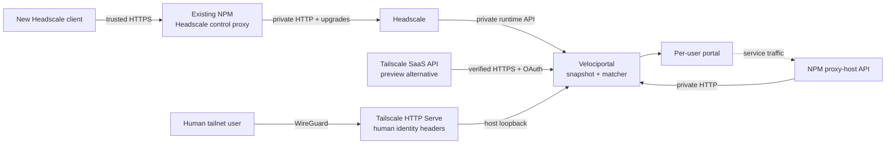

<div align="center">


# Velociportal

### Your network access policy *is* your dashboard policy.

A self-hosted service portal that reads one selected **Headscale or Tailscale SaaS policy source** plus **Nginx Proxy Manager proxy hosts**, then renders only the service and machine cards its current matchers can correlate with the trusted viewer identity. Headscale uses the legacy ACL subset; the Tailscale preview also accepts a narrow network-Grants subset and a separate bounded SSH Machines projection.

**Visibility layer only — complements identity and enforcement systems; never replaces them.**

[](https://github.com/cybersader/velociportal/actions/workflows/ci.yml)
[](https://github.com/cybersader/velociportal/actions/workflows/docs.yml)

[TrueNAS Quickstart](https://cybersader.github.io/velociportal/guides/truenas-scale/) · [Tailscale SaaS preview](https://cybersader.github.io/velociportal/guides/tailscale-saas-npm/) · [Documentation](https://cybersader.github.io/velociportal/) · [Optional private TLS](https://cybersader.github.io/velociportal/guides/private-tls/) · [Known limitations](https://cybersader.github.io/velociportal/reference/known-limitations/) · [Roadmap](#roadmap)

</div>

---

## Start here

Follow the [TrueNAS Quickstart](https://cybersader.github.io/velociportal/guides/truenas-scale/). Choose exactly one control plane: Headscale is the supported implementation path, while Tailscale SaaS is an implemented OAuth preview pending live acceptance. The same UI-managed one-service bundle covers both modes:

1. Importing the one-container Compose bundle so the named private upstream bridge exists.
2. Attaching NPM with its exact private Docker alias; Headscale mode also attaches Headscale with preserved outbound DNS and no LAN-published API port.
3. Preserving the existing NPM HTTPS Headscale control workflow in Headscale mode, or configuring a dedicated four-scope OAuth client in Tailscale preview mode.
4. Keeping provider credentials separate, explicit, redacted, and safe to switch without deleting unknown settings.
5. Configuring a real supported-policy exercise and declarative Tailscale HTTP Serve.
6. Deploying Velociportal without a source build or recurring NAS shell.
7. Running two-identity, header-replacement, restart, join, reachability, and LAN-negative acceptance.

The production bundle lives under [`deploy/`](./deploy/). It requires Docker Compose 2.33.1+ and Docker Engine 28+, pulls one immutable published image, creates `velociportal-upstreams`, runs exactly one Velociportal container, and never builds source on the deployment host. The base stack mounts no host paths; the private-CA, service-metadata, and explicit service-health overlays are optional.

> [!IMPORTANT]
> Published release-candidate images and `headscale-ops` artifacts exist, but they do not imply a public support claim. The selected provider's full TrueNAS acceptance matrix must still pass.

> [!NOTE]
> Published `v0.2.0-rc.10` is immutable at `sha256:d228ccefc0c65bd93cceb814c88b30416b33322db563d8a330ad189f1c3da746`. Live TrueNAS environment files reference RC.10, but the exact running-container digest has not been independently captured. The current branch adds per-device truthfulness for the Tailscale Machines navigation action, quieter machine-account presentation, mobile bottom navigation, and privacy-safe PWA metadata; it is not yet published or deployed.

> [!WARNING]
> The canonical browser route is tailnet-only HTTP Serve over WireGuard: `:8081 -> http://127.0.0.1:18080`. NPM is not portal identity. Official Tailscale can automate `*.ts.net` certificates, but Headscale automatic HTTPS Serve remains future upstream work tracked by [issue #2527](https://github.com/juanfont/headscale/issues/2527) and [PR #3300](https://github.com/juanfont/headscale/pull/3300). Tailnet HTTP Serve is not a release blocker.

## Approved deployment architecture


```mermaid
flowchart LR
    Client["New Headscale client"] -->|"trusted HTTPS"| NPMControl["Existing NPM<br/>Headscale control proxy"]
    NPMControl -->|"private HTTP + upgrades"| HS["Headscale"]
    HS -->|"private runtime API"| VP["Velociportal<br/>snapshot + matcher"]
    SaaS["Tailscale SaaS API<br/>preview alternative"] -->|"verified HTTPS + OAuth"| VP
    NPM["NPM proxy-host API"] -->|"private HTTP"| VP
    Human["Human tailnet user"] -->|"WireGuard"| Serve["Tailscale HTTP Serve<br/>human identity headers"]
    Serve -->|"host loopback"| VP
    VP --> Portal["Per-user portal"]
    Portal -. "service traffic" .-> NPM
```

The named private Docker bridge is `velociportal-upstreams`:

```text
CONTROL_PLANE=headscale
HEADSCALE_URL=http://headscale.velociportal.internal:8080
NPM_URL=http://npm.velociportal.internal:81
```

Tailscale preview deployments set `CONTROL_PLANE=tailscale`, use dedicated OAuth client credentials against the fixed verified SaaS origin, omit all Headscale keys, and keep the same NPM alias. Headscale and NPM HTTP are accepted only for their exact canonical private aliases or same-host/loopback compatibility routes. Every other location requires verified HTTPS. Credentialed clients refuse redirects, ignore environment proxy variables, and bound response sizes. There is no insecure TLS mode.

Existing NPM provides the trusted HTTPS endpoint that brand-new clients need before they can join the tailnet. The canonical privacy-preserving form uses split-horizon/private DNS and an existing publicly trusted wildcard certificate obtained with DNS-01, without a public Headscale hostname/address record or exact-host certificate-transparency disclosure. This project does not prescribe manual CA creation as the canonical path. If that endpoint is not already trusted by a client, stop rather than disabling verification.

In Headscale mode, NPM is therefore an explicit trust and availability boundary. It can observe Headscale control traffic and workstation operator Bearer API keys. Preserve WebSocket/upgrade behavior, avoid authorization-header logging, back up NPM state, and use separate Headscale operator and Velociportal runtime keys. Runtime Velociportal bypasses the NPM control proxy and uses the private bridge directly. `headscale-ops` remains workstation-only and HTTPS-only. Tailscale SaaS mode needs neither Headscale nor this control proxy; NPM remains service discovery only.

## How the portal works

Velociportal polls one selected control-plane result plus NPM on one ticker:

1. **Headscale mode:** `GET /api/v1/policy` and `GET /api/v1/node`
2. **Tailscale preview mode:** OAuth, then `GET /tailnet/-/acl`, `/users`, and `/devices?fields=all`
3. **Both modes:** NPM `GET /api/nginx/proxy-hosts`

A refresh replaces the authorization/catalog cache only after the optional local service metadata, complete selected-provider load, and NPM call succeed. Requests use the last complete in-process snapshot and never wait on an upstream API. Optional service health runs on a separate scheduler and atomic observation store, so probe failures never delay snapshot publication or change `/healthz`.

On each request, Velociportal accepts `Tailscale-User-Login` only from `TRUSTED_PROXY_CIDR`, resolves supported identity and group forms, evaluates normalized supported access rules against enabled NPM proxy hosts, and renders matching cards server-side. In Tailscale mode, `/users` supplies exact canonical `loginName`, `type`, and `role` values for authoritative Grant and supported SSH-machine role membership. A direct user receives `autogroup:member` plus its API role; the Owner also receives `autogroup:admin`, matching Tailscale's automatic membership. A `shared` user receives none. Role lookup requires exact login equality, padded API logins reject the complete refresh, and specialized roles do not imply one another. Membership is never inferred from devices, owners, tags, or `tagOwners`; machine/tag/shared selectors remain non-human. Legacy ACL ports/protocols remain unmodeled; accepted Tailscale Grants must permit TCP to the exact NPM backend port. After authorization evidence matches, Velociportal prefers the first concrete NPM frontend name, keeps wildcard-only services visible but unlinked, and can apply strict name, URL, category, and order presentation metadata keyed by that existing NPM host ID. Categories group cards with uncategorized cards last; explicit order applies only within a category before deterministic name/ID fallbacks. None of these fields changes policy evidence or the authorized card set. For explicitly configured proxy-host IDs, health joins only after this identity-filtered match and displays a coarse shared observation; it never creates, hides, enables, reorders, or authorizes a card. Probe targets come only from NPM backend fields, never browser metadata URLs.

The Tailscale-preview Machines section is a separate visibility projection. It is available only when the selected provider is Tailscale and the complete `ssh` policy is present and supported; Headscale, an absent SSH section, or any unsupported SSH rule omits the entire Machines section. When the projection is available but the current identity has no matches, the portal preserves an explicit empty Machines state. A device appears only when the same exact direct member matches both the bounded supported `ssh` policy subset and an independent Grant permitting TCP/22 to that device. Legacy ACL port 22, NPM hosts, service metadata, and health never create a machine card. Each card shows a short display/search name (the first label of a canonical `*.ts.net` target) alongside the full canonical target, plus truthful plain-language action text ("No extra sign-in" for `accept`, "Reauthenticate every `<period>`" for `check`, defaulting to Tailscale's documented 12 hours when `checkPeriod` is absent) instead of raw policy tokens. Cards are non-service-link policy summaries; copyable commands for a validated literal account are built server-side and use a canonical full `*.ts.net` device name or a validated Tailscale IPv4/IPv6 address. Where `autogroup:nonroot` applies, the portal additionally offers a purely client-side, client-validated custom account input (never pre-filled, never sent to or verified by Velociportal) so the viewer can copy a command for a permitted non-root account Velociportal cannot enumerate. Projection unavailability never broadens or invalidates otherwise supported HTTP service cards. The selected control plane, Tailscale Serve, Tailscale SSH, NPM, and backends still enforce access and reachability.

Tailscale does not provide a standalone one-click browser-SSH session URL. Velociportal can only open the admin console's filtered Machines page. That action appears only when the viewer is a direct member holding an automatic-admin-equivalent role (Owner, Admin, IT admin, or Network admin) **and** the exact device explicitly reports `sshEnabled=true` and `blocksIncomingConnections=false` in `/devices?fields=all`. Missing, null, malformed, disabled, or incoming-blocked values hide only the action; the policy-matched machine card remains. The fixed link uses `q=<validated-short-name-or-IP> property:tailscale-ssh`, opens in a new tab, and remains navigation rather than a session, proxy, enforcement check, health signal, reachability claim, or guarantee that browser SSH will succeed.

Where the safe custom non-root account input applies, the portal also remembers up to 10 validated account names the viewer has typed for that identity, most-recently-used first, as a datalist suggestion in that browser's `localStorage`, scoped by the same opaque SHA-256 login digest as the logo preference; a visible control clears the saved list. These suggestions are never sent to or stored by Velociportal.

Each user's display name and login open an accessible settings panel with the one appearance preference: showing or hiding the fixed built-in logo. That preference is scoped per exact identity by an opaque SHA-256 digest of the login and stored only in that one browser's `localStorage`; it is never sent to or stored by Velociportal, and a legacy unscoped key migrates once into the scoped key. Optional strict `PORTAL_LOGO_DEFAULT=visible|hidden` supplies only the initial deployment default used when no valid browser preference exists for that identity. On mobile, a safe-area-aware bottom bar adds Services, Machines, and More; More opens the same settings panel as a bottom sheet, and Machines is hidden only when the projection is unavailable.

The page includes an install manifest and committed mobile icons. Identity-derived portal responses are `no-store`, and the service worker has install/activate lifecycle handling only: it has no fetch handler, Cache Storage use, offline fallback, or cached service/machine data. Full service-worker control and normal install prompts require HTTPS or localhost. The canonical plain-HTTP Tailscale Serve route may still be saved as a browser shortcut where supported, but enabling HTTPS is a separate infrastructure decision. Arbitrary per-service logos, access history, broader personalization, account-synchronized profiles, and delegated administration remain deferred.

## What it is — and is not

| Velociportal is | Velociportal is not |
|---|---|
| A visibility layer derived from a narrow supported policy subset | A login, SSO, OIDC, SAML, or MFA provider |
| A read-only selected-control-plane and NPM API consumer | A reverse proxy or request enforcement point |
| One static Go binary in one minimal container | An ACL editor or service configuration database |
| An in-memory, all-or-nothing polling snapshot | A complete Tailscale policy engine |

## Current support boundary

**Implemented**

- Explicit `CONTROL_PLANE=headscale|tailscale`; implicit Headscale compatibility warns through v0.2
- Headscale adapter labeled supported and Tailscale OAuth adapter labeled preview
- Exact allowlisted local Headscale HTTP plus verified HTTPS elsewhere
- Fixed verified Tailscale API origin, in-memory token lifecycle, strict canonical Users API login/type/role validation, exact Grant/SSH-machine role membership, separate strict device-owner mapping, and exact read scopes
- Separate hardened provider and NPM transports with no redirects or environment proxies and bounded responses
- Named private production bridge, exact NPM alias, and exact Headscale alias when selected
- Optional private-CA public-root overlay with no CA mount in the base stack
- NPM credential JWT and proxy-host client
- All-or-nothing background snapshot refresh with atomic swap
- Trusted-source `Tailscale-User-*` identity middleware
- Legacy ACL matching plus a narrow Tailscale Grants network subset with exact TCP/backend-port checks and Users-API-authoritative role-autogroup sources
- Separate Tailscale-preview SSH Machines cards requiring both a fully supported SSH rule and Grant TCP/22 evidence for the same exact direct member and device; non-service-link summaries and narrowly validated copy commands only
- Known attr-only Tailscale `nodeAttrs` accepted as non-authorization metadata; the supported `funnel` attribute never becomes card evidence
- Server-rendered responsive portal with embedded htmx refresh, truthful concrete-domain links, visible unlinked wildcard cards, accessible category sections, a username-triggered accessible settings panel, mobile Services/Machines/More bottom navigation, per-identity browser-local preferences, and accessible coarse health labels
- A role- and device-gated Tailscale Machines navigation action that uses a validated short name/IP plus `property:tailscale-ssh`; it requires an eligible direct-member role and explicit device `sshEnabled=true` plus `blocksIncomingConnections=false`, and remains navigation only because Tailscale exposes no standalone browser-session URL
- Privacy-safe PWA metadata and icons, `no-store` identity responses, and a lifecycle-only service worker with no fetch interception, offline mode, or authorization-data cache; full install/service-worker behavior requires HTTPS or localhost
- Truthful plain-language SSH action labels, a short display/search machine name alongside the full canonical target, a safe client-validated custom non-root account input, and a browser-local, per-identity, 10-entry SSH account suggestion list with a clear control
- Strict optional name/URL/category/order service metadata applied only after policy matching; version 1 remains name/URL compatible and version 2 adds presentation-only organization
- One-shot private hostname suggestions from selected-control-plane names plus optional bounded hostname-only stdin, with whole-component ambiguity rejection and manual metadata merge only
- Explicit opt-in HTTP GET or connect-only TCP backend probes with topology allowlists, direct validated-IP dialing, verified TLS, fixed worker bounds, no credentials/proxies/redirects, and identity-filtered presentation
- Non-root `FROM scratch` image and Engine-28+-gated loopback-only publication
- Portable one-service production bundle and declarative Tailscale HTTP Serve template
- Read-only production `stack.env` preflight for image-pin, subnet/gateway, and trusted-proxy consistency, with process-environment interpolation and effective runtime override modeling
- Provider-aware setup/doctor UX with atomic confirmed credential switching and complete credential redaction
- Explainable schema-v3 validation reports with access-rule provenance, provider, policy-mode, support-level, selection, and build provenance

**Not implemented**

- General Grants, SSH as HTTP-service-card evidence, broader SSH selectors/user mappings, posture, routing constraints, services, IP sets, or application capabilities
- Caddy or Traefik service discovery
- Direct Authentik, Authelia, `Remote-User`, or `X-Webauth-*` adapters
- NPM access-list-driven visibility
- Arbitrary per-service logos, access-history collection, or server-side/account-synchronized personalization
- Automatic TrueNAS mutation or a complete guided update/rollback planner; the current deployment preflight is read-only
- Headscale automatic HTTPS Serve certificate automation

**Still requires real deployment validation**

- Tailscale SaaS OAuth scopes, token refresh/revocation, exact Users API `loginName`/`type`/`role` mapping, separate device-owner mapping, role-derived service and SSH-machine evidence, unsupported-SSH suppression, two-identity machine isolation, copied-target parity, policy negatives, and live reachability before preview can become supported
- The NPM HTTPS-to-Headscale control path, including WebSocket/upgrade behavior and trusted certificate use by brand-new clients
- The private Docker network and proof that Headscale port `8080` is not reachable from the LAN
- Separate operator/runtime key handling and NPM header-logging posture
- Declarative Serve identity injection, header replacement, and restart persistence
- The NPM `forward_host` join against real tailnet-routable destinations
- At least two human identities with intentionally different service and, when configured, machine card sets
- Every generated service link and copied SSH command compared with actual selected-control-plane/NPM/Tailscale-SSH reachability and behavior

Tailnet HTTP over WireGuard prevents ordinary on-path LAN/router/ISP interception. It does not protect against compromised clients, TrueNAS, NPM, Tailscale/Headscale control components, or trusted host workloads.

Read the complete [Known Limitations](https://cybersader.github.io/velociportal/reference/known-limitations/) before deployment.

## Router and backup boundary

No CA state lives on pfSense/the router. Router replacement restores ordinary DNS and routing only. Durable Headscale data and policy, NPM database/configuration/certificates, TrueNAS app settings, Docker network configuration, Serve configuration, and Velociportal environment files stay on TrueNAS and in tested backups.

## Tech stack

| Layer | Choice |
|---|---|
| Language | Go 1.22, standard library HTTP/JSON/logging |
| Rendering | Embedded server-rendered HTML |
| Interactivity | Embedded htmx; no CDN and no SPA |
| Identity | `Tailscale-User-*` headers from trusted Tailscale Serve |
| State | Atomic in-memory snapshot; no application database |
| Container | Multi-stage build to a non-root `FROM scratch` image |
| Target | TrueNAS SCALE or another Docker host with Compose 2.33.1+ and Engine 28+ |

## Documentation paths

| Goal | Page | Status |
|---|---|---|
| Install the full private stack | [TrueNAS Quickstart](https://cybersader.github.io/velociportal/guides/truenas-scale/) | Canonical release-candidate journey |
| Understand Headscale control and runtime paths | [Headscale + NPM](https://cybersader.github.io/velociportal/guides/headscale-npm/) | Implemented architecture; live acceptance pending |
| Use Tailscale SaaS OAuth | [Tailscale SaaS + NPM](https://cybersader.github.io/velociportal/guides/tailscale-saas-npm/) | Implemented preview; live SaaS acceptance pending |
| Compare identities and joins | [Real deployment validation](https://cybersader.github.io/velociportal/getting-started/validation/) | Tooling implemented; live worksheet pending |
| Use native private Headscale TLS | [Optional private TLS](https://cybersader.github.io/velociportal/guides/private-tls/) | Alternative only |
| Build and diagnose from source | [Local-source workflow](https://cybersader.github.io/velociportal/getting-started/setup/) | Contributor/advanced diagnostics only |
| Review trust and spoofing controls | [Tailscale identity headers](https://cybersader.github.io/velociportal/reference/tailscale-headers/) | Required reading |

## Roadmap

- [x] Headscale policy and node API clients
- [x] NPM JWT auth and proxy-host client
- [x] Complete-snapshot cache with failure retention
- [x] Trusted-proxy identity middleware
- [x] Legacy ACL matcher and server-side visibility filtering
- [x] Responsive portal with embedded htmx
- [x] Minimal non-root container and loopback-only Compose examples
- [x] Explainable schema-v3 multi-identity validation reports with access-rule provenance
- [x] Provider-neutral control-plane core and Headscale regression adapter
- [x] Tailscale SaaS OAuth adapter with fixture-tested policy/users/devices conversion
- [x] Provider-aware setup, Doctor, redaction, and atomic credential switching
- [x] Hardened isolated upstream transports and exact Headscale HTTP allowlist
- [x] Named private upstream bridge with direct runtime aliases and required egress
- [x] Optional private-CA Compose overlay without a base-stack CA mount
- [x] Canonical NPM Headscale control-proxy and Tailscale Serve architecture documented
- [x] Publish and anonymously verify immutable Velociportal and `headscale-ops` release-candidate artifacts
- [ ] Complete real NPM control-proxy, bootstrap, key-separation, and backup acceptance
- [ ] Complete Headscale two-identity, LAN-negative, restart, join, link, and reachability acceptance
- [ ] Complete Tailscale OAuth refresh/revocation, policy-negative, owner-mapping, identity, and reachability acceptance; retain preview until then
- [ ] Refine or replace the `forward_host` join
- [x] Model a narrow Tailscale Grants network subset with exact TCP/backend-port checks
- [x] Derive Grant-role source membership solely from exact Tailscale Users API `loginName`/`type`/`role` data
- [x] Publish and live-test immutable `v0.2.0-rc.3` without modifying `v0.2.0-rc.2`; record the Owner-to-Admin membership gap
- [x] Publish and live-test immutable `v0.2.0-rc.4` with Tailscale-compatible Owner membership; record the 48-card result and presentation defects
- [ ] Expand modern-policy support only with additional fail-closed semantics and live evidence
- [x] Prefer concrete NPM frontend names, preserve wildcard-only cards without broken links, and add strict optional name/URL metadata
- [x] Add bounded explicit-opt-in backend health checks without treating NPM route state as health
- [x] Add one-shot privacy-minimized selected-control-plane/hostname-feed suggestions with no runtime store or automatic metadata mutation
- [x] Add strict presentation-only categories/order plus a per-browser visibility toggle for the fixed built-in logo
- [x] Add a bounded Tailscale-preview SSH Machines view with dual SSH-policy plus Grant TCP/22 evidence and safe copy commands
- [x] Add a role-gated Tailscale Machines navigation action and a username-triggered accessible settings panel with a per-identity browser-local logo preference plus optional `PORTAL_LOGO_DEFAULT` deployment default
- [x] Narrow the navigation action by explicit per-device SSH capability, add mobile bottom navigation, and add a non-caching PWA shell
- [ ] Add arbitrary per-service logos, access history, and server-side/account-synchronized personalization
- [ ] Add Caddy and Traefik service-discovery adapters

## License

[MIT](./LICENSE)
