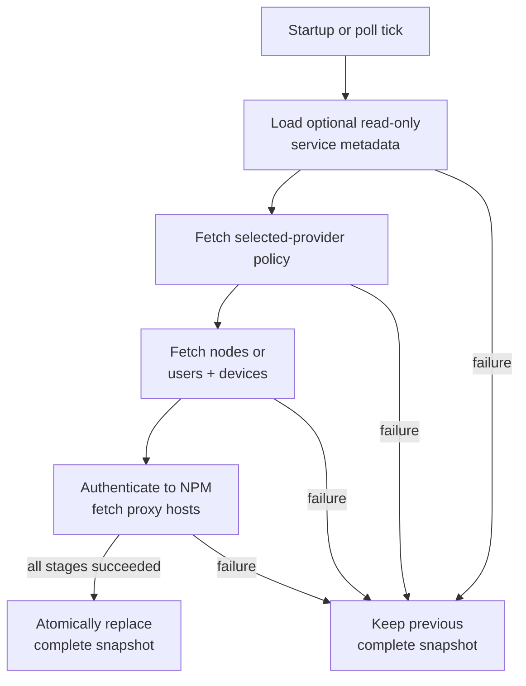
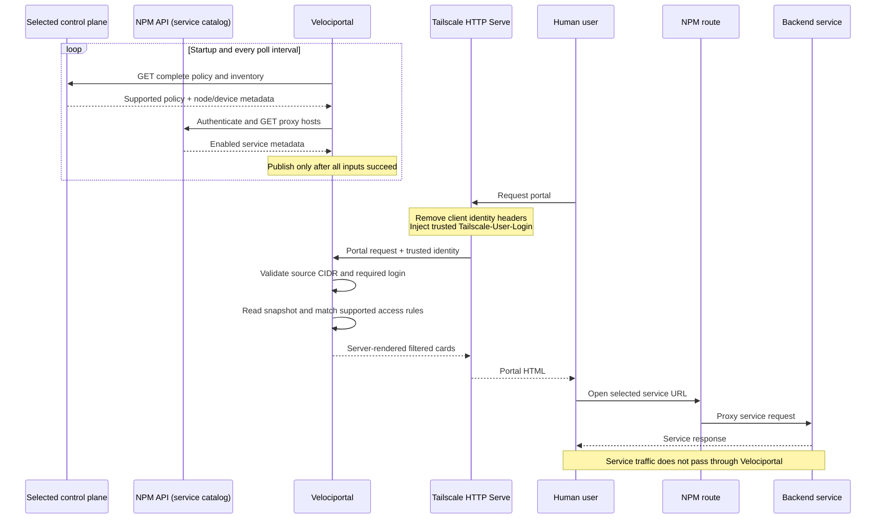

# How it works

Velociportal separates **control-plane refreshes**, **optional service-health observations**, **identity-aware portal requests**, and **service traffic**. Portal rendering reads immutable in-memory authorization/catalog and health snapshots and never waits on the selected control plane, NPM API, or a backend probe.

## Control plane: complete snapshot refresh

Success and failure are written on the paths; green or neutral styling is only supplemental.

- The default poll interval is `30s`.
- Each upstream call has a `10s` context timeout.
- A refresh is **all-or-nothing**: optional configured service metadata, the selected provider's complete policy/inventory load, and NPM proxy hosts must all succeed before publication.
- Service metadata is presentation-only. It is loaded before upstream contact, keyed by an existing NPM proxy-host ID, and cannot create a service or alter policy evidence.
- Startup performs an immediate refresh. If it fails and there is no earlier in-process snapshot, portal requests and `/healthz` remain unavailable until a later refresh succeeds.
- The cache is not persisted. A process restart always starts cold.

## Optional service-health observations

A separate scheduler reloads the strict service-health file before each cycle. Only explicitly listed proxy-host IDs are considered, and only enabled NPM hosts with supported identity-independent destination evidence become probe jobs. This structural gate does not evaluate source selectors and does not authorize anyone.

- Targets derive only from NPM `forward_scheme`, `forward_host`, and `forward_port`, plus the configured HTTP path. Presentation metadata and browser URLs are never inputs.
- HTTP sends one credential-free `GET`; TCP connects and closes without payload. Probes do not share clients, cookies, headers, tokens, or transports with the selected control plane or NPM API.
- DNS names require an exact host or suffix allowlist match. Every resolved address must fit an explicit CIDR, the complete answer set is validated, and the transport dials validated IPs directly while preserving HTTP Host and TLS SNI.
- Loopback, unspecified, multicast, link-local, broadcast, NPM API, and selected-control-plane API sockets remain denied. HTTPS uses verified TLS 1.2 or newer; redirects and environment proxies are disabled.
- A fixed worker pool runs non-overlapping cycles with bounded per-probe and total-cycle time. Results are memory-only coarse states and become `stale` after three configured intervals.
- Invalid health configuration launches no new probes and leaves prior observations only until stale. It never blocks or replaces the authorization/catalog snapshot and never changes `/healthz`.

## Identity, control, and service sequence

Every participant includes its role in text. Velociportal predicts visibility; Headscale, Tailscale Serve, NPM, and the backend retain their authentication, identity, routing, and enforcement roles.

## Request decision path

1. Parse the TCP source address.
2. Reject the request with `403` unless it is inside `TRUSTED_PROXY_CIDR`.
3. Require `Tailscale-User-Login`; a missing identity from a trusted source returns `401`.
4. Preserve a fully qualified login exactly. Short or bare legacy forms are accepted only when the trusted header itself uses that form.
5. Resolve supported policy groups and, for Tailscale Grants and the bounded SSH Machines projection, Users-API-authoritative role selectors for that exact login.
6. Evaluate enabled NPM proxy hosts against normalized supported access rules. Grant-derived cards require TCP to the exact backend port.
7. For each already-matched host, prefer the first concrete NPM frontend name. Keep wildcard-only hosts visible but unlinked, then apply any exact-ID name/URL/category/order presentation metadata.
8. Join any configured coarse health observation by the already-authorized proxy-host ID. Health cannot change card count, order, URL, link state, or authorization.
9. Sort matching service cards deterministically: categorized groups first, uncategorized last, explicit order within each category, then case-insensitive name and proxy-host ID. Render HTML server-side without inferring backend health from NPM route state.
10. Independently render the Machines section only when Tailscale is selected and the SSH policy is present and fully supported. Each device requires matching SSH policy, independent Grant TCP/22 evidence, and exact current `sshEnabled=true` plus `blocksIncomingConnections=false` self-report keyed by its validated device ID. Missing or invalid capability fails closed; a supported projection with zero matches preserves the explicit empty state. The admin-console action additionally requires an eligible direct-member role.
11. Let embedded htmx refresh the complete service-and-machine content every 60 seconds without turning the app into an SPA.

## Machine card names, action labels, and account input

Each machine card shows a short display/search name — the first DNS label of an already validated canonical `*.ts.net` target — prominently, with the full canonical target shown separately in smaller text; a validated IP fallback target has no separate short form. SSH policy renders as truthful, plain-language action text instead of raw tokens: an `accept` rule reads "No extra sign-in," and a `check` rule reads "Reauthenticate every `<period>`," using the canonical `checkPeriod` when present or Tailscale's documented 12-hour default when absent.

Where a card's access list includes `autogroup:nonroot`, the portal additionally renders a purely client-side text input so the viewer can type a candidate non-root account. The typed value is validated in the browser against the same bounded grammar as literal accounts (and rejects `root` outright), then used to build a copy command client-side; it is never pre-filled, never sent to or verified by Velociportal, and never rendered server-side. Literal-account copy commands remain built entirely server-side and unchanged.

## Tailscale Machines navigation, mobile shell, and preferences

Tailscale does not expose a standalone browser-SSH session URL. A machine row can only link to the admin console's Machines page. Every rendered row already requires the exact device to report `sshEnabled=true` and `blocksIncomingConnections=false` in `/devices?fields=all`; missing, null, malformed, disabled, incoming-blocked, or mismatched capability fields remove the row. Velociportal renders the additional navigation action when the identity is also a direct Tailscale member holding an automatic-admin-equivalent role (Owner, Admin, IT admin, or Network admin). The link opens `https://console.tailscale.com/admin/machines?q=<validated-short-name-or-IP>%20property:tailscale-ssh` in a new tab. The device fields narrow the projection but remain self-report, not authorization, health, reachability, or proof that a session will succeed.

Each user's display name and login open an accessible settings panel that replaces the former standalone logo toggle. Its one appearance preference — show or hide the fixed built-in logo — lives per exact identity in one browser only, scoped by an opaque SHA-256 digest of the login and stored only in `localStorage`; it is never sent to or stored by Velociportal, and a legacy unscoped key migrates once into the scoped key. Optional strict `PORTAL_LOGO_DEFAULT=visible|hidden` supplies only the initial deployment default used when no valid browser preference exists for that identity. The same settings panel also controls clearing the browser-local list of up to 10 recently typed SSH account names for that identity.

On mobile, a fixed safe-area-aware bottom bar links to Services and Machines and opens the same account settings through More. The bar remains outside the htmx swap boundary; Machines disappears only when the projection is unavailable, not when an available projection has zero matches. Portal responses are marked `no-store`. The install manifest and icons can support a PWA on a secure origin, but the service worker has no fetch handler, Cache Storage, offline fallback, or identity-derived response cache. Full service-worker control and normal installation require HTTPS or localhost; the canonical plain-HTTP Tailscale Serve origin does not meet that secure-context requirement.

[See the accepted and rejected routes →](../reference/tailscale-headers.md)

## Matching boundary

The current join compares NPM `forward_host` with supported access-rule destinations. It can resolve:

- Exact hostnames and IP addresses
- CIDRs
- Policy host aliases
- Destination tags resolved to node IPs
- `*`
- `autogroup:self`

Headscale remains legacy-ACL-only. The Tailscale preview also evaluates the narrow network-Grants subset: accepted capabilities must permit TCP to the exact NPM backend port. Exact users, defined groups, wildcard, and supported human-role autogroups may produce Grant evidence. Role membership comes only from the complete Users API response: a direct member receives `autogroup:member` plus its API role, the Owner additionally receives `autogroup:admin`, and a shared user receives none. Specialized roles do not imply one another. Lookup requires exact login equality and is never inferred from devices, owners, node tags, or `tagOwners`. Tags, IPs, CIDRs, host aliases, `autogroup:shared`, `autogroup:tagged`, and other machine sources remain non-human. Legacy ACLs and `nodeAttrs` do not consume the Users API role mapping; the known `*`/user/group/tag/`autogroup:member` attr-only `nodeAttrs` targets using `funnel` remain non-authorization metadata. NPM access lists, posture, routing, services, IP sets, application capabilities, and unknown semantics are not modeled. `autogroup:internet` fails closed.

!!! warning "Validate the join on real data"
    NPM may store a Docker DNS name such as `grafana`, while Headscale destinations resolve to an IP address or tag. The current join is covered by fixtures but has not been proven end-to-end. See [Known Limitations](../reference/known-limitations.md).

## Health endpoint

`GET /healthz` returns:

- **`200`** when a complete snapshot exists and is no older than three poll intervals.
- **`503`** when the cache is empty or stale.

A successful health response means Velociportal has a recent complete authorization/catalog snapshot. It does not depend on the optional service-health scheduler and does not prove that every rendered card is reachable, that each generated URL uses the correct public scheme, that an unconfigured backend is running, or that the matcher reflects unsupported policy features. Even a `reachable` card label is a shared point-in-time observation, not authorization or end-to-end user-path proof.
