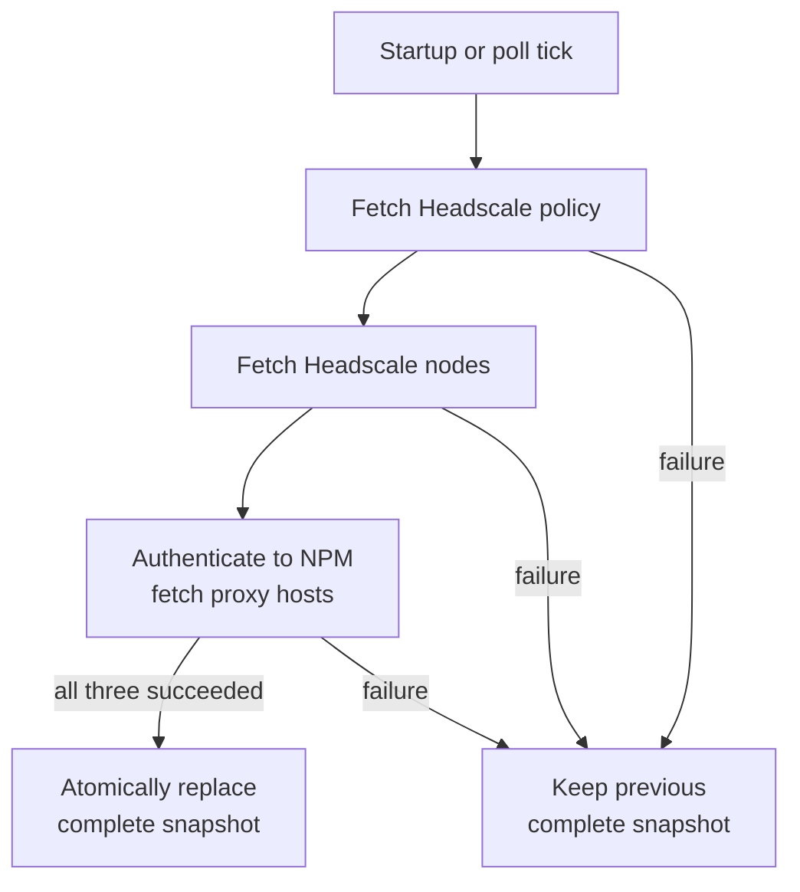
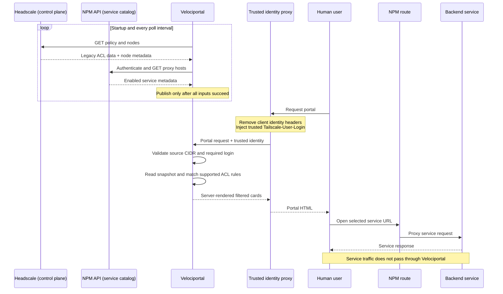

# How it works

Velociportal separates **control-plane refreshes**, **identity-aware portal requests**, and **service traffic**. Portal rendering reads one immutable in-memory snapshot and never waits on Headscale or NPM.

## Control plane: complete snapshot refresh

Success and failure are written on the paths; green or neutral styling is only supplemental.

- The default poll interval is `30s`.
- Each upstream call has a `10s` context timeout.
- A refresh is **all-or-nothing**: policy, nodes, and proxy hosts must all succeed before publication.
- Startup performs an immediate refresh. If it fails and there is no earlier in-process snapshot, portal requests and `/healthz` remain unavailable until a later refresh succeeds.
- The cache is not persisted. A process restart always starts cold.

## Identity, control, and service sequence

Every participant includes its role in text. Velociportal predicts visibility; Headscale, NPM, the IdP, and the backend continue to enforce access.

## Request decision path

1. Parse the TCP source address.
2. Reject the request with `403` unless it is inside `TRUSTED_PROXY_CIDR`.
3. Require `Tailscale-User-Login`; a missing identity from a trusted source returns `401`.
4. Preserve a fully qualified login exactly. Short or bare legacy forms are accepted only when the trusted header itself uses that form.
5. Resolve supported policy groups for that identity.
6. Evaluate enabled NPM proxy hosts against supported legacy ACL `accept` rules.
7. Sort matching cards and render HTML server-side.
8. Let embedded htmx refresh the card grid every 60 seconds without turning the app into an SPA.

[See the accepted and rejected routes →](../reference/tailscale-headers.md)

## Matching boundary

The current join compares NPM `forward_host` with supported ACL destinations. It can resolve:

- Exact hostnames and IP addresses
- CIDRs
- Policy host aliases
- Destination tags resolved to node IPs
- `*`
- `autogroup:self`

It does **not** evaluate Grants, NPM access lists, protocols, or destination ports. `autogroup:internet` and unsupported autogroups fail closed. Human identities do not inherit `tag:*` source membership from `tagOwners` or from tags on nodes they own.

!!! warning "Validate the join on real data"
    NPM may store a Docker DNS name such as `grafana`, while Headscale destinations resolve to an IP address or tag. The current join is covered by fixtures but has not been proven end-to-end. See [Known Limitations](../reference/known-limitations.md).

## Health endpoint

`GET /healthz` returns:

- **`200`** when a complete snapshot exists and is no older than three poll intervals.
- **`503`** when the cache is empty or stale.

A successful health response means Velociportal has a recent complete snapshot. It does not prove that every rendered card is reachable, that each generated URL uses the correct public scheme, or that the matcher reflects unsupported policy features.
