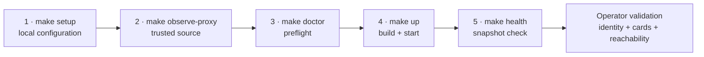

# Guided setup

Use this path for the current **Headscale + Nginx Proxy Manager (NPM)** implementation. It keeps configuration local, makes the trusted proxy source an explicit decision, runs preflight checks before deployment, and ends at the real `/healthz` endpoint.

<div class="vp-chip-row" aria-label="Setup scope">
<span class="vp-chip vp-chip--supported">Supported adapter pair</span>
<span class="vp-chip vp-chip--security">Trusted proxy required</span>
<span class="vp-chip vp-chip--validation">Production validation still required</span>
</div>

!!! warning "What this setup does not prove"
    A healthy process proves that Velociportal has a recent complete snapshot. It does not prove that the current NPM `forward_host` join matches your real Headscale destinations, that every card URL is correct, or that the matcher models every part of your policy. Complete the validation matrix at the end.

## The canonical command path

<ol class="vp-command-path" aria-label="Guided setup command sequence">
<li><code>make setup</code><span>Prepare local configuration.</span></li>
<li><code>make observe-proxy</code><span>Identify the proxy source Velociportal will trust.</span></li>
<li><code>make doctor</code><span>Run configuration and deployment preflight checks.</span></li>
<li><code>make up</code><span>Build and start the Compose deployment.</span></li>
<li><code>make health</code><span>Check the current snapshot health.</span></li>
</ol>



<p class="vp-diagram-note">The numbered labels preserve the sequence without relying on color. Stop when a step fails; do not widen the trusted CIDR or bypass a preflight check just to continue.</p>

## What the guided path automates

<div class="grid cards" markdown>

-   :material-form-textbox-password: **Local, hidden setup**

    The wizard accepts API credentials through hidden terminal input and atomically writes an owner-only environment file. It never puts secrets in command-line flags.

-   :material-radar: **Exact proxy observation**

    A temporary one-time URL records only the immediate TCP peer. Forwarded and identity headers are ignored, and the exact `/32` or `/128` is written only after confirmation.

-   :material-stethoscope: **Real preflight diagnostics**

    Doctor validates configuration, file mode, upstream calls, complete snapshot construction, join coverage, and optional identity previews through the real matcher.

-   :material-heart-pulse: **Health-gated startup**

    Compose waits for the static binary's built-in health client to receive HTTP 200 from `/healthz`, which requires a recent complete snapshot.

</div>

## Before you begin

You need:

- A local Git checkout, GNU Make, Docker Engine, and Docker Compose **2.30 or newer** (`up --wait` and raw env-file format are required).
- A reachable Headscale server and an API key created with an appropriate expiry.
- A reachable NPM instance, at least one enabled proxy host, and credentials for an account that can list proxy hosts.
- A trusted component that strips client-supplied identity headers and injects `Tailscale-User-Login` for a human user.
- A private path from that identity proxy to the loopback-published Velociportal port.

!!! danger "Do not start by exposing port 8080"
    The repository Compose deployment publishes `127.0.0.1:8080:8080`. Keep that loopback-only boundary. If network clients can reach the raw application port, they can attempt to forge identity headers.

!!! warning "The Docker host is inside this trust boundary"
    Docker NAT presents host-originated connections as the private bridge gateway. Any other process with access to host loopback, including a host-network container, can therefore appear to come from the same trusted `/32` as a host identity proxy. Use this topology only when the Docker host and its local workloads are trusted. For stronger isolation, put the identity proxy and Velociportal on a dedicated private container network, trust only the proxy's stable address, and remove host port publication.

## 1. Prepare configuration

From the repository root:

```bash
make setup
```

Answer the prompts. API keys and passwords use hidden terminal input; existing hidden values can be preserved without displaying them. The wizard validates each answer and atomically writes `.env` with mode `0600`. It intentionally leaves `TRUSTED_PROXY_CIDR` unset until the observation step.

| Variable | Purpose | Safe guidance |
|---|---|---|
| `HEADSCALE_URL` | Headscale base URL | Do not append `/api/v1` |
| `HEADSCALE_API_KEY` | Bearer credential | Use an expiring key and protect the file |
| `NPM_URL` | NPM base URL | Plain HTTP only on an isolated local/container network |
| `NPM_EMAIL` | NPM login identity | Prefer a dedicated least-privilege account |
| `NPM_PASSWORD` | NPM login secret | Never commit it |
| `LISTEN_ADDR` | Process listener | Compose sets `0.0.0.0:8080` inside the container |
| `POLL_INTERVAL` | Refresh cadence | Go duration from `5s` through `24h`; default is `30s` |
| `TRUSTED_PROXY_CIDR` | Source allowed to assert identity | Fill this after observing the real proxy path |

Confirm the local environment file is readable only by the account that operates the deployment.

## 2. Observe the trusted proxy source

Run:

```bash
make observe-proxy
```

The command runs the observer on the same stable Compose network the production service will use, prints a cryptographically random one-time **path**, and waits for one request. Append that path to the existing browser-facing origin of the **final identity-aware proxy** you intend to use in production; do not browse directly to the temporary listener. Velociportal ignores forwarded and identity headers, derives an exact `/32` or `/128` only from the immediate TCP peer, shows the proposal, and asks for explicit confirmation before updating `TRUSTED_PROXY_CIDR` in `.env`.

Do not assume:

- Host loopback remains `127.0.0.1` inside a bridged container.
- Every Docker deployment uses the same bridge gateway.
- The entire `100.64.0.0/10` tailnet is safe to trust with identity injection.
- A correct header name is trustworthy without a source-address boundary.

!!! danger "A broad CIDR is not a troubleshooting shortcut"
    If the request is rejected, observe the actual path. Do not expand `TRUSTED_PROXY_CIDR` to a LAN, Docker supernet, or whole tailnet unless every address in that range is intentionally trusted to assert another user's identity.

## 3. Run preflight checks

```bash
make doctor
```

To preview the card sets for two identities through the real matcher:

```bash
make doctor DOCTOR_ARGS='--identity alice@example.com --identity bob@example.com'
```

Resolve every failed check before continuing. In particular, verify that:

- Required configuration values are present.
- URLs point to reachable services from the container's network path, not to a sibling container's `localhost`.
- The Compose host publication remains loopback-only.
- `TRUSTED_PROXY_CIDR` is explicit and narrow.
- NPM credentials are not sent over plain HTTP outside an isolated local/container network.

A passing preflight does not remove the [known matcher and deployment limitations](../reference/known-limitations.md).

## 4. Build and start

```bash
make up
```

The repository deployment builds from source because no public container image is currently published. The resulting container is non-root, read-only, and based on `FROM scratch`; it contains no shell, curl, or wget.

If startup fails, inspect the deployment output and confirm all three upstream calls can complete: Headscale policy, Headscale nodes, and NPM proxy hosts. The cache publishes only after all three succeed.

## 5. Check snapshot health

```bash
make health
```

`GET /healthz` reports:

- **`200` — healthy snapshot:** a complete snapshot exists and is newer than three poll intervals.
- **`503` — unavailable or stale:** the cache is empty or too old.

A restart begins with an empty in-memory cache. If Headscale or NPM is unavailable, health remains `503` until one complete refresh succeeds.

## Validate before relying on the portal

Use this matrix for the first real deployment:

| Test | Expected result | Why it matters |
|---|---|---|
| User A through the trusted proxy | Only User A's supported ACL matches appear | Proves one identity/group path |
| User B with different groups | A meaningfully different card set | Detects identity collapse or over-broad matching |
| Direct request bypassing the proxy | `403 untrusted source` | Tests the anti-spoofing boundary |
| Trusted-source request without `Tailscale-User-Login` | `401 no identity` | Confirms identity is required |
| Every rendered card | Link opens with the correct public scheme and host | Current cards reuse NPM `forward_scheme` |
| Each visible and hidden service | Compare with actual Headscale connectivity | A card is only a visibility prediction |
| NPM `forward_host` values | Compare with resolved ACL destinations | The join may fail when Docker names and IPs differ |

!!! success "Setup complete means validated, not merely running"
    Record the observed proxy source, two opaque identity labels, and any `forward_host` mismatches without recording secrets or personal data. Until the [real-deployment worksheet](validation.md) is complete, preserve the project status: fixture-tested, not proven end-to-end.

## Next steps

- [Generate an explainable validation report](validation.md)
- [Deploy on TrueNAS SCALE](../guides/truenas-scale.md)
- [Understand the identity trust boundary](../reference/tailscale-headers.md)
- [Review every known limitation](../reference/known-limitations.md)
- [Use the CLI and Make target reference](../reference/cli.md)
