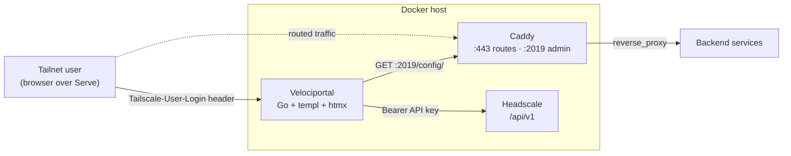
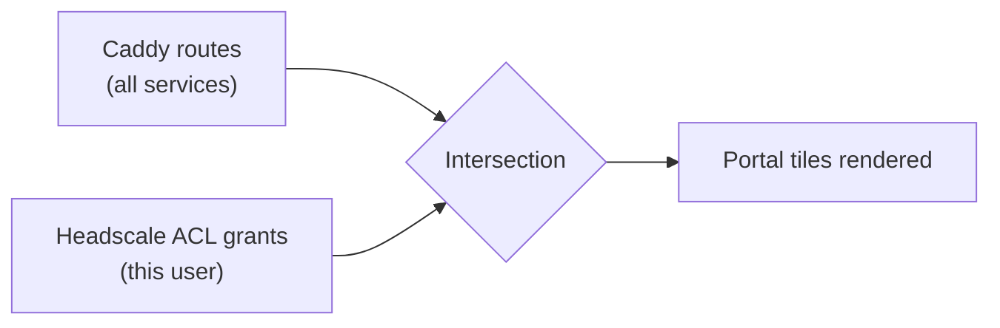

# Headscale + Caddy Reference Architecture

!!! warning "Planned integration — not yet implemented"
    Caddy support is on the Velociportal roadmap. The reference proxy today is Nginx Proxy Manager (NPM). This page documents the *intended* design so you can plan ahead. Config paths, header names, and discovery logic may change before release.

!!! info "Velociportal complements your IdP — it does not replace it"
    Velociportal is a visibility layer. It reads Headscale ACLs and Caddy routes to render a per-user portal of the services a person can reach. Authentication and authorization still belong to your identity provider and to the Tailscale ACL layer. Velociportal never issues sessions, mints tokens, or gates access.

## Why Caddy instead of NPM

| Concern | NPM | Caddy |
|---|---|---|
| Config source | REST API (credential JWT) | Caddyfile + admin API (JSON) |
| Read-only token | None (full-access JWT only) | Admin API is local-only by default |
| HTTPS | Manual per-host certs | Automatic |
| Access control | Built-in access lists | None — delegate to Tailscale ACLs |

The last row is the important one. Caddy has no per-route access lists, so **all access control lives in your Headscale ACL policy**. Velociportal reads both layers and shows each user only what their tailnet grants allow.

## Architecture



Velociportal pulls two inputs:

1. **Caddy admin API** (`localhost:2019/config/`) — the live route table: which hostnames map to which upstreams.
2. **Headscale REST API** (`/api/v1`, Bearer key) — groups, tags, and ACL grants that decide who may reach each service.

It joins them and renders a portal. Identity comes from the `Tailscale-User-Login` / `-Name` / `-Profile-Pic` headers that Tailscale Serve injects.

!!! note "Identity header limits"
    Serve headers only exist for **human users over the tailnet**. Tagged devices and Funnel traffic carry no identity header — those requests render the anonymous/public portal view.

## Example Caddyfile

=== "Caddyfile"

    ```caddy
    {
        # Admin API — bound to loopback so only local containers reach it.
        # Velociportal reads service discovery from here.
        admin localhost:2019
    }

    # Each site block = one discoverable service.
    npm.example.com {
        reverse_proxy npm:81
    }

    grafana.example.com {
        reverse_proxy grafana:3000
    }

    vault.example.com {
        reverse_proxy vault:8200
    }

    # Velociportal itself, served over Tailscale Serve upstream.
    portal.example.com {
        reverse_proxy velociportal:8080 {
            # Forward the Serve identity headers through to the portal.
            header_up Tailscale-User-Login {http.request.header.Tailscale-User-Login}
            header_up Tailscale-User-Name {http.request.header.Tailscale-User-Name}
            header_up Tailscale-User-Profile-Pic {http.request.header.Tailscale-User-Profile-Pic}
        }
    }
    ```

=== "What Velociportal sees"

    Each `site` block becomes one portal tile, keyed by hostname. The `reverse_proxy` upstream is used only to detect health/reachability — never shown to end users.

!!! tip "Automatic HTTPS"
    With real public DNS, Caddy provisions certificates on its own — no cert config needed. Over a pure tailnet you can front Caddy with `tailscale serve` and let Tailscale terminate TLS instead.

## Docker Compose

```yaml
services:
  headscale:
    image: headscale/headscale:latest
    command: serve
    volumes:
      - ./headscale/config:/etc/headscale
      - ./headscale/data:/var/lib/headscale
    ports:
      - "8080:8080"   # Headscale API + coordination
    restart: unless-stopped

  caddy:
    image: caddy:2
    volumes:
      - ./caddy/Caddyfile:/etc/caddy/Caddyfile
      - ./caddy/data:/data
      - ./caddy/config:/config
    ports:
      - "443:443"
      # :2019 is intentionally NOT published to the host —
      # only sibling containers on the compose network reach it.
    restart: unless-stopped

  velociportal:
    image: velociportal:latest
    environment:
      CADDY_ADMIN_URL: "http://caddy:2019"
      HEADSCALE_API_URL: "http://headscale:8080/api/v1"
      HEADSCALE_API_KEY: "${HEADSCALE_API_KEY}"
    depends_on:
      - caddy
      - headscale
    restart: unless-stopped

networks:
  default:
    name: velociportal-net
```

!!! danger "Keep the admin API off the public interface"
    Caddy's admin API has no authentication. Never publish `:2019` to the host or the internet. Reach it only over the internal Docker network (`http://caddy:2019`) as shown above.

## How Velociportal reads Caddy

Service discovery is a single GET against the admin API:

```bash
curl -s http://caddy:2019/config/ | jq '.apps.http.servers'
```

The route table lives under `apps.http.servers.<server>.routes`. Each route's `match[].host` gives the discoverable hostnames, and `handle[].upstreams` gives the backend:

```json
{
  "match": [{ "host": ["grafana.example.com"] }],
  "handle": [{
    "handler": "subroute",
    "routes": [{
      "handle": [{
        "handler": "reverse_proxy",
        "upstreams": [{ "dial": "grafana:3000" }]
      }]
    }]
  }]
}
```

Velociportal's discovery loop:

1. `GET /config/` → parse `apps.http.servers.*.routes`.
2. Extract each `match.host` as a service hostname.
3. Cross-reference each hostname against Headscale ACL grants for the requesting user.
4. Render only the tiles that user's tailnet access permits.

!!! note "Poll, don't assume"
    Caddy config is mutable at runtime. Velociportal re-reads `/config/` on an interval (and can subscribe to changes via the admin API) so the portal stays in sync with live routes.

## Access control model

There are no NPM-style access lists here. A user's visible services are the **intersection** of:

- **Caddy routes** — what is proxied at all.
- **Headscale ACL grants** — what that user's tailnet identity is allowed to reach.



Velociportal only *reflects* this intersection. Enforcement stays where it belongs: the Tailscale ACL layer decides reachability, your IdP decides who each user is.