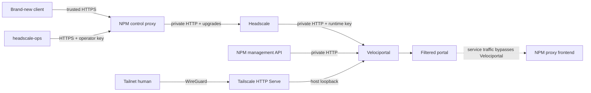

# Headscale + NPM Reference Architecture

This is the only currently implemented adapter pair. Velociportal reads Headscale policy and nodes, reads Nginx Proxy Manager (NPM) proxy hosts, and renders a visibility-only portal.

!!! warning "Validation status"
    The clients, matcher, restricted transport configuration, and request flow have automated coverage. The NPM Headscale control proxy, private Docker confinement, and ACL-to-`forward_host` join have not yet passed real deployment acceptance.

## Three separate paths



1. **Pre-tailnet Headscale control and operations:** existing NPM terminates trusted HTTPS and proxies to Headscale.
2. **Velociportal runtime reads:** direct HTTP over the private named Docker network; runtime bypasses NPM.
3. **Portal browser ingress:** Tailscale HTTP Serve over WireGuard; NPM does not assert portal identity.

## Named private bridge with egress

The production bundle creates:

```text
velociportal-upstreams
```

Attach existing apps through TrueNAS-managed network settings:

| App | Exact alias | Port |
|---|---|---:|
| Headscale | `headscale.velociportal.internal` | `8080` |
| NPM | `npm.velociportal.internal` | `81` |

TrueNAS catalog apps render a selected UI-managed network as their only service network. The bridge therefore provides outbound NAT and Docker DNS as well as private alias traffic; a normal user-defined bridge does not publish container ports to the LAN. Attach Headscale first and verify DERP retrieval, external DNS, and `/health`, then attach NPM and verify its existing listeners, outbound HTTPS, and certificate operations. Headscale port `8080` must use `None`/`Expose` only in the accepted final topology and must never remain published on the LAN. Untrusted containers must not join this bridge.

## Runtime configuration

| Variable | Canonical value | Notes |
|---|---|---|
| `HEADSCALE_URL` | `http://headscale.velociportal.internal:8080` | Exact private Docker alias; base URL without `/api/v1` |
| `HEADSCALE_API_KEY` | `...` | Dedicated Velociportal runtime key; unscoped administrator credential |
| `NPM_URL` | `http://npm.velociportal.internal:81` | Exact private Docker alias |
| `NPM_EMAIL` | `velociportal@example.com` | Dedicated account that can list proxy hosts |
| `NPM_PASSWORD` | `...` | Stored as a secret |
| `LISTEN_ADDR` | `0.0.0.0:8080` | Container listener; host publication remains loopback-only |
| `POLL_INTERVAL` | `30s` | Go duration from `5s` through `24h` |
| `TRUSTED_PROXY_CIDR` | `<ingress-gateway>/32` | Exact immediate source for Tailscale Serve ingress |

Headscale HTTP is accepted only for the implementation's exact local/internal allowlist. All other Headscale locations require verified HTTPS. The allowlist does not prove the deployed route is private; acceptance must prove network attachment, retained upstream egress, exact aliases, no LAN publication or direct routing, and no untrusted bridge members.

Both credentialed clients ignore environment proxy variables, refuse redirects, and bound response headers and bodies. HTTPS uses normal certificate verification with TLS 1.2 or newer. There is no insecure TLS mode.

The base production Compose file has no CA mount. Use the optional private-CA overlay only for a verified-HTTPS upstream whose public root is not already in the image trust store.

## NPM as the Headscale control boundary

Brand-new clients require a trusted HTTPS Headscale URL before they can join the tailnet. The canonical architecture uses split-horizon/private DNS to reach the operator's existing NPM service and an already trusted wildcard certificate obtained through its automated DNS-01 lifecycle. Do not publish the Headscale hostname or address in public DNS; using a wildcard also avoids exact-host disclosure in certificate-transparency logs. This project does not prescribe manual CA creation as the canonical path.

NPM forwards that HTTPS origin to:

```text
http://headscale.velociportal.internal:8080
```

Configure the NPM Proxy Host with WebSocket support and preserve HTTP upgrade behavior. Do not add caching or request transformations that alter Headscale protocol behavior.

This decision makes NPM an explicit trust and availability boundary:

- NPM can observe Headscale client/control traffic.
- NPM can observe workstation operator Bearer API keys after TLS termination.
- NPM failure or certificate-renewal failure can block new enrollment and `headscale-ops`.
- Authorization-header or full-request-header logging must remain disabled.
- NPM database, configuration, and certificate state require tested backup and restore.

If a required pre-tailnet client does not already trust the NPM certificate, stop rather than disabling verification.

Use separate Headscale API keys:

- **Operator key:** used by workstation-only, HTTPS-only `headscale-ops` through NPM.
- **Runtime key:** used only by Velociportal directly over `velociportal-upstreams`.

Headscale v0.29.3 keys are unscoped, so this separation improves rotation and incident response rather than least privilege.

## Browser identity path

The runtime accepts only:

- `Tailscale-User-Login` (required)
- `Tailscale-User-Name` (optional display value)
- `Tailscale-User-Profile-Pic` (optional)

The canonical publisher is the existing TrueNAS Tailscale app with host networking and declarative HTTP Serve:

```text
Tailnet HTTP :8081 -> http://127.0.0.1:18080
```

WireGuard protects ordinary on-path LAN/router/ISP transport. Serve must strip caller-supplied `Tailscale-User-*` headers and inject the authenticated human identity. Velociportal accepts the login only from the exact trusted immediate source. NPM alone cannot derive or assert this human identity.

Endpoint, TrueNAS, NPM, Tailscale/Headscale control-plane, and trusted-host compromise remain in scope.

## HTTPS Serve status

Official Tailscale can automate `*.ts.net` certificates. Headscale automatic HTTPS Serve remains upstream work tracked by [issue #2527](https://github.com/juanfont/headscale/issues/2527) and [PR #3300](https://github.com/juanfont/headscale/pull/3300). Tailnet HTTP Serve over WireGuard is not a release blocker.

## Policy and service join

Velociportal evaluates legacy ACL `accept` rules and compares supported destinations with each NPM record's `forward_host`. Ports and protocols are ignored for visibility. Grants and NPM access lists are not evaluated.

An RFC1918 destination still needs an advertised, Headscale-approved subnet route and client route acceptance; string equality does not create reachability. The policy must also allow intended users to reach the Tailscale Serve node on port `8081`.

Before any support claim, test at least two users with different groups and compare:

1. Cards rendered by Velociportal.
2. Actual connectivity allowed by Headscale.
3. NPM's stored `forward_host` values.
4. Trusted NPM HTTPS behavior for a brand-new client.
5. LAN-negative results for Headscale `8080` and Velociportal `18080`.
6. Restart and backup/restore behavior for NPM, Headscale, Tailscale, and Velociportal.

Start with the [TrueNAS Quickstart](truenas-scale.md), then use [Known Limitations](../reference/known-limitations.md) and [Real deployment validation](../getting-started/validation.md).
