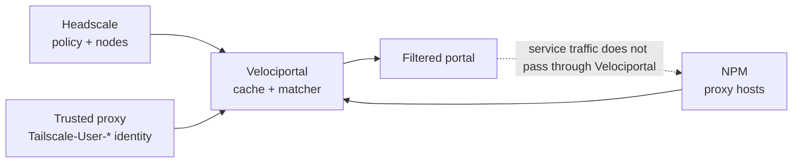

# Headscale + NPM Reference Architecture

This is the only currently implemented adapter pair. Velociportal reads Headscale policy and nodes, reads Nginx Proxy Manager (NPM) proxy hosts, and renders a visibility-only portal.

!!! warning "Validation status"
    The clients, matcher, and request flow are covered by unit and `httptest` fixtures. The ACL-to-NPM `forward_host` join has not yet been validated against a real deployment.

## Architecture



## Required configuration

| Variable | Example | Notes |
|---|---|---|
| `HEADSCALE_URL` | `https://headscale.example.com` | Base URL; no `/api/v1` suffix |
| `HEADSCALE_API_KEY` | `...` | Bearer key |
| `NPM_URL` | `http://npm:81` | Plain HTTP only on an isolated local/container network; use HTTPS when crossing a broader network |
| `NPM_EMAIL` | `velociportal@example.com` | Account that can list proxy hosts |
| `NPM_PASSWORD` | `...` | Stored as a secret |
| `LISTEN_ADDR` | `0.0.0.0:8080` | Required inside the container; publish the host port on loopback only |
| `POLL_INTERVAL` | `30s` | Go duration from `5s` through `24h` |
| `TRUSTED_PROXY_CIDR` | `<observed-proxy-source-ip>/32` | Required; a host proxy reaching a bridged container commonly appears as the Docker bridge gateway, not loopback |

The repository's Compose file already uses:

```yaml
ports:
  - "127.0.0.1:8080:8080"
environment:
  LISTEN_ADDR: 0.0.0.0:8080
```

This distinction matters: `0.0.0.0` is inside the container, while the host publication remains loopback-only.

## Upstream URLs

- Containers on the **same Docker network** can use DNS names such as `http://headscale:8080` and `http://npm:81`.
- A sibling container is **not** `localhost`. Inside Velociportal, `127.0.0.1` means the Velociportal container itself.
- Do not send NPM credentials over plain HTTP across a LAN, tailnet, or public network. Keep HTTP on an isolated local/container network, or terminate HTTPS with a valid certificate.

## Identity path

The runtime accepts only:

- `Tailscale-User-Login` (required)
- `Tailscale-User-Name` (optional display value)
- `Tailscale-User-Profile-Pic` (optional)

The proxy must strip client-supplied versions and inject its own values. Set `TRUSTED_PROXY_CIDR` to the narrowest address or subnet that covers the path actually seen by the application.

!!! danger "Do not guess the trusted CIDR"
    Docker, host networking, and proxy chaining can change the source address. Observe it in Velociportal/proxy logs, `docker inspect`, or a packet capture, then configure that exact `/32` or the smallest necessary subnet. A broad `172.16.0.0/12` or `100.64.0.0/10` copied from an example weakens the anti-spoofing boundary.

## Policy and service join

Velociportal evaluates legacy ACL `accept` rules and compares supported destinations with each NPM record's `forward_host`. Ports and protocols are ignored for visibility. Grants and NPM access lists are not evaluated.

Before rollout, test at least two users with different groups and compare:

1. Cards rendered by Velociportal.
2. Actual connectivity allowed by Headscale.
3. NPM's stored `forward_host` values.

Read [Known Limitations](../reference/known-limitations.md) and the [TrueNAS deployment guide](truenas-scale.md) for the complete operational guidance.
