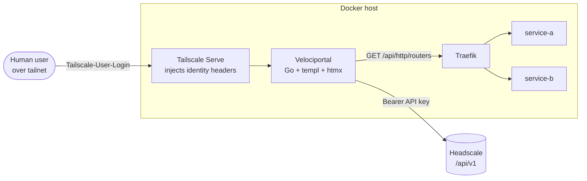

# Headscale + Traefik Reference Architecture

!!! info "Planned integration"
    Traefik support is a **future / planned** integration. Velociportal ships with Headscale + Nginx Proxy Manager (NPM) today. This page documents the target design so the Traefik provider can be built against a stable contract. Placeholder values throughout.

!!! note "Velociportal complements your IdP"
    Velociportal is a **visibility layer**. It reads Headscale ACLs and Traefik routers to render a per-user portal of the services someone can actually reach. It does **not** issue tokens, manage sessions, or replace your identity provider. Keep Authelia / Authentik / Keycloak / your SSO exactly where it is.

## Why Traefik instead of NPM

| | NPM | Traefik |
|---|---|---|
| Service discovery | Manual proxy hosts (DB) | Docker labels or file provider |
| Read API | Credential JWT (`POST /api/tokens`), no scoped token | `GET /api/http/routers` with optional basic auth |
| Access control | Built-in access lists | Tailscale ACLs + middleware |
| Config source | UI / SQLite | Declarative (labels, YAML) |

The key win: Traefik's routing table **is** the source of truth, exposed read-only over its API. No credential-based login, no unscoped admin token.

## Architecture



- **Identity in:** Tailscale Serve injects `Tailscale-User-Login`, `Tailscale-User-Name`, `Tailscale-User-Profile-Pic`. Works only for human users over tailnet Serve — **not** tagged devices, **not** Funnel.
- **Services in:** Velociportal polls Traefik's API for the live router/service table.
- **Policy in:** Velociportal reads Headscale ACLs (huJSON: `groups` / `tagOwners` / `acls` / `grants`) to decide what each user should see.

## Docker Compose

=== "docker-compose.yml"

    ```yaml
    services:
      traefik:
        image: traefik:v3.1
        command:
          - "--api=true"                       # enable API
          - "--api.dashboard=true"
          - "--providers.docker=true"
          - "--providers.docker.exposedbydefault=false"
          - "--entrypoints.web.address=:80"
        ports:
          - "80:80"
          - "8080:8080"                        # API / dashboard
        volumes:
          - /var/run/docker.sock:/var/run/docker.sock:ro
        networks: [web]

      # Example backend, discovered via labels
      service-a:
        image: ghcr.io/example/service-a:latest
        labels:
          - "traefik.enable=true"
          - "traefik.http.routers.service-a.rule=Host(`a.example.com`)"
          - "traefik.http.routers.service-a.entrypoints=web"
          - "traefik.http.services.service-a.loadbalancer.server.port=8000"
        networks: [web]

      velociportal:
        image: ghcr.io/cybersader/velociportal:latest
        environment:
          - TRAEFIK_API_URL=http://traefik:8080
          - HEADSCALE_API_URL=https://headscale.example.com
          - HEADSCALE_API_KEY=${HEADSCALE_API_KEY}
        networks: [web]
        # Exposed to users via Tailscale Serve, not Traefik

    networks:
      web:
        external: false
    ```

=== "Tailscale Serve"

    ```bash
    # Front Velociportal with Serve so identity headers are injected.
    # Human users only — tagged devices and Funnel get no headers.
    tailscale serve --bg --set-path / http://127.0.0.1:8081
    ```

!!! warning "Lock down the Traefik API"
    `--api.insecure` / port `8080` exposes the dashboard. Keep it on an internal Docker network reachable only by Velociportal, or protect it with a middleware. Never Funnel it.

## Reading Traefik for service discovery

Velociportal calls two endpoints and joins them.

=== "List routers"

    ```bash
    curl -s http://traefik:8080/api/http/routers | jq '.[0]'
    ```

    ```json
    {
      "name": "service-a@docker",
      "rule": "Host(`a.example.com`)",
      "service": "service-a",
      "status": "enabled",
      "entryPoints": ["web"]
    }
    ```

=== "List services"

    ```bash
    curl -s http://traefik:8080/api/http/services | jq '.[0]'
    ```

    ```json
    {
      "name": "service-a@docker",
      "status": "enabled",
      "loadBalancer": {
        "servers": [{ "url": "http://172.18.0.4:8000" }]
      }
    }
    ```

=== "Discovery flow"

    ```go
    // Pseudocode
    routers := GET("/api/http/routers")            // name, rule, service, status
    for _, r := range routers {
        if r.Status != "enabled" { continue }
        host := parseHost(r.Rule)                   // Host(`a.example.com`) -> a.example.com
        tile := Service{Name: r.Service, URL: "https://" + host}
        tiles = append(tiles, tile)
    }
    // Then filter tiles by what the Headscale ACL grants this user.
    ```

Parse the `Host(...)` matcher from each router's `rule` to get the public hostname. Skip routers whose `status` is not `enabled`, and ignore Traefik's internal routers (`api@internal`, `dashboard@internal`).

!!! tip "No credentials needed"
    Unlike NPM's `POST /api/tokens` login flow, Traefik's API is read-only GET. If you enable basic auth on the API entrypoint, pass it via a middleware header — Velociportal never needs an admin session.

## Access control

Traefik has no NPM-style access lists. Enforcement stays where it belongs:

- **Network layer:** Tailscale ACLs decide who can reach each host/port. This is the real boundary.
- **App layer:** your IdP (forward-auth middleware) handles authn/authz per service.
- **Velociportal:** reads both to render each user's view — it filters tiles, it does not gate traffic.

!!! note "Visibility, not enforcement"
    A user seeing a tile means the ACL grants reachability. Removing a tile is cosmetic — the ACL and IdP are the gate. Never treat Velociportal as an access control point.

## Status

- [x] Contract defined (routers + services API)
- [ ] Traefik provider implementation
- [ ] `Host()` rule parser (handle `||`, `PathPrefix`, multiple hosts)
- [ ] Router-to-Headscale-grant mapping

Track progress in the Velociportal repo. Contributions welcome against this contract.