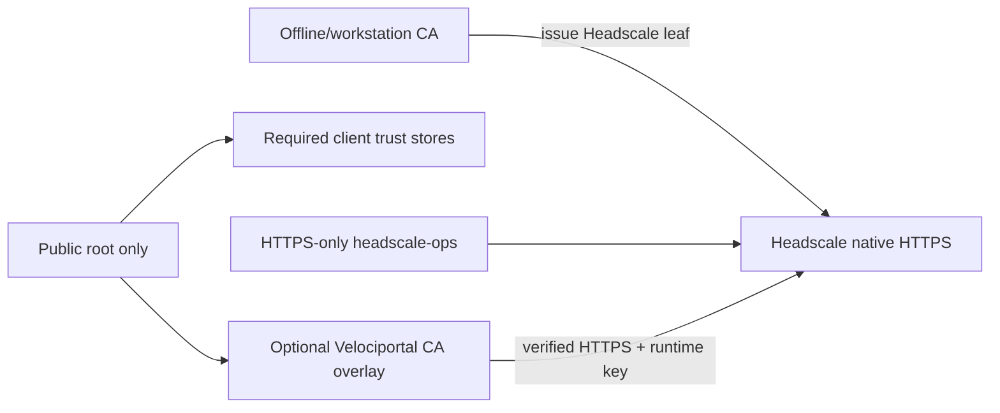

# Optional native Headscale TLS

Native Headscale HTTPS with a private certificate authority remains a supported **alternative**, not the canonical TrueNAS path. The canonical path uses the operator's existing trusted NPM HTTPS certificate lifecycle for pre-tailnet Headscale control and direct private Docker-alias HTTP for Velociportal runtime calls.

Use this alternative only when the operator deliberately wants Headscale itself to terminate HTTPS and every required client can trust the private root before joining.

!!! warning "Verified HTTPS only"
    If any required Tailscale process, browser, workstation tool, or Velociportal container cannot validate the private certificate, stop. Do not fall back to unallowlisted HTTP, disable verification, or transmit API/pre-auth keys over an unverified connection.

## What this alternative changes



Compared with the canonical architecture:

- Headscale terminates HTTPS directly rather than receiving control traffic through NPM.
- `headscale-ops` still uses verified HTTPS only.
- Velociportal sets an HTTPS `HEADSCALE_URL` and may need the optional Compose CA overlay.
- The base Compose stack remains unchanged and has no CA mount.
- No PKI daemon or container is added.
- No insecure TLS mode is added.

NPM may still proxy applications and supply the portal's service catalog. It remains unrelated to portal identity.

## Security and recovery boundary

Keep the CA private key off TrueNAS, NPM, Velociportal, client devices, Git, shared folders, and the router. Distribute only the public root certificate and the service-specific Headscale leaf/key where needed.

No CA state belongs on pfSense/the router. Router replacement restores ordinary DNS and routing only. Back up the CA private key separately in encrypted offline storage and retain Headscale, NPM, policy, Serve, and app state on TrueNAS backups.

A client that trusts a private root trusts every certificate it signs. Use a narrowly purposed root and remove it from retired devices.

## 1. Establish private DNS

Choose a private name such as:

```text
headscale.home
```

Point ordinary private DNS to the TrueNAS address. Do not create WAN forwarding or public exposure solely for this alternative.

Confirm from the administration workstation:

```bash
getent hosts headscale.home
```

## 2. Create and protect a private root

One possible workstation-only tool is `mkcert`. It is not a daemon and does not add a PKI service:

```bash
sudo dnf install mkcert nss-tools
mkcert -install
chmod 700 "$(mkcert -CAROOT)"
chmod 600 "$(mkcert -CAROOT)/rootCA-key.pem"
```

Files:

- `rootCA.pem` — public certificate; distribute only as needed.
- `rootCA-key.pem` — private signing key; keep encrypted and offline-backed-up.

Issue a Headscale leaf:

```bash
mkcert -cert-file headscale.crt -key-file headscale.key headscale.home
chmod 600 headscale.key
```

The exact CA tooling is an operator choice. This project requires verified trust, not a particular manual CA lifecycle.

## 3. Enable native Headscale HTTPS

Use the TrueNAS Headscale app UI to import/select the Headscale leaf and set the external server URL, for example:

```text
https://headscale.home:30210
```

For the previously reviewed TrueNAS Community App revision, Headscale v0.29.3 required the native Headscale variables rather than catalog-emitted `HEADSCALE_SSL_*` names:

| Name | Value |
|---|---|
| `HEADSCALE_TLS_CERT_PATH` | `/certs/headscale.crt` |
| `HEADSCALE_TLS_KEY_PATH` | `/certs/headscale.key` |
| `HEADSCALE_GRPC_LISTEN_ADDR` | `127.0.0.1:50443` |

Reconfirm these details against the deployed app revision before use. Do not duplicate catalog-owned fields.

## 4. Verify before creating credentials

From the administration workstation:

```bash
curl --fail --show-error --cacert "$(mkcert -CAROOT)/rootCA.pem" https://headscale.home:30210/health
curl --fail --show-error https://headscale.home:30210/health
```

Require:

- DNS resolves to the intended private address.
- The certificate SAN contains the intended hostname.
- Explicit-root and system-root verification pass without insecure flags.
- `/health` is healthy.
- Any prior unintended plaintext/LAN publication is removed.

Do not create or transmit an API key until these checks pass.

## 5. Install the public root on every required client

Install only `rootCA.pem` into the system trust store used by the actual Tailscale process. Browser trust alone is insufficient.

For every supported platform:

1. Verify the Headscale HTTPS health URL without a warning.
2. Join a disposable client through that HTTPS URL.
3. Restart the actual Tailscale service/app.
4. Confirm reconnect succeeds.

Mobile apps may reject user-installed roots even when a browser accepts them. If any required client fails, stop rather than disabling verification.

## 6. Bootstrap and separate keys

Create exactly one short-lived first key through the Headscale app shell only after TLS verification:

```bash
/ko-app/headscale apikeys create --expiration 24h
```

Configure workstation-only `headscale-ops` with the direct HTTPS URL, create separate operator and Velociportal runtime keys, and expire the bootstrap key. `headscale-ops` remains HTTPS-only.

## 7. Configure Velociportal HTTPS

Set:

```text
CONTROL_PLANE="headscale"
HEADSCALE_URL="https://headscale.home:30210"
```

If the root is not already in the image trust store, use the optional production overlay:

```bash
VELOCIPORTAL_CA_FILE=/absolute/host/path/rootCA.pem \
  docker compose --env-file stack.env \
  -f compose.yaml -f compose.private-ca.yaml up --detach --wait
```

The overlay mounts one readable public certificate at:

```text
/etc/ssl/certs/velociportal-private-ca.crt
```

Never mount `rootCA-key.pem`, `headscale.key`, a directory, or a combined private-key bundle. The base stack does not mount a CA file.

For local-source diagnostics, `PRIVATE_CA_FILE` activates the repository overlay. It must also reference only the readable public root.

## 8. Keep browser identity separate

Native Headscale TLS does not create portal identity. The canonical browser route remains:

```text
Tailscale HTTP Serve :8081 -> http://127.0.0.1:18080
```

WireGuard protects transport, Tailscale Serve injects human identity, and Velociportal checks the immediate source. NPM is not portal identity.

Official Tailscale can automate `*.ts.net` certificates. Headscale automatic HTTPS Serve remains future upstream work tracked by [issue #2527](https://github.com/juanfont/headscale/issues/2527) and [PR #3300](https://github.com/juanfont/headscale/pull/3300).

## Acceptance gates

| Gate | Required evidence |
|---|---|
| Private DNS | Name resolves to the intended private address |
| Native Headscale TLS | Hostname and chain verify without insecure flags |
| Client trust | Every required Tailscale process enrolls and reconnects |
| Workstation operations | HTTPS-only `headscale-ops status` succeeds |
| Runtime trust | Velociportal reaches Headscale through verified HTTPS using only the public-root overlay when needed |
| Network exposure | Headscale and Velociportal raw ports remain unreachable from the LAN unless explicitly required by this alternative and separately protected |
| Identity path | Tailscale HTTP Serve injects and replaces human identity headers |
| Real validation | Two identities' cards match intended reachability and NPM joins |

This alternative does not create a public support claim. Complete the same [real-deployment validation worksheet](../getting-started/validation.md).

## Related pages

- [Canonical TrueNAS Quickstart](truenas-scale.md)
- [Headscale + NPM architecture](headscale-npm.md)
- [Headscale API reference](../reference/headscale-api.md)
- [Tailscale identity headers](../reference/tailscale-headers.md)
- [Known limitations](../reference/known-limitations.md)
