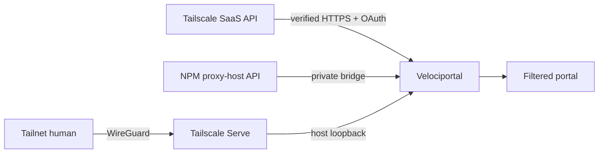

# Tailscale SaaS + NPM

<div class="vp-chip-row" aria-label="Tailscale SaaS status">
<span class="vp-chip vp-chip--validation">Labeled preview</span>
<span class="vp-chip vp-chip--supported">Fixture-tested OAuth adapter</span>
<span class="vp-chip vp-chip--security">Live acceptance pending</span>
</div>

Velociportal can select Tailscale SaaS as its single control plane while continuing to use Nginx Proxy Manager (NPM) as the service catalog. This path is implemented and fixture-tested, but it remains **preview** until the live SaaS acceptance matrix passes.

!!! warning "Preview is not a support claim"
    The adapter has automated coverage for OAuth, policy/user/device conversion, owner mapping, response limits, redaction, and fail-closed policy handling. It has not yet been accepted against a real tailnet with token refresh, revocation, two human identities, actual reachability, and unsupported-policy negative tests.

## Architecture


```mermaid
flowchart LR
    SaaS["Tailscale SaaS API"] -->|"verified HTTPS + OAuth"| VP["Velociportal"]
    NPM["NPM proxy-host API"] -->|"private bridge"| VP
    Human["Tailnet human"] -->|"WireGuard"| Serve["Tailscale Serve"]
    Serve -->|"host loopback"| VP
    VP --> Portal["Filtered portal"]
```

One process selects one provider. Velociportal does not combine a Headscale tailnet with a Tailscale SaaS tailnet in one snapshot.

Compared with the Headscale path:

- Headscale, its private alias, its API key, `headscale-ops`, and the NPM Headscale control proxy are not required.
- NPM remains attached to `velociportal-upstreams` at `npm.velociportal.internal` for service discovery.
- The fixed default Compose network remains Velociportal's preferred route and provides verified HTTPS egress to Tailscale SaaS.
- Browser identity still comes from trusted `Tailscale-User-*` Serve headers. The management API does not authenticate browser requests.
- The one-service/two-network Compose hardening contract does not change.

## OAuth configuration

Use `deploy/velociportal.tailscale.env.example` as the provider-specific runtime file:

```text
CONTROL_PLANE="tailscale"
TAILSCALE_OAUTH_CLIENT_ID="..."
TAILSCALE_OAUTH_CLIENT_SECRET="..."
NPM_URL="http://npm.velociportal.internal:81"
NPM_EMAIL="velociportal@example.com"
NPM_PASSWORD="..."
POLL_INTERVAL="30s"
```

The production adapter is OAuth-only. It does not accept an API key, access token, configurable API origin, or explicit tailnet name.

Create a dedicated OAuth client with exactly these read scopes:

```text
policy_file:read
devices:posture_attributes:read
devices:core:read
users:read
```

Velociportal always calls the fixed verified origin:

```text
https://api.tailscale.com/api/v2
```

It uses the OAuth credential's `-` tailnet alias and calls:

```text
GET /tailnet/-/acl
GET /tailnet/-/users
GET /tailnet/-/devices
```

Access tokens remain in memory only. The client coalesces concurrent refreshes, refreshes about five minutes before expiry, and retries one request after a `401` with a replacement token. A restart starts without a token or cached snapshot.

Never put an access token in the environment file. Keep the OAuth client ID out of public diagnostic output even though it is not normally treated as a secret, and protect the client secret as a credential.

## Policy compatibility

Tailscale SaaS uses the same `legacy_acl_visibility_v1` policy mode as the Headscale adapter.

| Policy construct | Preview behavior |
|---|---|
| Legacy `acls` with `action`, `src`, and `dst` | Evaluated for visibility |
| Destination ports | Stripped; not modeled |
| Protocols | Parsed when syntactically simple, then ignored |
| Empty policy or empty `acls` | Complete snapshot with zero cards |
| Grants | Non-empty section fails the entire refresh |
| Postures, IP sets, service selectors | Non-empty/used constructs fail the entire refresh |
| SSH | Not card evidence; reported as a separate authorization surface |
| Unknown access-control fields or actions | Fail the entire refresh |
| `autogroup:internet` and unsupported source tags | Fail closed in matching |

A failed control-plane or NPM stage never publishes a partial snapshot. A warm process retains the exact previous complete snapshot; a cold process has no snapshot and remains unhealthy.

## User and device mapping

The adapter maps each device owner reference through the users response to one exact `loginName`. That login is the matcher-facing owner identity and must align with `Tailscale-User-Login` supplied by Serve.

The refresh fails rather than guessing when it encounters:

- blank or duplicate user IDs;
- blank or duplicate login names;
- ambiguous ID/login references;
- an unresolved owner reference;
- a duplicate or blank device ID; or
- an untagged device with no owner.

Tagged devices may have no human owner. Device addresses and tags are normalized and deduplicated; unrelated profile data is not retained in the snapshot.

## Deploy on TrueNAS

Follow the [TrueNAS Quickstart](truenas-scale.md), choosing the Tailscale SaaS preview branch:

1. Import the same `deploy/compose.yaml` one-service bundle.
2. Copy `velociportal.tailscale.env.example` to the selected `velociportal.env` path.
3. Attach NPM, but not Headscale, to `velociportal-upstreams` with alias `npm.velociportal.internal`.
4. Keep the fixed ingress network as the preferred gateway for SaaS HTTPS egress.
5. Configure the dedicated least-privilege OAuth client outside Velociportal.
6. Configure Tailscale Serve and the exact trusted proxy source.
7. Run Doctor and schema-v2 validation, then complete live acceptance.

The optional private-CA overlay can still be used when the NPM API uses a private public root. It does not change or replace verification of `api.tailscale.com`.

## Rollback and switching

Provider files are intentionally separate. To roll back, select the prior immutable image and the matching provider-specific environment file. Do not combine both credential families in one runtime file.

The setup wizard prompts for the provider first. When switching providers, it lists the inactive known key names and requires explicit confirmation before deleting them. Refusal or input abort leaves the original file byte-for-byte unchanged; unknown keys are preserved. No plaintext credential backup is created.

## Live acceptance required

Before changing the Tailscale label from preview to supported, record:

- [ ] The exact four OAuth scopes and fixed API origin
- [ ] Successful policy, users, and devices reads through the `-` alias
- [ ] Token refresh beyond the normal one-hour lifetime
- [ ] Revocation behavior and recovery after replacement credentials
- [ ] No client ID, secret, old token, or replacement token in errors or reports
- [ ] Exact owner mapping for at least two human logins
- [ ] Different predicted card sets for those identities
- [ ] Actual Tailscale and NPM reachability parity for visible and hidden services
- [ ] Unsupported Grants, posture, IP-set, and service policies fail closed
- [ ] Cold-start failure, stale-snapshot retention, recovery, and restart behavior
- [ ] Caller-supplied identity headers are replaced by Serve
- [ ] The raw Velociportal port remains unreachable from the LAN
- [ ] Immutable image digest and schema-v2 validation report are recorded

Until those checks pass, describe this path as **implemented preview**, not supported production behavior.

## References

- [Tailscale API reference](../reference/tailscale-api.md)
- [Known limitations](../reference/known-limitations.md)
- [TrueNAS Quickstart](truenas-scale.md)
- [Real-deployment validation](../getting-started/validation.md)
- [Tailscale identity headers](../reference/tailscale-headers.md)
