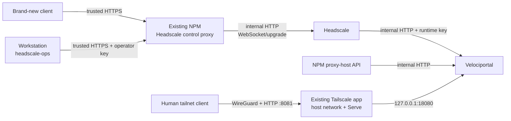

# TrueNAS Quickstart

This is the canonical, linear path for a private **Headscale + Nginx Proxy Manager (NPM) + Velociportal** deployment on TrueNAS SCALE. It is UI-managed: no source build on the NAS and no recurring NAS shell. The only normal app-shell action is the one-time first Headscale API-key bootstrap.

Velociportal remains one read-only container. Headscale, NPM, and the existing Tailscale app remain separate security boundaries. Workstation administration uses HTTPS-only `headscale-ops`.

!!! warning "Release-candidate path"
    The architecture and templates are implemented, but the real TrueNAS acceptance matrix has not passed. No public image, `headscale-ops` release, or support claim is implied until immutable artifacts are published and verified and the full two-identity, NPM-control, restart, reachability, and LAN-negative worksheet succeeds.

## Target architecture



Three paths stay distinct:

1. **Browser ingress:** Tailscale HTTP Serve on tailnet port `8081` forwards to `http://127.0.0.1:18080`. WireGuard protects transport and Serve injects human identity headers. NPM is not portal identity.
2. **Runtime upstreams:** Velociportal reaches Headscale and NPM directly over the named internal Docker network `velociportal-upstreams`.
3. **Pre-tailnet control and operations:** existing NPM provides trusted HTTPS for Headscale clients and HTTPS-only `headscale-ops`, then proxies to Headscale over the internal network.

Tailnet HTTP prevents ordinary on-path LAN/router/ISP interception because the traffic is inside WireGuard. It does not protect against compromised clients, TrueNAS, NPM, Tailscale/Headscale control components, or trusted host workloads.

## What runs where

| Location | Responsibility |
|---|---|
| **TrueNAS UI** | Import Compose, attach app networks/aliases, configure Headscale/NPM/Tailscale, manage datasets, and deploy Velociportal |
| **Existing NPM** | Trusted Headscale HTTPS endpoint and certificate lifecycle; control/API proxy to internal Headscale |
| **One-time Headscale app shell** | Create the first short-lived Headscale API key |
| **Administration workstation** | HTTPS-only `headscale-ops`, policy preparation, client enrollment, and validation |
| **Client devices** | Trust the existing NPM HTTPS endpoint, join Headscale, and browse the portal through Serve |
| **Router/pfSense** | Ordinary DNS and routing only; no CA or application state |

## Before you begin

You need:

- TrueNAS SCALE with Headscale, NPM, and the official Tailscale app already installed.
- Docker Engine **28.0 or newer** and Docker Compose **2.30 or newer** in the selected deployment interface.
- A published, immutable, anonymously verified Velociportal image. If it does not exist yet, stop; do not substitute `latest` or a NAS source build.
- A published, checksum-verified `headscale-ops` release on the administration workstation. If it does not exist yet, stop; the canonical NAS journey does not fall back to a source build.
- An existing NPM hostname and automated certificate lifecycle that brand-new clients already trust before joining the tailnet. The canonical privacy-preserving form uses split-horizon/private DNS plus an existing publicly trusted wildcard certificate obtained with DNS-01; do not publish the Headscale hostname or address in public DNS.
- Two real human test identities and two services with intentionally different visibility.
- Authenticated backup and file-transfer paths, such as TrueNAS-managed snapshots plus SMB for policy and Serve configuration.

Record:

| Value | Example |
|---|---|
| Headscale external hostname | `headscale.example.net` |
| TrueNAS tailnet hostname | `truenas.tail.home` |
| TrueNAS Tailscale IP | `100.64.0.10` |
| Internal Headscale alias | `headscale.velociportal.internal` |
| Internal NPM alias | `npm.velociportal.internal` |
| Velociportal host loopback port | `18080` |
| Tailnet Serve port | `8081` |
| Compose subnet/gateway | `172.31.255.0/24`, `172.31.255.1` |

## 1. Back up and inventory the current services

**Use: TrueNAS UI and NPM UI**

Before changing networks or ports:

1. Back up Headscale configuration, database, keys, and policy storage.
2. Back up the NPM database, configuration, certificates, and the operator's automated certificate-renewal state.
3. Export or record current TrueNAS app settings for Headscale, NPM, and Tailscale.
4. Record current DNS and routing entries.
5. Confirm you can restore each backup without relying on the current router.

No CA state belongs on pfSense/the router. Router replacement should require restoring ordinary DNS and routing only. Durable app, NPM, Headscale, policy, Serve, and Docker-network state belongs on TrueNAS and in backups.

## 2. Import the Velociportal Compose definition so the upstream network exists

**Use: TrueNAS Apps UI, Dockge, Dokploy, or another Compose UI**

Prepare the files from `deploy/` on an administration workstation and transfer them through the authenticated file path:

- `compose.yaml`
- `stack.env` based on `stack.env.example`
- `velociportal.env` based on `velociportal.env.example`
- `tailscale-serve.json.example`
- `policy.hujson.example`

Do not include `compose.private-ca.yaml` in the canonical path. The base stack has no CA mount.

Set an immutable published image in `stack.env`. Keep the fixed subnet, gateway, and trusted proxy values together unless they conflict:

```text
VELOCIPORTAL_SUBNET=172.31.255.0/24
VELOCIPORTAL_GATEWAY=172.31.255.1
VELOCIPORTAL_TRUSTED_PROXY_CIDR=172.31.255.1/32
```

Import the Compose definition with a project name distinct from the repository workflow, such as `velociportal-production`. The import creates the named internal network:

```text
velociportal-upstreams
```

At this stage Velociportal may remain stopped or unhealthy because real upstream aliases and credentials are not configured yet. Do not expose a temporary port or weaken configuration to make it healthy early.

For TrueNAS Custom App YAML, use an include wrapper whose root sets the project name:

```yaml
name: velociportal-production

include:
  - path: /mnt/<pool>/app-config/velociportal/compose.yaml
    project_directory: /mnt/<pool>/app-config/velociportal
    env_file: /mnt/<pool>/app-config/velociportal/stack.env
```

## 3. Attach Headscale and NPM to the internal network

**Use: TrueNAS app network settings**

Edit each existing app through the TrueNAS UI. Do not use recurring `docker network connect` shell commands.

Attach both apps to:

```text
velociportal-upstreams
```

Assign exact aliases:

| App | Alias | Internal port |
|---|---|---:|
| Headscale | `headscale.velociportal.internal` | `8080` |
| NPM | `npm.velociportal.internal` | `81` |

Keep untrusted containers off this network.

For Headscale's API/listener port, set the host bind mode to **None/Expose** or the equivalent UI option. Container port `8080` must be reachable only by attached containers. It must never be published on the TrueNAS LAN address.

Apply each app update and confirm both apps remain running. The external Headscale hostname is configured next; do not publish internal aliases in DNS.

## 4. Set the external Headscale URL to existing NPM HTTPS

**Use: DNS/router UI and Headscale app UI**

Choose the NPM-managed hostname that clients already trust, for example:

```text
https://headscale.example.net
```

Use split-horizon/private DNS so intended pre-tailnet clients on the trusted local network resolve this hostname to NPM. Do not publish an A, AAAA, or CNAME record for the Headscale hostname in public DNS and do not add WAN forwarding.

Set Headscale's external `server_url` or **Headscale Server URL** field to that exact HTTPS origin. Do not set it to the internal Docker alias.

The certificate comes from the operator's existing automated NPM certificate lifecycle. To avoid disclosing the exact internal hostname through certificate-transparency logs, prefer an already trusted wildcard certificate obtained with DNS-01 rather than issuing a public leaf certificate for the Headscale name. This project does not prescribe manual CA creation as the canonical path. If the endpoint is not already trusted by every required joining client, stop. Do not disable certificate verification and do not fall back to plaintext.

## 5. Configure the NPM Headscale control proxy

**Use: NPM UI**

Create or update the Headscale Proxy Host:

| NPM field | Value |
|---|---|
| Domain | External Headscale hostname, such as `headscale.example.net` |
| Scheme | `http` |
| Forward hostname | `headscale.velociportal.internal` |
| Forward port | `8080` |
| WebSocket support | Enabled |
| SSL certificate | Existing automatically managed trusted certificate |
| Force SSL | Enabled |

Preserve normal HTTP upgrade and WebSocket behavior. Do not add caching, body rewriting, or authentication middleware that changes Headscale protocol behavior.

NPM is now an explicit trust and availability boundary:

- It can observe Headscale control traffic.
- It can observe workstation operator Bearer API keys.
- A failed NPM service or certificate renewal can block new enrollment and workstation operations.
- Custom access/error logging must not record `Authorization` or full request headers.
- NPM database, configuration, and certificate state must be included in backup and restore tests.

Do not route runtime Velociportal through this proxy; its dedicated key uses the internal Headscale alias directly.

From the administration workstation, before creating any API key:

```bash
curl --fail --show-error https://headscale.example.net/health
```

Require normal certificate verification and a healthy response. Do not use `--insecure`.

## 6. Bootstrap the first API key once

**Use: one-time Headscale app shell**

Only after the NPM HTTPS endpoint verifies:

```bash
/ko-app/headscale apikeys create --expiration 24h
```

Capture the key privately. This is the only normal Headscale app-shell command. Do not paste it into chat, issue trackers, documentation, or shell history.

## 7. Configure HTTPS-only `headscale-ops` and separate keys

**Use: administration workstation**

Install the checksum-verified `headscale-ops` release. Configure it with the external NPM HTTPS endpoint:

```bash
headscale-ops configure --server-url https://headscale.example.net
headscale-ops status
```

`headscale-ops` remains HTTPS-only in this architecture. It must not connect to the internal HTTP alias or disable verification.

List keys and record the bootstrap key ID:

```bash
headscale-ops apikey list
```

Create a distinct operator key:

```bash
umask 077; headscale-ops apikey create --expiration 2160h >operator-api.key
```

Re-run `headscale-ops configure`, enter the operator key through hidden input, and confirm `headscale-ops status`.

Create a separate Velociportal runtime key:

```bash
umask 077; headscale-ops apikey create --expiration 2160h >velociportal-api.key
```

Expire the bootstrap key:

```bash
headscale-ops apikey expire --id <bootstrap-id> --yes
```

Headscale v0.29.3 keys remain unscoped administrator credentials. Separation improves rotation and incident response; it does not create least privilege. NPM can observe the operator key in transit after TLS termination. The Velociportal runtime key bypasses NPM.

## 8. Configure policy, users, and clients

**Use: workstation plus TrueNAS UI-managed storage**

Prepare a reviewed legacy ACL policy using `deploy/policy.hujson.example` as a seed. Merge into existing policy rather than replacing unrelated rules.

Replace example identities and destinations. The policy must include:

- Two human identities with intentionally different service access.
- Two service destinations that deliberately align with NPM `forward_host` values.
- Permission for both test users to reach the TrueNAS Tailscale IP on TCP port `8081`.

Mount the policy through the Headscale app's UI-managed persistent storage and set Headscale's file-policy fields. Do not edit inside the container.

Use `headscale-ops` from the workstation to create users and one-use pre-auth keys. Join clients using the trusted external URL:

```bash
read -r -s -p 'Pre-auth key: ' TS_AUTHKEY; printf '\n'
sudo tailscale up --login-server=https://headscale.example.net --auth-key="$TS_AUTHKEY"
unset TS_AUTHKEY
```

A brand-new client must validate NPM HTTPS before it can join. If it cannot, stop rather than disabling verification.

For each NPM application host used in validation, ensure `forward_host` aligns with a supported Headscale destination and is actually reachable through the tailnet or an approved subnet route. String equality alone is not reachability.

## 9. Configure declarative Tailscale HTTP Serve

**Use: TrueNAS Tailscale app UI**

Keep **Host Network** enabled. Create `serve.json` from `deploy/tailscale-serve.json.example`, replace the example `truenas.tail.home:8081` `Web` key with the real TrueNAS tailnet hostname and port recorded earlier, then mount the file read-only and set:

```text
TS_SERVE_CONFIG=/config/serve.json
```

The canonical route is:

```text
Tailnet HTTP :8081 -> http://127.0.0.1:18080
```

The official Tailscale app supplies `Tailscale-User-*` identity headers. NPM is not part of this browser path.

Official Tailscale can automate `*.ts.net` certificates. Headscale automatic HTTPS Serve remains future work tracked by [issue #2527](https://github.com/juanfont/headscale/issues/2527) and [PR #3300](https://github.com/juanfont/headscale/pull/3300). Tailnet HTTP Serve over WireGuard is not a release blocker.

Apply the Tailscale app update. Confirm the route returns after a Tailscale app restart before continuing.

## 10. Configure and deploy Velociportal

**Use: Compose UI**

Set `velociportal.env` to the direct internal runtime paths:

```text
HEADSCALE_URL="http://headscale.velociportal.internal:8080"
HEADSCALE_API_KEY="<dedicated-runtime-key>"
NPM_URL="http://npm.velociportal.internal:81"
NPM_EMAIL="velociportal@example.com"
NPM_PASSWORD="<dedicated-npm-password>"
POLL_INTERVAL="30s"
```

The canonical base stack mounts no CA file. Headscale HTTP is accepted because the hostname is the exact internal alias. The implementation's allowlist does not prove network confinement; the acceptance checks below do.

Redeploy the imported Compose project. Require:

- exactly one Velociportal container;
- no `build:` operation;
- an immutable image pull;
- attachment to `velociportal-upstreams`;
- host publication only at `127.0.0.1:18080:8080`;
- read-only root filesystem, dropped capabilities, and non-root user;
- healthy status after a complete upstream snapshot.

Securely remove the temporary runtime-key file from the workstation after storing the secret in the administrator-managed environment file.

## 11. Run required acceptance

### Trusted Headscale control path

- [ ] `https://headscale.example.net/health` verifies without an insecure flag.
- [ ] A brand-new required client can enroll and reconnect through that URL.
- [ ] WebSocket/upgrade-dependent behavior survives the NPM proxy.
- [ ] `headscale-ops status` succeeds through HTTPS only.
- [ ] NPM custom logs do not record authorization headers.
- [ ] Separate operator and Velociportal runtime keys are active; the bootstrap key is expired.

### Internal upstream isolation

First inspect the Headscale app's TrueNAS port settings and record every current or previous host port mapped to container port `8080`; the secure configuration has no such mapping. Do not assume the host port would also be `8080`.

From another LAN system, the raw Velociportal port and every recorded Headscale host port must fail to connect. For example, if `8080` or an older `30210` mapping ever existed:

```bash
curl --connect-timeout 3 http://<truenas-lan-address>:18080/healthz
curl --connect-timeout 3 http://<truenas-lan-address>:8080/health
curl --connect-timeout 3 http://<truenas-lan-address>:30210/health
```

Use a LAN-side TCP scan as supporting evidence that no unexpected Headscale listener remains, and reconcile every open port with the TrueNAS UI rather than treating a failed `:8080` probe as sufficient. Do not expect application `403`; the secure result is no raw network listener on the LAN address. Any Headscale or Velociportal raw-port connection is a hard stop.

### Browser identity and cards

From two real human tailnet clients, open:

```text
http://truenas.tail.home:8081
```

Require intentionally different card sets. Send a caller-supplied `Tailscale-User-Login` through Serve and confirm it does not change the authenticated identity; Serve must strip or replace it.

For every enabled NPM proxy host:

- Record `forward_host` and the supported Headscale destination it joins, or mark it unmatched.
- Confirm each visible and hidden service against actual Headscale reachability for both users.
- Open every generated card and verify the browser-facing URL.
- Confirm RFC1918 destinations have an advertised, approved, and client-accepted subnet route.

### Restart and backup acceptance

Restart, one at a time:

1. Velociportal
2. Tailscale app
3. NPM
4. Headscale
5. TrueNAS

After each restart, repeat health, Headscale HTTPS, Serve, identity, and representative reachability checks. Test restoring NPM configuration/certificate state and Headscale/policy state from backups in a controlled procedure.

Use the complete [real-deployment validation worksheet](../getting-started/validation.md).

## 12. Update, rollback, and router replacement

Never deploy `latest`.

To update Velociportal, change only the immutable image reference, redeploy through the same UI, and repeat acceptance. Velociportal has no database or persistent application volume.

To roll back, restore the prior image reference and redeploy. Preserve:

- `stack.env` and `velociportal.env`;
- Headscale database/configuration/policy;
- NPM database/configuration/certificates;
- TrueNAS network aliases and app settings;
- Tailscale Serve configuration;
- prior image digest and acceptance record.

Router replacement restores ordinary DNS and routing only. No CA or application state should be recovered from the router.

## Hard stops

Stop rather than weakening the design when:

- The required immutable Velociportal or `headscale-ops` artifact is unavailable or unverified.
- The external NPM Headscale certificate is not already trusted by a required client.
- NPM does not preserve Headscale WebSocket/upgrade behavior.
- NPM authorization-header logging cannot be disabled or ruled out.
- Headscale port `8080` or Velociportal port `18080` is reachable through the LAN address.
- Headscale or NPM cannot attach to `velociportal-upstreams` with the exact aliases.
- An untrusted container must share the upstream network.
- The Tailscale app cannot use host networking or declarative Serve.
- Serve does not replace caller-supplied identity headers.
- The policy does not permit intended users to reach Serve port `8081`.
- A service destination is not tailnet-routable or lacks required subnet-route approval.
- The policy uses only Grants or the NPM join does not align with supported destinations.

Never substitute disabled certificate verification, plaintext pre-tailnet Headscale access, a public raw app port, an NPM-only portal identity route, caller-supplied identity headers, a recurring NAS shell workflow, or a source build on the NAS.

## Optional native Headscale HTTPS

If direct native Headscale HTTPS is preferred, follow [Optional native Headscale TLS](private-tls.md) and add `compose.private-ca.yaml` only when Velociportal needs a private public root. That is an alternative, not the canonical path, and it adds no PKI service or insecure mode.

## Detailed references

- [Headscale + NPM architecture](headscale-npm.md)
- [Tailscale identity headers](../reference/tailscale-headers.md)
- [Real-deployment validation](../getting-started/validation.md)
- [Known limitations](../reference/known-limitations.md)
- [CLI and diagnostic reference](../reference/cli.md)
- [Optional native Headscale TLS](private-tls.md)
