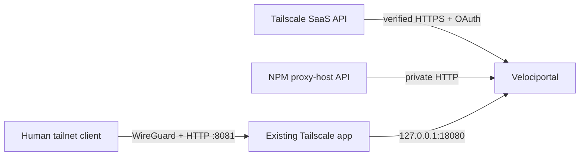

# TrueNAS Quickstart

This is the canonical, UI-managed TrueNAS SCALE path for one Velociportal container plus Nginx Proxy Manager (NPM) and one selected control plane. **Headscale is the supported implementation path. Tailscale SaaS is an implemented preview until live acceptance passes.** There is no source build on the NAS and no recurring NAS shell.

Velociportal remains one read-only container. The selected control plane, NPM, and the existing Tailscale app remain separate security boundaries. Headscale mode retains the one-time first API-key bootstrap and HTTPS-only workstation `headscale-ops`; Tailscale mode uses a dedicated externally managed OAuth client and needs neither Headscale nor `headscale-ops`.

!!! warning "Release-candidate path"
    The architecture and templates are implemented, but the real TrueNAS acceptance matrix has not passed. No public image, `headscale-ops` release, or support claim is implied until immutable artifacts are published and verified and the full two-identity, NPM-control, restart, reachability, and LAN-negative worksheet succeeds.

## Choose the control plane

| Mode | Status | Runtime credentials | Local apps required |
|---|---|---|---|
| `CONTROL_PLANE=headscale` | Supported implementation path; live TrueNAS acceptance pending | `HEADSCALE_URL` + dedicated runtime API key | Headscale + NPM + Tailscale app |
| `CONTROL_PLANE=tailscale` | Labeled preview; live SaaS acceptance pending | Dedicated OAuth client ID/secret with four read scopes | NPM + Tailscale app; Headscale is not required |

One process selects one provider. Do not combine both tailnets or both credential families in one deployment file. Use `deploy/velociportal.env.example` for Headscale or `deploy/velociportal.tailscale.env.example` for Tailscale SaaS.

The full linear procedure below preserves the existing Headscale workflow. Tailscale operators follow the explicit preview branches and skip Headscale-only control-proxy, bootstrap, and `headscale-ops` steps.

## Target architecture

### Headscale supported path


### Tailscale SaaS preview path



Three paths stay distinct:

1. **Browser ingress:** Tailscale HTTP Serve on tailnet port `8081` forwards to `http://127.0.0.1:18080`. WireGuard protects transport and Serve injects human identity headers. NPM is not portal identity.
2. **Runtime upstreams:** NPM stays on `velociportal-upstreams`. Headscale mode also reaches Headscale there; Tailscale mode reaches the fixed SaaS API over the preferred default network.
3. **Pre-tailnet control and operations:** in Headscale mode, existing NPM provides trusted HTTPS for Headscale clients and HTTPS-only `headscale-ops`. Tailscale mode uses the hosted control plane and skips this Headscale-only path.

Tailnet HTTP prevents ordinary on-path LAN/router/ISP interception because the traffic is inside WireGuard. It does not protect against compromised clients, TrueNAS, NPM, Tailscale/Headscale control components, or trusted host workloads.

## What runs where

| Location | Responsibility |
|---|---|
| **TrueNAS UI** | Import Compose, attach app networks/aliases, configure Headscale/NPM/Tailscale, manage datasets, and deploy Velociportal |
| **Existing NPM** | Trusted Headscale HTTPS endpoint and certificate lifecycle; control/API proxy to privately addressed Headscale |
| **One-time Headscale app shell** | Create the first short-lived Headscale API key |
| **Administration workstation** | HTTPS-only `headscale-ops`, policy preparation, client enrollment, and validation |
| **Client devices** | Trust the existing NPM HTTPS endpoint, join Headscale, and browse the portal through Serve |
| **Router/pfSense** | Ordinary DNS and routing only; no CA or application state |

## Before you begin

You need:

- TrueNAS SCALE with NPM and the official Tailscale app installed. Headscale is additionally required only for Headscale mode.
- Docker Engine **28.0 or newer** and Docker Compose **2.33.1 or newer** in the selected deployment interface.
- A published, immutable, anonymously verified Velociportal image. If it does not exist yet, stop; do not substitute `latest` or a NAS source build.
- In Headscale mode, a published checksum-verified `headscale-ops` release on the administration workstation. If it does not exist yet, stop; the canonical NAS journey does not fall back to a source build.
- In Headscale mode, an existing NPM hostname and automated certificate lifecycle that brand-new clients already trust before joining the tailnet. The canonical privacy-preserving form uses split-horizon/private DNS plus an existing publicly trusted wildcard certificate obtained with DNS-01; do not publish the Headscale hostname or address in public DNS.
- In Tailscale mode, a dedicated OAuth client with exactly `policy_file:read`, `devices:posture_attributes:read`, `devices:core:read`, and `users:read`; no API key or pre-created access token.
- Two real human test identities and two services with intentionally different visibility.
- Authenticated backup and file-transfer paths, such as TrueNAS-managed snapshots plus SMB for policy and Serve configuration.

Record:

| Value | Example |
|---|---|
| Headscale external hostname | `headscale.example.net` |
| TrueNAS tailnet hostname | `truenas.tail.home` |
| TrueNAS Tailscale IP | `100.64.0.10` |
| Internal Headscale alias | `headscale.velociportal.internal` |
| Internal NPM alias | `npm.velociportal.internal` |
| Velociportal host loopback port | `18080` |
| Tailnet Serve port | `8081` |
| Compose subnet/gateway | `172.31.255.0/24`, `172.31.255.1` |

## 1. Back up and inventory the current services

**Use: TrueNAS UI and NPM UI**

Before changing networks or ports:

1. Back up Headscale configuration, database, keys, and policy storage.
2. Back up the NPM database, configuration, certificates, and the operator's automated certificate-renewal state.
3. Export or record current TrueNAS app settings for Headscale, NPM, and Tailscale.
4. Record current DNS and routing entries.
5. Confirm you can restore each backup without relying on the current router.

No CA state belongs on pfSense/the router. Router replacement should require restoring ordinary DNS and routing only. Durable app, NPM, Headscale, policy, Serve, and Docker-network state belongs on TrueNAS and in backups.

## 2. Import the Velociportal Compose definition so the upstream network exists

**Use: TrueNAS Apps UI, Dockge, Dokploy, or another Compose UI**

Prepare the files from `deploy/` on an administration workstation and transfer them through the authenticated file path:

- `compose.yaml`
- `stack.env` based on `stack.env.example`
- `velociportal.env` based on `velociportal.env.example` for Headscale **or** `velociportal.tailscale.env.example` for the Tailscale preview
- `tailscale-serve.json.example`
- `policy.hujson.example`

Do not include `compose.private-ca.yaml` in the canonical path. The base stack has no CA mount.

!!! danger "RC.1 requires network recreation"
    Docker cannot change an existing network's `Internal` property. Before installing RC.2 over an RC.1 attempt, keep Headscale and NPM detached, delete only the stopped stateless Velociportal Custom App through the TrueNAS UI, and verify that `velociportal-upstreams` disappeared. If it remains, confirm it has zero endpoints and stop for explicit approval before any manual removal. Re-importing RC.2 while the old network remains can reproduce the Headscale DNS failure.

Set an immutable published image in `stack.env`. Keep the fixed subnet, gateway, and trusted proxy values together unless they conflict:

```text
VELOCIPORTAL_SUBNET=172.31.255.0/24
VELOCIPORTAL_GATEWAY=172.31.255.1
VELOCIPORTAL_TRUSTED_PROXY_CIDR=172.31.255.1/32
```

Import the Compose definition with a TrueNAS Application Name distinct from the repository workflow, such as `velociportal-production`. The import creates the named private bridge:

```text
velociportal-upstreams
```

Headscale and NPM require outbound DNS and HTTPS. The bridge is therefore a normal user-defined Docker bridge rather than `internal: true`; this does not publish attached container ports to the LAN. Velociportal's fixed ingress bridge remains its preferred route through explicit Compose gateway priority.

At this stage the intentionally blank selected-provider secret (`HEADSCALE_API_KEY` or `TAILSCALE_OAUTH_CLIENT_SECRET`), `NPM_EMAIL`, and `NPM_PASSWORD` fail startup validation. After confirming that the networks were created, stop only the Velociportal app to prevent a restart loop. Do not expose a temporary port, add fake credentials, or weaken validation to make it healthy early.

For TrueNAS Custom App YAML, place a `.env` file beside `compose.yaml` and use the proven short-form include wrapper. Set the project identity with the TrueNAS **Application Name** field:

```yaml
include:
  - /mnt/<pool>/app-config/velociportal/compose.yaml
services: {}
```

## 3. Attach the required local upstreams to the private bridge

**Use: TrueNAS app network settings**

Always attach NPM through the TrueNAS UI. Attach Headscale only in Headscale mode. Do not use recurring `docker network connect` shell commands.

TrueNAS catalog renderer library 2.3.4 replaces an app's implicit default network whenever any UI-managed network is selected. The selected bridge must therefore provide the app's outbound NAT and Docker DNS as well as private service traffic. RC.1 incorrectly made this bridge internal; live acceptance showed Headscale losing DERP-map DNS and restart-looping. RC.2 corrects that failure.

In **Tailscale mode**, skip the Headscale attachment and attach only NPM with alias `npm.velociportal.internal`. Verify its management/API health, existing listeners, outbound DNS/HTTPS, certificate operations, and representative proxy hosts. Keep untrusted containers off the bridge, then continue at the Tailscale OAuth preview step below.

In **Headscale mode**, attach **Headscale first** to:

```text
velociportal-upstreams
```

Assign exact aliases:

| App | Alias | Container port |
|---|---|---:|
| Headscale | `headscale.velociportal.internal` | `8080` |
| NPM | `npm.velociportal.internal` | `81` |

Keep Headscale's existing host publication temporarily during this checkpoint. After the update, require Headscale to remain running, fetch its external DERP map, resolve external DNS, and pass `/health`. If any check fails, remove only the added network entry and confirm recovery before continuing.

Only after Headscale passes, attach NPM and verify its management/API health, existing listeners, outbound DNS/HTTPS, certificate operations, and representative proxy hosts. If any check fails, remove only NPM's added network entry. Keep untrusted containers off the bridge.

Set Headscale's host bind mode to **None/Expose** only after its private alias and the trusted NPM HTTPS control path both pass. Container port `8080` must never remain published on the TrueNAS LAN address in the accepted final topology. Do not publish the private aliases in DNS.

## 4. Set the external Headscale URL to existing NPM HTTPS

!!! note "Headscale mode only"
    Tailscale SaaS operators skip steps 4 through 8 and continue at the OAuth preview step.

**Use: DNS/router UI and Headscale app UI**

Choose the NPM-managed hostname that clients already trust, for example:

```text
https://headscale.example.net
```

Use split-horizon/private DNS so intended pre-tailnet clients on the trusted local network resolve this hostname to NPM. Do not publish an A, AAAA, or CNAME record for the Headscale hostname in public DNS and do not add WAN forwarding.

Set Headscale's external `server_url` or **Headscale Server URL** field to that exact HTTPS origin. Do not set it to the internal Docker alias.

The certificate comes from the operator's existing automated NPM certificate lifecycle. To avoid disclosing the exact internal hostname through certificate-transparency logs, prefer an already trusted wildcard certificate obtained with DNS-01 rather than issuing a public leaf certificate for the Headscale name. This project does not prescribe manual CA creation as the canonical path. If the endpoint is not already trusted by every required joining client, stop. Do not disable certificate verification and do not fall back to plaintext.

## 5. Configure the NPM Headscale control proxy

**Use: NPM UI**

Create or update the Headscale Proxy Host:

| NPM field | Value |
|---|---|
| Domain | External Headscale hostname, such as `headscale.example.net` |
| Scheme | `http` |
| Forward hostname | `headscale.velociportal.internal` |
| Forward port | `8080` |
| WebSocket support | Enabled |
| SSL certificate | Existing automatically managed trusted certificate |
| Force SSL | Enabled |

Preserve normal HTTP upgrade and WebSocket behavior. Do not add caching, body rewriting, or authentication middleware that changes Headscale protocol behavior.

NPM is now an explicit trust and availability boundary:

- It can observe Headscale control traffic.
- It can observe workstation operator Bearer API keys.
- A failed NPM service or certificate renewal can block new enrollment and workstation operations.
- Custom access/error logging must not record `Authorization` or full request headers.
- NPM database, configuration, and certificate state must be included in backup and restore tests.

Do not route runtime Velociportal through this proxy; its dedicated key uses the private Headscale alias directly.

From the administration workstation, before creating any API key:

```bash
curl --fail --show-error https://headscale.example.net/health
```

Require normal certificate verification and a healthy response. Do not use `--insecure`.

## 6. Bootstrap the first API key once

**Use: one-time Headscale app shell**

Only after the NPM HTTPS endpoint verifies:

```bash
/ko-app/headscale apikeys create --expiration 24h
```

Capture the key privately. This is the only normal Headscale app-shell command. Do not paste it into chat, issue trackers, documentation, or shell history.

## 7. Configure HTTPS-only `headscale-ops` and separate keys

**Use: administration workstation**

Install the checksum-verified `headscale-ops` release. Configure it with the external NPM HTTPS endpoint:

```bash
headscale-ops configure --server-url https://headscale.example.net
headscale-ops status
```

`headscale-ops` remains HTTPS-only in this architecture. It must not connect to the private HTTP alias or disable verification.

List keys and record the bootstrap key ID:

```bash
headscale-ops apikey list
```

Create a distinct operator key:

```bash
umask 077; headscale-ops apikey create --expiration 2160h >operator-api.key
```

Re-run `headscale-ops configure`, enter the operator key through hidden input, and confirm `headscale-ops status`.

Create a separate Velociportal runtime key:

```bash
umask 077; headscale-ops apikey create --expiration 2160h >velociportal-api.key
```

Expire the bootstrap key:

```bash
headscale-ops apikey expire --id <bootstrap-id> --yes
```

Headscale v0.29.3 keys remain unscoped administrator credentials. Separation improves rotation and incident response; it does not create least privilege. NPM can observe the operator key in transit after TLS termination. The Velociportal runtime key bypasses NPM.

## 8. Configure policy, users, and clients

**Use: workstation plus TrueNAS UI-managed storage**

Prepare a reviewed legacy ACL policy using `deploy/policy.hujson.example` as a seed. Merge into existing policy rather than replacing unrelated rules.

Replace example identities and destinations. The policy must include:

- Two human identities with intentionally different service access.
- Two service destinations that deliberately align with NPM `forward_host` values.
- Permission for both test users to reach the TrueNAS Tailscale IP on TCP port `8081`.

Mount the policy through the Headscale app's UI-managed persistent storage and set Headscale's file-policy fields. Do not edit inside the container.

Use `headscale-ops` from the workstation to create users and one-use pre-auth keys. Join clients using the trusted external URL:

```bash
read -r -s -p 'Pre-auth key: ' TS_AUTHKEY; printf '\n'
sudo tailscale up --login-server=https://headscale.example.net --auth-key="$TS_AUTHKEY"
unset TS_AUTHKEY
```

A brand-new client must validate NPM HTTPS before it can join. If it cannot, stop rather than disabling verification.

For each NPM application host used in validation, ensure `forward_host` aligns with a supported Headscale destination and is actually reachable through the tailnet or an approved subnet route. String equality alone is not reachability.

## Tailscale SaaS preview: configure OAuth and policy

Skip this section in Headscale mode.

Create a dedicated OAuth client outside Velociportal with exactly:

```text
policy_file:read
devices:posture_attributes:read
devices:core:read
users:read
```

Do not create an API key or paste an access token into the environment file. Velociportal always uses `https://api.tailscale.com/api/v2`, requests the credential's `-` tailnet alias, keeps tokens in memory, refreshes early, and retries once after `401`.

Review the real tailnet policy before deployment. ACL-only policies use `legacy_acl_visibility_v1`; accepted safe network Grants select `network_access_visibility_v1` and coexist additively with ACLs. Grant cards require TCP to the exact NPM backend port. Machine-source Grants and attr-only Funnel `nodeAttrs` may load but never become human card evidence. Posture, IP sets, services, non-empty routing `via`, application capabilities, malformed capabilities, and unknown semantics reject the entire refresh. SSH is not card evidence. Legacy ACL ports/protocols remain unmodeled.

Ensure the two test users' exact Tailscale `loginName` values match the `Tailscale-User-Login` values supplied by Serve, and ensure NPM `forward_host` values align with supported policy destinations. Complete token refresh, revocation, owner-mapping, unsupported-policy, and reachability acceptance before changing the preview label.

## 9. Configure declarative Tailscale HTTP Serve

**Use: TrueNAS Tailscale app UI**

Keep **Host Network** enabled. Create `serve.json` from `deploy/tailscale-serve.json.example`, replace the example `truenas.tail.home:8081` `Web` key with the real TrueNAS tailnet hostname and port recorded earlier, then mount the file read-only and set:

```text
TS_SERVE_CONFIG=/config/serve.json
```

The canonical route is:

```text
Tailnet HTTP :8081 -> http://127.0.0.1:18080
```

The official Tailscale app supplies `Tailscale-User-*` identity headers. NPM is not part of this browser path.

Official Tailscale can automate `*.ts.net` certificates. Headscale automatic HTTPS Serve remains future work tracked by [issue #2527](https://github.com/juanfont/headscale/issues/2527) and [PR #3300](https://github.com/juanfont/headscale/pull/3300). Tailnet HTTP Serve over WireGuard is not a release blocker.

Apply the Tailscale app update. Confirm the route returns after a Tailscale app restart before continuing.

## 10. Configure and deploy Velociportal

**Use: Compose UI**

Set `velociportal.env` from exactly one provider example.

=== "Headscale supported path"

    ```text
    CONTROL_PLANE="headscale"
    HEADSCALE_URL="http://headscale.velociportal.internal:8080"
    HEADSCALE_API_KEY="<dedicated-runtime-key>"
    NPM_URL="http://npm.velociportal.internal:81"
    NPM_EMAIL="velociportal@example.com"
    NPM_PASSWORD="<dedicated-npm-password>"
    POLL_INTERVAL="30s"
    ```

=== "Tailscale SaaS preview"

    ```text
    CONTROL_PLANE="tailscale"
    TAILSCALE_OAUTH_CLIENT_ID="<dedicated-oauth-client-id>"
    TAILSCALE_OAUTH_CLIENT_SECRET="<dedicated-oauth-client-secret>"
    NPM_URL="http://npm.velociportal.internal:81"
    NPM_EMAIL="velociportal@example.com"
    NPM_PASSWORD="<dedicated-npm-password>"
    POLL_INTERVAL="30s"
    ```

    Do not add a Tailscale API URL, API key, access token, or explicit tailnet variable.

The canonical base stack mounts no CA or service metadata file. In Headscale mode, HTTP is accepted because the hostname is the exact private Docker alias. The alias suffix does not prove network confinement; the acceptance checks below must prove that no raw LAN publication or unintended direct route exists.

### Optional concrete service names and URLs

Prefer adding the real concrete hostname alongside the wildcard on the **same NPM proxy host**. Velociportal selects the first valid concrete NPM name even when a wildcard appears earlier. Do not create a duplicate NPM proxy host solely for the dashboard because it can create a duplicate card.

If NPM cannot or should not contain the desired browser target, copy `service-metadata.example.json`, key the entry by the existing NPM proxy-host ID, and add `compose.service-metadata.yaml` to the imported Compose files. Set these stack variables through the Compose UI:

```text
VELOCIPORTAL_SERVICE_METADATA_FILE=/mnt/personal/docker-configs/velociportal/velociportal-services.json
VELOCIPORTAL_SERVICE_METADATA_GID=950
```

Keep the existing dataset permissions unchanged: directory `950:950`/`0750`, file `950:950`/`0640`. The overlay adds group `950` only to the Velociportal container, mounts the one file read-only at `/velociportal-services.json`, and refuses to create a missing host path. Do not `chmod`, `chown`, or alter dataset ACLs for this feature. A malformed configured file blocks a cold snapshot and a failed reload preserves the prior complete snapshot.

Metadata changes only display names and browser URLs after policy matching. It cannot create a card, enable an NPM host, change `forward_host`/`forward_port`, or grant access. Wildcard-only services without metadata remain visible with `link needed`; they never produce `%2A` links. NPM `nginx_online` is not backend health, so the portal shows no online dot.

Redeploy the imported Compose project. Require:

- exactly one Velociportal container;
- no `build:` operation;
- an immutable image pull;
- attachment to `velociportal-upstreams`;
- host publication only at `127.0.0.1:18080:8080`;
- read-only root filesystem, dropped capabilities, and non-root user;
- healthy status after a complete upstream snapshot.

Securely remove the temporary runtime-key file from the workstation after storing the secret in the administrator-managed environment file.

## 11. Run required acceptance

### Provider metadata and credentials

- [ ] `CONTROL_PLANE` is explicit.
- [ ] Schema-v3 validation records the expected provider, policy mode, support level, access-rule provenance, and `selection: explicit`.
- [ ] Inactive known provider credentials are absent from the selected environment file.
- [ ] Doctor and validation expose no API key, OAuth client ID/secret, access token, NPM password, or JWT.

### Trusted Headscale control path

Skip this section in Tailscale mode.

- [ ] `https://headscale.example.net/health` verifies without an insecure flag.
- [ ] A brand-new required client can enroll and reconnect through that URL.
- [ ] WebSocket/upgrade-dependent behavior survives the NPM proxy.
- [ ] `headscale-ops status` succeeds through HTTPS only.
- [ ] NPM custom logs do not record authorization headers.
- [ ] Separate operator and Velociportal runtime keys are active; the bootstrap key is expired.

### Tailscale SaaS preview

Skip this section in Headscale mode.

- [ ] Exact four OAuth scopes and fixed API origin recorded.
- [ ] Policy, users, and devices reads succeed through the `-` alias.
- [ ] Token refresh beyond normal expiry, revocation failure, and replacement recovery recorded.
- [ ] Two real `loginName` values map unambiguously through device owner references.
- [ ] ACL/Grant coexistence, exact TCP/backend-port checks, source-tag non-inference, and attr-only Funnel `nodeAttrs` match the live policy.
- [ ] Posture, IP-set, service, routing, application-capability, malformed, and unknown semantics fail the complete refresh.
- [ ] Cold-start failure and stale-snapshot retention/recovery recorded.
- [ ] Support remains labeled preview.

### Private upstream isolation

Always test the raw Velociportal port. In Headscale mode, also inspect the Headscale app's TrueNAS port settings and record every current or previous host port mapped to container port `8080`; the secure configuration has no such mapping. Do not assume the host port would also be `8080`.

From another LAN system, the raw Velociportal port and every recorded Headscale host port must fail to connect. For example, if `8080` or an older `30210` mapping ever existed:

```bash
curl --connect-timeout 3 http://<truenas-lan-address>:18080/healthz
curl --connect-timeout 3 http://<truenas-lan-address>:8080/health
curl --connect-timeout 3 http://<truenas-lan-address>:30210/health
```

Use a LAN-side TCP scan as supporting evidence that no unexpected Headscale listener remains, and reconcile every open port with the TrueNAS UI rather than treating a failed `:8080` probe as sufficient. Do not expect application `403`; the secure result is no raw network listener on the LAN address. Any Headscale or Velociportal raw-port connection is a hard stop.

### Browser identity and cards

From two real human tailnet clients, open:

```text
http://truenas.tail.home:8081
```

Require intentionally different card sets. Send a caller-supplied `Tailscale-User-Login` through Serve and confirm it does not change the authenticated identity; Serve must strip or replace it.

For every enabled NPM proxy host:

- Record `forward_host` and the supported Headscale destination it joins, or mark it unmatched.
- Confirm each visible and hidden service against actual selected-control-plane reachability for both users.
- Open every generated card and verify the browser-facing URL.
- Confirm RFC1918 destinations have an advertised, approved, and client-accepted subnet route.

### Restart and backup acceptance

Restart, one at a time:

1. Velociportal
2. Tailscale app
3. NPM
4. Headscale, only in Headscale mode
5. TrueNAS

After each restart, repeat health, Headscale HTTPS, Serve, identity, and representative reachability checks. Test restoring NPM configuration/certificate state and Headscale/policy state from backups in a controlled procedure.

Use the complete [real-deployment validation worksheet](../getting-started/validation.md).

## 12. Update, rollback, and router replacement

Never deploy `latest`.

The RC.1-to-RC.2 correction is not an ordinary image update: remove only the stopped stateless RC.1 Custom App, verify the old `velociportal-upstreams` network disappeared, and then install RC.2 so Docker creates it with `Internal=false`. Do not attach Headscale or NPM while the old `Internal=true` network exists.

For later updates that do not change immutable Docker-network properties, change only the immutable image reference, redeploy through the same UI, and repeat acceptance. Velociportal has no database or persistent application volume.

To roll back, restore the prior image reference and redeploy. Preserve:

- `stack.env` and the matching provider-specific `velociportal.env`;
- Headscale database/configuration/policy in Headscale mode, or externally managed OAuth-client records in Tailscale mode;
- NPM database/configuration/certificates;
- TrueNAS network aliases and app settings;
- Tailscale Serve configuration;
- prior image digest and acceptance record.

Router replacement restores ordinary DNS and routing only. No CA or application state should be recovered from the router.

## Hard stops

Stop rather than weakening the design when:

- The required immutable Velociportal or `headscale-ops` artifact is unavailable or unverified.
- The external NPM Headscale certificate is not already trusted by a required client.
- NPM does not preserve Headscale WebSocket/upgrade behavior.
- NPM authorization-header logging cannot be disabled or ruled out.
- Headscale port `8080` or Velociportal port `18080` is reachable through the LAN address.
- Headscale or NPM cannot attach to `velociportal-upstreams` with the exact aliases while retaining outbound DNS/HTTPS and normal application health.
- An untrusted container must share the upstream network.
- The Tailscale app cannot use host networking or declarative Serve.
- Serve does not replace caller-supplied identity headers.
- The policy does not permit intended users to reach Serve port `8081`.
- A service destination is not tailnet-routable or lacks required subnet-route approval.
- The policy uses only Grants or the NPM join does not align with supported destinations.
- Tailscale mode requires an API key, stored access token, configurable API origin, broader OAuth scopes, or a policy construct outside `legacy_acl_visibility_v1`.
- A provider switch would delete inactive known keys without explicit confirmation or preserve both credential families in the active file.

Never substitute disabled certificate verification, plaintext pre-tailnet Headscale access, a public raw app port, an NPM-only portal identity route, caller-supplied identity headers, a recurring NAS shell workflow, or a source build on the NAS.

## Optional native Headscale HTTPS

If direct native Headscale HTTPS is preferred, follow [Optional native Headscale TLS](private-tls.md) and add `compose.private-ca.yaml` only when Velociportal needs a private public root. That is an alternative, not the canonical path, and it adds no PKI service or insecure mode.

## Detailed references

- [Headscale + NPM architecture](headscale-npm.md)
- [Tailscale SaaS + NPM preview](tailscale-saas-npm.md)
- [Tailscale API reference](../reference/tailscale-api.md)
- [Tailscale identity headers](../reference/tailscale-headers.md)
- [Real-deployment validation](../getting-started/validation.md)
- [Known limitations](../reference/known-limitations.md)
- [CLI and diagnostic reference](../reference/cli.md)
- [Optional native Headscale TLS](private-tls.md)
