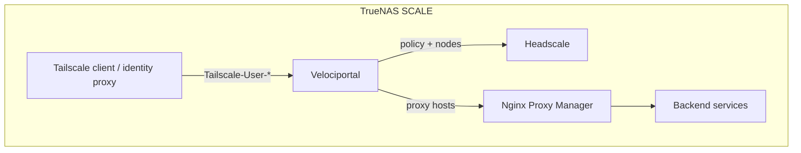
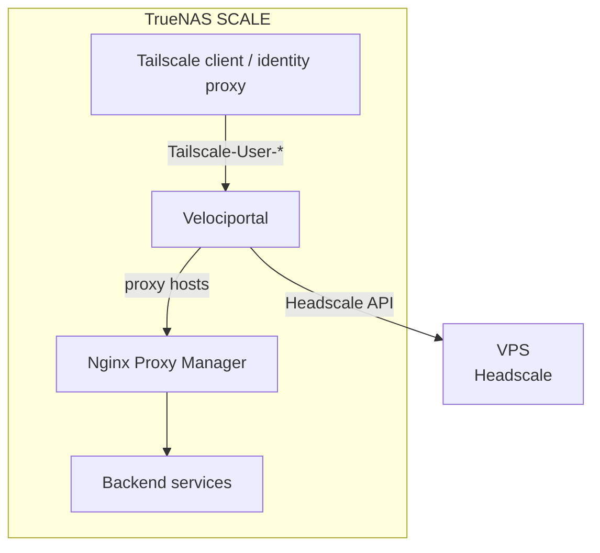

# Deploy on TrueNAS SCALE

This guide deploys the current **Headscale + Nginx Proxy Manager (NPM)** implementation on TrueNAS SCALE.

!!! warning "Validate before relying on it"
    The code is covered by fixture-based tests, but the NPM `forward_host` join and full identity path have not yet been proven against a real installation. Compare the first portal output with actual Headscale connectivity for multiple users.

Velociportal is a visibility layer, not an auth layer. Headscale, NPM, your IdP, and each backend remain responsible for enforcement.

## Recommended path: guided repository deployment

Start with the repository workflow rather than assembling the container configuration from the TrueNAS form by hand:

<ol class="vp-command-path" aria-label="TrueNAS guided deployment sequence">
<li><code>make setup</code><span>Prepare the local environment file.</span></li>
<li><code>make observe-proxy</code><span>Identify the source allowed to assert identity.</span></li>
<li><code>make doctor</code><span>Run configuration and deployment preflight checks.</span></li>
<li><code>make up</code><span>Build and start the loopback-published deployment.</span></li>
<li><code>make health</code><span>Verify that a recent complete snapshot exists.</span></li>
</ol>



<p class="vp-diagram-note">Numbered labels preserve the order without relying on color. Health is not the finish line: compare card visibility with real Headscale reachability and inspect every NPM <code>forward_host</code>.</p>

```mermaid
flowchart LR
    accTitle: Recommended TrueNAS deployment path
    accDescr: Prepare local configuration, observe the final identity proxy source, run preflight checks, build and start the loopback-published Compose deployment, then verify snapshot health and validate multiple users.

    Setup["1 · Setup<br/>local configuration"] --> Observe["2 · Observe<br/>trusted proxy source"]
    Observe --> Doctor["3 · Doctor<br/>preflight checks"]
    Doctor --> Up["4 · Up<br/>build + start"]
    Up --> Health["5 · Health<br/>snapshot status"]
    Health --> Validate["Operator validation<br/>two users + bypass + cards"]

    class Setup,Doctor core
    class Observe identity
    class Up service
    class Health,Validate output
```

!!! success "Guided commands are included"
    The repository Makefile implements all five steps using the production scratch image. Setup uses hidden terminal input; proxy observation and doctor run on the same Compose network as production; observation requires confirmation; and startup waits for the binary-native healthcheck.

Use the rest of this guide to understand the topology and TrueNAS-specific constraints. The manual environment, Compose, and Custom App procedures are advanced fallbacks for operators who cannot use the guided repository path.

## Architecture options

### All services on the NAS



This is the simplest topology. A NAS outage also takes down the co-located services, including Headscale.

### Optional Headscale VPS



Moving Headscale can reduce the control plane's dependence on NAS uptime, but it adds a paid host and another backup/security surface. See [VPS options](vps-headscale.md).

## Prerequisites

- TrueNAS SCALE with shell or SSH access for the guided repository path.
- A Git checkout of this repository, GNU Make, the Docker CLI, and Docker Compose **2.30 or newer** (`up --wait` and raw env-file format are required).
- Headscale reachable from the Velociportal container.
- NPM reachable from the Velociportal container, with at least one proxy host.
- A Headscale API key:

  ```bash
  headscale apikeys create --expiration 90d
  ```

- NPM credentials for an account that can list proxy hosts.
- A trusted component that can inject the supported `Tailscale-User-*` headers.

## Container networking rules

The guided Make path reserves `172.31.255.0/24` with gateway `172.31.255.1` for a stable project bridge. That stability keeps an observed exact host-proxy `/32` valid across `down` and `up`. If this subnet conflicts with an existing route, choose an unused private `/24` and matching first-address gateway consistently for every guided command:

```bash
make observe-proxy VELOCIPORTAL_SUBNET=172.30.254.0/24 VELOCIPORTAL_GATEWAY=172.30.254.1
make doctor VELOCIPORTAL_SUBNET=172.30.254.0/24 VELOCIPORTAL_GATEWAY=172.30.254.1
make up VELOCIPORTAL_SUBNET=172.30.254.0/24 VELOCIPORTAL_GATEWAY=172.30.254.1
```

Do not change those values after confirming `TRUSTED_PROXY_CIDR` without observing the final path again.

### A sibling container is not localhost

Inside the Velociportal container:

- `127.0.0.1` is Velociportal itself.
- A Headscale sibling on the same Docker network is typically `http://headscale:8080`, not `http://localhost:8080`.
- An NPM sibling on the same Docker network is typically `http://npm:81`.
- If the containers do not share a network, use an explicitly routed host, NAS, or tailnet address.

### Keep NPM HTTP local

`NPM_URL=http://npm:81` is appropriate only on an isolated local/container network. NPM authentication sends an account password. If the request crosses a LAN, tailnet, VPS link, or public network, use HTTPS with a certificate the container trusts.

### Host networking prerequisite for the loopback Serve pattern

The repository Compose file publishes Velociportal on **host loopback only**:

```yaml
ports:
  - "127.0.0.1:8080:8080"
```

A `tailscaled` process running on the TrueNAS host can reach that address. If Tailscale runs as a sibling bridged container, its `127.0.0.1` is a different network namespace and cannot reach the host's loopback socket. For the commands in this guide, run Tailscale/Serve in the **host network namespace** (host installation or a container with deliberately reviewed host networking), or design an equivalent private network path and set the trusted CIDR from the address Velociportal actually sees.

Do not put Velociportal itself in host networking with `LISTEN_ADDR=0.0.0.0:8080`; that can expose it on every NAS interface. Prefer a bridged container with loopback-only host publication.

Loopback publication makes the TrueNAS host part of the identity trust boundary: Docker NAT presents host-originated traffic as the bridge gateway, so another local process or host-network container can appear identical to the intended host proxy. Do not run untrusted local workloads in this topology. For stronger isolation, connect the identity proxy and Velociportal directly to a dedicated private container network, trust only the proxy's stable container address, and omit the host port.

## Advanced fallback: manual configuration

Use this section when you cannot follow the guided repository workflow. You are responsible for performing the same trust observation and preflight checks explicitly.

Copy the example file:

```bash
cp .env.example .env
chmod 600 .env
```

Set all values explicitly:

```ini
HEADSCALE_URL=https://headscale.example.com
HEADSCALE_API_KEY=<headscale API key>

# Plain HTTP only on an isolated local/container network.
NPM_URL=http://npm:81
NPM_EMAIL=velociportal@example.com
NPM_PASSWORD=<NPM password>

# Compose overrides this inside the container, but keeping it explicit is clearer.
LISTEN_ADDR=0.0.0.0:8080
POLL_INTERVAL=30s

# Required. Use the source address Velociportal observes inside the container.
# A host proxy commonly appears as the Docker bridge gateway, not loopback.
TRUSTED_PROXY_CIDR=<observed-proxy-source-ip>/32
```

### Select `TRUSTED_PROXY_CIDR` from observed traffic

This required value is the anti-spoofing boundary. Do not assume that all Docker requests use `172.17.0.0/16` or that all Serve requests appear from `100.64.0.0/10`. With the recommended loopback-published bridged container, a host proxy commonly appears from the project network's Docker bridge gateway (for example `172.17.0.1`), not `127.0.0.1`.

1. Trace the actual proxy path.
2. Observe the source address with proxy access logs, `docker inspect`, or a short host packet capture such as:

   ```bash
   sudo tcpdump -ni any 'tcp dst port 8080'
   ```

3. Configure the exact proxy `/32` where possible, or the smallest dedicated subnet.
4. Verify that direct/bypass requests receive `403 untrusted source`.

## Advanced fallback: manual Docker Compose deployment

The repository Compose file builds from source because no public image is currently published.

```bash
ENV_FILE=.env docker compose up -d --build
ENV_FILE=.env docker compose logs -f velociportal
```

It provides:

- Container listener `0.0.0.0:8080`.
- Host publication `127.0.0.1:8080:8080`.
- Read-only root filesystem.
- `no-new-privileges`.
- Restart policy.

The `FROM scratch` image contains no shell, curl, or wget. Its static binary includes a credential-free health client, and Docker invokes it directly as `CMD ["/velociportal", "healthcheck"]`. You can also probe `/healthz` from the host, proxy, or an external monitor.

## Advanced fallback: TrueNAS Custom App

There is no public image yet, so build and push one to a registry the NAS can access:

```bash
docker build -t <registry>/velociportal:latest .
docker push <registry>/velociportal:latest
```

In the Custom App form:

- Use the built image.
- Add the eight configuration variables above.
- Set the container listener to `0.0.0.0:8080`.
- Publish the host port on `127.0.0.1` **only if the TrueNAS UI/version supports an explicit host bind address**.
- If the UI can publish only on all host interfaces, do not expose the port that way. Use Compose or a private app network behind the trusted proxy instead.
- Keep the root filesystem read-only and run as the image's non-root user.

!!! danger "Container-wide listen is not host-wide publication"
    `LISTEN_ADDR=0.0.0.0:8080` is required for a bridged container to accept traffic. It is safe only when the host-side publication remains loopback-only or equivalently private.

## Identity publication

### Tailscale SaaS Serve

On a Tailscale-managed tailnet with HTTPS certificates enabled, host Serve can terminate HTTPS and proxy to the loopback publication:

```bash
tailscale serve --bg --https=443 http://127.0.0.1:8080
```

Tailscale documents that Serve strips incoming `Tailscale-User-*` values and injects trusted identity for human tailnet users. Tagged-device and Funnel requests do not get those headers. See [Tailscale Serve](https://tailscale.com/docs/features/tailscale-serve).

### Headscale and Tailscale Serve HTTPS

Headscale currently tracks native **HTTPS Serve** support as an open feature gap: [headscale#1921](https://github.com/juanfont/headscale/issues/1921). Tailscale's automatic Serve HTTPS relies on its `*.ts.net` DNS and certificate-provisioning flow; TLS on the Headscale control-server URL does not create per-node Serve certificates.

Safe choices are:

1. **Tailnet-only HTTP Serve:** explicitly run an HTTP listener on the tailnet while keeping the backend on host loopback:

   ```bash
   tailscale serve --bg --http=8081 http://127.0.0.1:8080
   ```

   Access it only through the tailnet address/MagicDNS name on port 8081. The tailnet transport remains WireGuard-encrypted, but the browser origin is HTTP rather than HTTPS. Do not expose that listener on the LAN or internet.

2. **An identity-aware HTTPS proxy you operate:** terminate a certificate for a domain you control, derive the caller from the Tailscale LocalAPI/WhoIs path, remove all client-supplied identity headers, and inject only `Tailscale-User-Login`, `Tailscale-User-Name`, and `Tailscale-User-Profile-Pic` before forwarding to loopback. Velociportal does not provide this proxy, and NPM alone does not infer the human tailnet identity.

In either case, verify the actual source address at Velociportal and configure `TRUSTED_PROXY_CIDR` accordingly.

## Policy example

The current matcher supports legacy `acls`, not Grants:

```jsonc
{
  "groups": {
    "group:family": ["alice@example.com", "bob@example.com"],
    "group:admins": ["alice@example.com"]
  },
  "tagOwners": {
    "tag:media": ["group:admins"]
  },
  "acls": [
    { "action": "accept", "src": ["group:family"], "dst": ["tag:media:8096"] },
    { "action": "accept", "src": ["group:admins"], "dst": ["*:*"] }
  ]
}
```

For the media card to match, the NPM proxy host's `forward_host` must line up with an IP resolved for `tag:media` (or another supported destination). If NPM stores `jellyfin` as a Docker DNS name while the policy resolves the tag to `100.64.0.20`, the current matcher will not join them.

Ports and protocols are ignored for card visibility. `tagOwners` does not make an admin human match `src: ["tag:media"]`, and tags on a user's nodes are not inferred as human source identities. `autogroup:internet` fails closed. See [Known Limitations](../reference/known-limitations.md).

## Verify the deployment

1. Check the snapshot health:

   ```bash
   curl -i http://127.0.0.1:8080/healthz
   ```

   `200` means a complete snapshot exists and is newer than three poll intervals. `503` means it is empty or stale.

2. Open the portal through the trusted identity path as two users with different groups.
3. Compare every card with actual Headscale connectivity.
4. Open every generated card URL and confirm its public `http://` or `https://` scheme is correct; the current code reuses NPM's backend `forward_scheme`.
5. Confirm the NPM status dot is only NPM's `meta.nginx_online` value, not an independent backend probe.
6. Send a direct request that bypasses the proxy and confirm it gets `403`.
7. Confirm a trusted request with no `Tailscale-User-Login` gets `401`.

## Backup and outage behavior

### Headscale

Headscale recommends backing up both its configuration and data directories before upgrades. Standard paths are `/etc/headscale` and `/var/lib/headscale`, the latter containing the database and key material. See the [Headscale upgrade guide](https://headscale.net/stable/setup/upgrade/).

- Back up the complete directories or equivalent configured paths, not only `db.sqlite`.
- Use an application-consistent SQLite backup or stop Headscale briefly before copying live database files.
- Keep at least one backup outside the NAS/VPS failure domain. A ZFS snapshot on the same NAS is useful rollback, but it is not an off-host backup.
- Test a restore on a disposable host.

A coordination-server outage does not necessarily drop every established peer connection immediately. Cached keys and policy can keep existing traffic working, while new joins, policy changes, key updates, and connectivity may degrade over time. Tailscale documents the general control/data-plane behavior in [What happens if the coordination server is down?](https://tailscale.com/docs/reference/coordination-server-down). Treat Headscale behavior as something to test for your version and DERP topology.

### Velociportal

Velociportal has no persistent database or volume to back up. Preserve the deployment definition and secrets separately.

- While the process remains running, a failed refresh keeps the previous complete snapshot.
- After a restart, the in-memory snapshot is gone. If Headscale or NPM is unavailable, the portal remains unavailable until a full refresh succeeds.
- A running cache becoming stale eventually makes `/healthz` return `503` even though the last snapshot may still be used for page requests.

## Troubleshooting

### Headscale or NPM connection refused

Check the URL from **inside** the Velociportal container. Replace sibling `localhost` URLs with Docker DNS names or routed addresses.

### NPM login exposed over HTTP

If `NPM_URL` leaves an isolated local/container network, stop and configure HTTPS before continuing.

### `403 untrusted source`

The request source is outside `TRUSTED_PROXY_CIDR`. Observe the real source address; do not fix this by widening the CIDR to an entire LAN or tailnet without proving that every address in it is trusted to inject identity.

### `401 no identity`

The trusted proxy did not supply `Tailscale-User-Login`. The current runtime does not fall back to Authentik, Authelia, `Remote-User`, or `X-Webauth-*` headers.

### Empty portal

Check, in order:

1. The user login/group spelling.
2. That the policy uses legacy `acls`, not only Grants.
3. The NPM `forward_host` value.
4. The resolved ACL destination after tags/hosts/CIDRs.
5. The limitations around ports, protocols, source tags, and autogroups.
