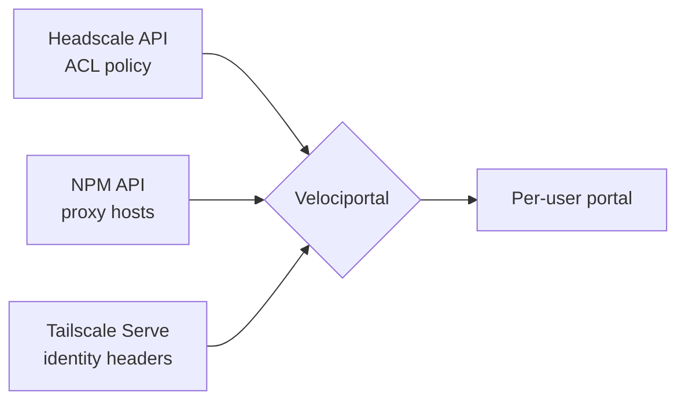

# Velociportal

**See what you can reach. Nothing you can't.**

Velociportal is an identity-aware service dashboard for tailnets. It reads your Headscale/Tailscale ACLs and your Nginx Proxy Manager (NPM) proxy hosts, matches them together, and renders a per-user portal that shows each person only the services their ACLs actually grant. No separate permission list to maintain, no drift between "who can reach it" and "who can see it."

!!! info "Velociportal complements your IdP — it does not replace it"
    Velociportal is a **visibility layer**. It does not authenticate users, issue tokens, or enforce access. Your IdP (and your ACLs, and your reverse proxy) remain the source of truth for *auth*. Velociportal just reads the access rules you already defined and renders them as a usable dashboard. If a user can see a tile, it is because their ACL grants it — the actual gate is still your proxy and IdP.

## Why?

You already define access twice, and you feel it every time someone joins or leaves:

- Your **ACLs** (Headscale/Tailscale huJSON) define who can reach which host and port.
- Your **dashboard** (Homepage, Heimdall, a wiki page) defines who *sees* which link.

These two lists drift. You add a service to the tailnet, forget to add the tile. You revoke a group in ACLs, but the old bookmark still sits on the shared dashboard. Users click links they can't reach and file tickets; new hires can't find services they *can* reach.

Velociportal removes the second list. Access is defined once — in your ACLs — and the portal is derived from it.

## How?



1. **Read the ACLs.** Velociportal pulls the policy from the Headscale REST API (`/api/v1`, Bearer key) — `groups`, `tagOwners`, `acls`, and `grants`.
2. **Read the proxy hosts.** It pulls your published services from NPM (e.g. `headscale.example.com`, `npm.example.com`, `grafana.example.com`).
3. **Match them.** Each proxy host maps to a destination the ACLs describe. Velociportal computes which groups/users are granted that destination.
4. **Identify the viewer.** Behind Tailscale Serve, requests arrive with `Tailscale-User-Login` / `Tailscale-User-Name` / `Tailscale-User-Profile-Pic` headers.
5. **Render.** The user sees a portal containing only the tiles their identity is granted.

=== "What a user sees"

    ```text
    alice@example.com

    ┌────────────┐  ┌────────────┐  ┌────────────┐
    │  Grafana   │  │    NPM     │  │  Headscale │
    │ grafana... │  │ npm.exa... │  │ headsca... │
    └────────────┘  └────────────┘  └────────────┘

    (services alice's ACLs do NOT grant are not shown)
    ```

=== "Deploy (planned)"

    ```yaml
    services:
      velociportal:
        image: velociportal:latest   # single container
        environment:
          HEADSCALE_URL: https://headscale.example.com
          HEADSCALE_API_KEY: ${HEADSCALE_API_KEY}
          NPM_URL: https://npm.example.com
          NPM_EMAIL: ${NPM_EMAIL}
          NPM_PASSWORD: ${NPM_PASSWORD}
        # Publish via Tailscale Serve so identity headers are injected
    ```

!!! warning "Identity only flows over Tailscale Serve"
    The `Tailscale-User-*` headers exist only for **human users** reaching Velociportal over **tailnet Serve**. They are **not** present for tagged devices and **not** present over **Funnel** (public internet). Velociportal is meant to be served inside the tailnet.

!!! note "NPM uses credential auth"
    NPM has no scoped read-only API token. Velociportal authenticates with `POST /api/tokens` using an email/password (ideally a dedicated read-only NPM user) to obtain a JWT. Treat those credentials accordingly.

!!! danger "Status: concept-stage"
    Velociportal is a **concept and design placeholder**. There is **no code yet** — no releases, no container image. This documentation describes intended behavior. Design targets: single Docker container, Go + templ + htmx, minimal dependencies.

## Quick links

- [Concept & Architecture](concept/overview.md) — how the matching works
- [How It Works](concept/how-it-works.md) — step-by-step data flow
- [Alternatives](concept/alternatives.md) — how Velociportal compares to existing tools
- [Reference Architectures](guides/index.md) — Headscale+NPM, Tailscale SaaS, Caddy, Traefik
- [IdP Integrations](integrations/index.md) — Authentik, Authelia, or no IdP
- [API Reference](reference/headscale-api.md) — Headscale, NPM, and Tailscale headers