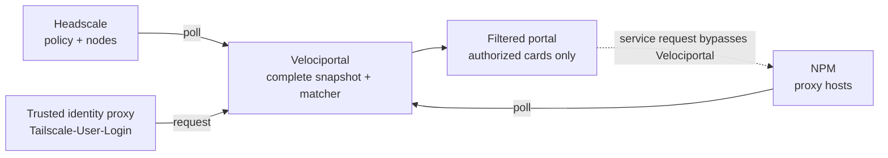

Self-hosted · identity-aware · visibility only

# Your network policy is your dashboard policy.

Velociportal reads Headscale legacy ACL rules and Nginx Proxy Manager proxy hosts, then renders a server-authorized portal for the human identity supplied by your trusted proxy.

[Start the guided setup](getting-started/setup.md){ .md-button .md-button--primary }
[See how trust works](reference/tailscale-headers.md){ .md-button }

Supported: Headscale + NPM
Validation pending: real deployment
Security boundary: trusted proxy

!!! info "Visibility, not enforcement"
    Velociportal does not authenticate users, issue tokens, proxy service traffic, or enforce access. Headscale ACLs, your reverse proxy, your IdP, and each backend remain the security boundaries. A hidden card is not authorization.

## Follow the operator journey

-   :material-rocket-launch-outline: **Set up the supported stack**

    Run the guided sequence from local configuration through health verification.

    [Open guided setup →](getting-started/setup.md)

-   :material-shield-account-outline: **Establish the identity boundary**

    See why trusted proxy traffic is accepted while direct header spoofing is rejected.

    [Review identity headers →](reference/tailscale-headers.md)

-   :material-server-network: **Deploy on TrueNAS SCALE**

    Use the guided Make path first, with manual Compose and Custom App instructions as advanced fallbacks.

    [Deploy on TrueNAS →](guides/truenas-scale.md)

-   :material-alert-circle-outline: **Validate known limitations**

    Compare rendered cards with real Headscale connectivity before relying on the current `forward_host` join.

    [Read the support boundary →](reference/known-limitations.md)

## One snapshot, one request decision

```mermaid
flowchart LR
    accTitle: Velociportal data and request flow
    accDescr: Headscale policy and nodes plus NPM proxy hosts build a complete in-memory snapshot. A trusted identity proxy supplies the user login. Velociportal matches the user to visible services and returns a filtered portal. Service traffic then goes to NPM, not through Velociportal.

    HS["Headscale<br/>policy + nodes"] -->|poll| VP["Velociportal<br/>complete snapshot + matcher"]
    NPM["NPM<br/>proxy hosts"] -->|poll| VP
    Proxy["Trusted identity proxy<br/>Tailscale-User-Login"] -->|request| VP
    VP --> Portal["Filtered portal<br/>authorized cards only"]
    Portal -. "service request bypasses Velociportal" .-> NPM

    class HS control
    class NPM service
    class Proxy identity
    class VP core
    class Portal output
```

Labels name every role; color is only a secondary visual cue. Requests are served from the last complete in-memory snapshot, so page rendering never waits on an upstream API.

<strong>Complete refreshes</strong>Policy, nodes, and proxy hosts must all succeed before the snapshot is replaced.

<strong>Server-side filtering</strong>Unauthorized cards are omitted before HTML is rendered; the browser does not make the decision.

<strong>No app database</strong>State is an atomic in-process snapshot. Restarting starts cold and requires a successful refresh.

## Current support boundary

=== "Implemented"

    - Headscale `GET /api/v1/policy` and `GET /api/v1/node`
    - NPM credential login and proxy-host discovery
    - Legacy ACL `accept` matching for supported identity and destination forms
    - Trusted `Tailscale-User-*` identity headers
    - Responsive server-rendered portal with embedded htmx
    - Single non-root `FROM scratch` container

=== "Not implemented"

    - Tailscale SaaS API support
    - Grants, SSH, posture, capabilities, or protocol evaluation
    - Caddy or Traefik service discovery
    - Direct Authentik, Authelia, `Remote-User`, or `X-Webauth-*` adapters
    - NPM access-list-driven visibility

=== "Must be validated"

    - The NPM `forward_host` join against real Headscale destinations
    - The complete identity-proxy path and observed trusted source address
    - Card visibility for at least two human identities with different groups
    - Every generated card URL, including its browser-facing scheme

!!! warning "Sprint 3 limitation remains"
    The clients, matcher, and request flow are covered by fixtures and `httptest`, but the project has not yet been validated end-to-end against a real Headscale + NPM + identity-proxy deployment. Start with the [guided setup](getting-started/setup.md), then complete its validation matrix.
