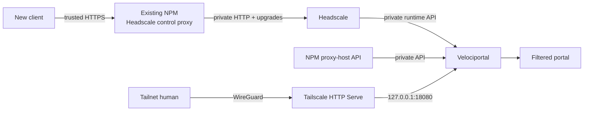

<div class="vp-hero" markdown>

<div class="vp-hero__content" markdown>

<span class="vp-kicker">Self-hosted · identity-aware · visibility only</span>

# Your network policy is your dashboard policy.

<p class="vp-hero__lede">Velociportal reads one selected Headscale or Tailscale SaaS policy source plus Nginx Proxy Manager proxy hosts, then renders server-filtered service cards and, for an available Tailscale SSH projection, separate machine cards for the human identity supplied by Tailscale Serve.</p>

<div class="vp-actions" markdown>
[Start the TrueNAS Quickstart](guides/truenas-scale.md){ .md-button .md-button--primary }
[See how trust works](reference/tailscale-headers.md){ .md-button }
</div>

<div class="vp-chip-row" aria-label="Project status">
<span class="vp-chip vp-chip--supported">Headscale implemented</span>
<span class="vp-chip vp-chip--validation">Tailscale SaaS preview</span>
<span class="vp-chip vp-chip--validation">Live acceptance pending</span>
<span class="vp-chip vp-chip--security">Identity: tailnet Serve</span>
</div>

</div>

<div class="vp-hero__art">

</div>

</div>

!!! info "Visibility, not enforcement"
    Velociportal does not authenticate users, issue tokens, proxy service or SSH traffic, or enforce access. Tailscale Serve, Tailscale SSH, the selected control plane, NPM, destination operating systems, and each backend remain security boundaries. A hidden card is not authorization.

## Canonical TrueNAS shape


```mermaid
flowchart LR
    Client["New client"] -->|"trusted HTTPS"| NPMControl["Existing NPM<br/>Headscale control proxy"]
    NPMControl -->|"private HTTP + upgrades"| HS["Headscale"]
    HS -->|"private runtime API"| VP["Velociportal"]
    NPM["NPM proxy-host API"] -->|"private API"| VP
    Human["Tailnet human"] -->|"WireGuard"| Serve["Tailscale HTTP Serve"]
    Serve -->|"127.0.0.1:18080"| VP
    VP --> Portal["Filtered portal"]
```

The runtime upstream network is the named private Docker network `velociportal-upstreams`:

```text
CONTROL_PLANE=headscale
HEADSCALE_URL=http://headscale.velociportal.internal:8080
NPM_URL=http://npm.velociportal.internal:81
```

Headscale HTTP is accepted only for the implementation's exact local/internal allowlist. Other locations require verified HTTPS. The base Compose bundle has no host mounts; private-CA, service-metadata, and service-health mounts are explicit optional overlays. Strict service metadata can apply presentation-only names/URLs and, in version 2, deterministic categories/order after normal identity and policy matching.

In Headscale mode, existing NPM provides the trusted HTTPS endpoint needed before a client joins the tailnet. Runtime Velociportal bypasses that control proxy; workstation-only `headscale-ops` stays HTTPS-only. Tailscale SaaS preview mode instead uses dedicated OAuth credentials against the fixed verified SaaS origin and does not require Headscale or the NPM Headscale control proxy.

## Follow one operator journey

<div class="grid cards" markdown>

-   :material-server-network: **Start with the TrueNAS Quickstart**

    Create the private bridge, attach Headscale and NPM one at a time through TrueNAS UI settings while verifying egress and health, configure the trusted NPM control proxy, bootstrap separate keys, configure policy and Serve, deploy one container, and run acceptance.

    [Open the Quickstart →](guides/truenas-scale.md)

-   :material-router-network: **Understand Headscale + NPM**

    See the separate pre-tailnet control path, direct runtime path, NPM trust boundary, exact aliases, and backup requirements.

    [Review the architecture →](guides/headscale-npm.md)

-   :material-cloud-outline: **Use Tailscale SaaS preview**

    Configure a dedicated four-scope OAuth client, fixed verified API origin, strict owner mapping, the shared legacy ACL boundary, and the unchanged NPM/Serve deployment shape. Keep the preview label until live acceptance passes.

    [Open the SaaS preview →](guides/tailscale-saas-npm.md)

-   :material-shield-account-outline: **Understand identity trust**

    Learn why HTTP Serve over WireGuard is the canonical browser path, why NPM cannot assert the portal identity, and how bypass attempts are handled.

    [Review identity headers →](reference/tailscale-headers.md)

-   :material-test-tube: **Validate a real deployment**

    Compare two users, NPM joins, card URLs, restart persistence, LAN-negative results, and actual selected-control-plane reachability before making a support claim.

    [Open the validation worksheet →](getting-started/validation.md)

-   :material-certificate-outline: **Use optional native Headscale TLS**

    Native Headscale HTTPS with a private CA remains an alternative. It is not required by the canonical NPM-control-proxy path and adds no PKI service.

    [Review the optional overlay →](guides/private-tls.md)

-   :material-tools: **Develop or diagnose from source**

    Use repository commands for contributors and advanced diagnostics, not as the normal NAS installation path.

    [Open local-source workflow →](getting-started/setup.md)

</div>

## Current support boundary

=== "Implemented"

    - Explicit Headscale or Tailscale provider selection; implicit Headscale warns through v0.2
    - Exact local/internal Headscale HTTP allowlist plus verified HTTPS elsewhere
    - Fixed-origin Tailscale OAuth adapter with strict Users/device-owner mapping, labeled preview
    - Separate hardened provider and NPM transports
    - Named private production bridge, required egress, and direct runtime aliases
    - Optional private-CA overlay; no base-stack CA mount
    - NPM credential login and proxy-host discovery
    - Legacy ACL `accept` matching plus a narrow Tailscale network-Grants subset with exact TCP/backend-port checks
    - Separate Tailscale-preview SSH Machines projection requiring supported SSH plus independent Grant TCP/22 evidence
    - Trusted `Tailscale-User-*` identity headers
    - Responsive server-rendered portal with embedded htmx, presentation-only organization, and bounded optional health labels
    - A username/mobile-More account settings panel with per-identity browser-local preferences, a role- and device-gated Tailscale Machines action, safe-area mobile navigation, and privacy-safe PWA metadata with no offline portal cache
    - Single non-root `FROM scratch` container
    - Portable one-service production bundle for Compose 2.33.1+ and Engine 28+

=== "Not implemented"

    - Headscale automatic HTTPS Serve certificate automation
    - General Grants, broader SSH selectors/user mappings, posture, routing constraints, services, IP sets, or application capabilities
    - Caddy or Traefik discovery
    - Direct Authentik, Authelia, `Remote-User`, or `X-Webauth-*` adapters
    - NPM access-list-driven visibility

=== "Must be validated"

    - Tailscale SaaS OAuth scopes, refresh/revocation, exact Users/device-owner mapping, HTTP-policy and SSH-projection negatives, two-identity service/machine isolation, copied-target parity, and actual HTTP/SSH reachability before preview becomes supported
    - Trusted NPM HTTPS for brand-new Headscale clients and WebSocket/upgrade preservation
    - Headscale port `8080` not published to the LAN
    - Separate operator/runtime API keys and safe NPM logging
    - Policy permission to Serve port `8081` and identity-header replacement
    - Two different human card sets and actual reachability parity
    - Every NPM `forward_host`, generated card URL, restart, and backup/restore path

!!! warning "Fixture coverage is not production proof"
    The clients, matcher, transport, and request flow have automated coverage, but the full TrueNAS acceptance matrix has not run. Tailnet HTTP over WireGuard blocks ordinary on-path LAN/router/ISP interception; it does not eliminate endpoint, NPM, host, or control-plane compromise. Preserve release-candidate status until the [validation worksheet](getting-started/validation.md) passes.

## Router replacement boundary

No CA state lives on pfSense/the router. Restore ordinary DNS and routing after router replacement. Durable Headscale, NPM, policy, certificate, Serve, Docker-network, and Velociportal configuration belongs on TrueNAS and in tested backups.
