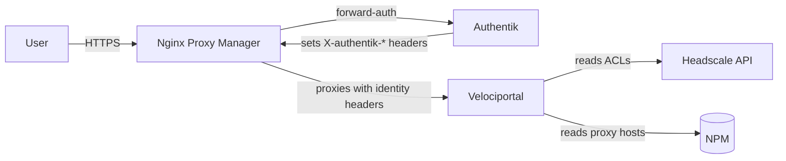

# Authentik Integration

Authentik and Velociportal solve different problems. Authentik is your identity provider (IdP): it authenticates users, enforces MFA, and gates access at the proxy. Velociportal is a visibility layer: it reads your Tailscale/Headscale ACLs and NPM proxy hosts, then renders a per-user dashboard of what each person can actually reach.

!!! note "Velociportal complements your IdP — it does not replace it"
    Velociportal never authenticates users or issues sessions. Keep Authentik in front of your services for auth. Velociportal only *shows* users which services their ACLs grant, driven by identity headers passed down from the proxy or tailnet.

## Division of responsibility

| Concern | Authentik | Velociportal |
|---|---|---|
| Authentication (login, sessions) | Yes | No |
| MFA / passkeys / TOTP | Yes | No |
| Forward-auth for NPM proxy hosts | Yes | No |
| User & group management | Yes | No |
| ACL-driven service visibility | No | Yes |
| Dashboard rendering per user | No | Yes |
| Reading Headscale/NPM state | No | Yes |

Authentik ships its own **application portal** listing apps a user is entitled to. Velociportal adds an orthogonal view: what the *network layer* (Tailscale ACLs) grants, which is often broader or narrower than the Authentik app catalog. Run both — they answer different questions ("what am I logged into?" vs. "what can I route to?").

## How they work together



1. User hits a service behind NPM.
2. NPM's forward-auth calls Authentik's outpost; unauthenticated users get redirected to login + MFA.
3. On success, Authentik injects `X-authentik-username`, `X-authentik-email`, `X-authentik-groups` headers.
4. NPM proxies to Velociportal with those headers.
5. Velociportal maps the identity to a Tailscale/Headscale user and renders only the services their ACLs allow.

!!! tip "Identity header sources"
    Velociportal can read identity from **either** Tailscale Serve headers (`Tailscale-User-Login`, etc.) **or** Authentik forward-auth headers (`X-authentik-*`). Tailscale Serve only works for human users over the tailnet (not tagged devices, not Funnel). Behind NPM + Authentik, use the `X-authentik-*` headers — that path works for any browser client.

## Docker Compose

Add Authentik alongside your existing stack. This is the standard Authentik server + worker + Postgres + Redis, plus Velociportal.

=== "docker-compose.yml"

    ```yaml
    services:
      postgresql:
        image: docker.io/library/postgres:16-alpine
        restart: unless-stopped
        environment:
          POSTGRES_USER: authentik
          POSTGRES_PASSWORD: ${PG_PASS}
          POSTGRES_DB: authentik
        volumes:
          - authentik-db:/var/lib/postgresql/data

      redis:
        image: docker.io/library/redis:7-alpine
        restart: unless-stopped
        volumes:
          - authentik-redis:/data

      authentik-server:
        image: ghcr.io/goauthentik/server:2024.8
        restart: unless-stopped
        command: server
        environment:
          AUTHENTIK_SECRET_KEY: ${AUTHENTIK_SECRET_KEY}
          AUTHENTIK_POSTGRESQL__HOST: postgresql
          AUTHENTIK_POSTGRESQL__USER: authentik
          AUTHENTIK_POSTGRESQL__PASSWORD: ${PG_PASS}
          AUTHENTIK_REDIS__HOST: redis
        ports:
          - "9000:9000"
        depends_on: [postgresql, redis]

      authentik-worker:
        image: ghcr.io/goauthentik/server:2024.8
        restart: unless-stopped
        command: worker
        environment:
          AUTHENTIK_SECRET_KEY: ${AUTHENTIK_SECRET_KEY}
          AUTHENTIK_POSTGRESQL__HOST: postgresql
          AUTHENTIK_POSTGRESQL__USER: authentik
          AUTHENTIK_POSTGRESQL__PASSWORD: ${PG_PASS}
          AUTHENTIK_REDIS__HOST: redis
        depends_on: [postgresql, redis]

      velociportal:
        image: ghcr.io/example/velociportal:latest
        restart: unless-stopped
        environment:
          VP_HEADSCALE_URL: https://headscale.example.com
          VP_HEADSCALE_API_KEY: ${HEADSCALE_API_KEY}
          VP_NPM_URL: https://npm.example.com
          VP_NPM_EMAIL: ${NPM_EMAIL}
          VP_NPM_PASSWORD: ${NPM_PASSWORD}
          # Trust identity from Authentik forward-auth instead of Tailscale Serve
          VP_IDENTITY_HEADER: X-authentik-username
          VP_GROUPS_HEADER: X-authentik-groups
        ports:
          - "8080:8080"

    volumes:
      authentik-db:
      authentik-redis:
    ```

=== ".env"

    ```bash
    PG_PASS=change-me
    AUTHENTIK_SECRET_KEY=$(openssl rand -base64 60)
    HEADSCALE_API_KEY=your-headscale-bearer-key
    NPM_EMAIL=admin@example.com
    NPM_PASSWORD=change-me
    ```

!!! warning "NPM auth is credential-based"
    NPM has no scoped read-only API token. Velociportal authenticates by POSTing your admin email/password to `/api/tokens` to get a JWT. Use a dedicated NPM account with a strong password and treat these credentials as secrets.

## NPM forward-auth for Authentik

In Authentik, create a **Proxy Provider** (forward-auth, single application) and attach an **Embedded Outpost**. Then wire NPM to it.

For each proxy host in NPM, add an **Advanced** config snippet:

```nginx
location /outpost.goauthentik.io {
    proxy_pass http://authentik-server:9000/outpost.goauthentik.io;
    proxy_set_header Host $host;
    proxy_set_header X-Forwarded-For $proxy_add_x_forwarded_for;
    proxy_set_header X-Forwarded-Host $host;
    proxy_set_header X-Forwarded-Proto $scheme;
    add_header Set-Cookie $auth_cookie;
    auth_request_set $auth_cookie $upstream_http_set_cookie;
}

location / {
    auth_request /outpost.goauthentik.io/auth/nginx;
    error_page 401 = @goauthentik_proxy_signin;
    auth_request_set $authentik_username $upstream_http_x_authentik_username;
    auth_request_set $authentik_groups   $upstream_http_x_authentik_groups;
    proxy_set_header X-authentik-username $authentik_username;
    proxy_set_header X-authentik-groups   $authentik_groups;

    proxy_pass http://velociportal:8080;
}

location @goauthentik_proxy_signin {
    internal;
    add_header Set-Cookie $auth_cookie;
    return 302 /outpost.goauthentik.io/start?rd=$request_uri;
}
```

!!! tip "Protect the dashboard too"
    Put Velociportal itself behind the same forward-auth. That is how it receives the `X-authentik-*` identity headers it needs to render the right view.

## Syncing Authentik groups with Tailscale ACL groups

Velociportal keys visibility off Tailscale/Headscale ACL **groups** (huJSON `groups`, `tagOwners`, `acls`, `grants`). To keep Authentik and your tailnet aligned, mirror group names between the two so a user's Authentik membership predicts their ACL access.

=== "Headscale ACL (huJSON)"

    ```json
    {
      "groups": {
        "group:engineering": ["alice@example.com", "bob@example.com"],
        "group:ops": ["carol@example.com"]
      },
      "acls": [
        {
          "action": "accept",
          "src": ["group:engineering"],
          "dst": ["tag:internal-tools:443"]
        }
      ]
    }
    ```

=== "Matching Authentik groups"

    ```
    engineering  -> members: alice, bob
    ops          -> members: carol
    ```

Two ways to keep them in sync:

- **Manual mirror (simplest):** name Authentik groups to match ACL group names (`engineering`, `ops`). Velociportal reads the `X-authentik-groups` header and filters services against the matching `group:*` entries. No writes to Headscale needed.
- **Scripted push (optional):** a small cron job reads Authentik group membership via its API and rewrites the Headscale ACL `groups` block via the Headscale REST API (`/api/v1`, Bearer key). Authentik stays the source of truth for membership; Headscale gets regenerated ACLs.

!!! note "Velociportal does not write ACLs by default"
    Out of the box Velociportal is read-only — it reads Headscale ACLs and NPM hosts, nothing more. Group sync is an optional external script you own, not a built-in feature. This keeps Velociportal a single, minimal container.

## Summary

- Authentik: authentication, MFA, forward-auth, user/group source of truth.
- Velociportal: ACL-driven, per-user view of reachable services on top of your existing auth.
- Wire NPM forward-auth to Authentik; pass `X-authentik-*` headers down to Velociportal.
- Mirror group names so Authentik membership and Tailscale ACL access stay consistent.