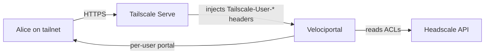

# No IdP / Tailscale Only

The simplest Velociportal deployment: no identity provider, no OAuth, no extra login. Velociportal reads the identity headers that Tailscale Serve already injects and renders a per-user portal from them.

!!! note "Velociportal complements IdPs, it does not replace them"
    This mode uses Tailscale's identity as the only signal. It gives you a visibility layer, not authentication for your backend services. When you outgrow it, add an IdP (see [When to add an IdP](#when-to-add-an-idp)) — Velociportal keeps working alongside it.

## How it works

When a human on your tailnet reaches a service through `tailscale serve`, Tailscale terminates the connection and injects identity headers on the proxied request:

| Header | Example value |
| --- | --- |
| `Tailscale-User-Login` | `alice@example.com` |
| `Tailscale-User-Name` | `Alice Example` |
| `Tailscale-User-Profile-Pic` | `https://.../alice.jpg` |

Velociportal reads these headers, cross-references the user against your Headscale/Tailscale ACLs, and renders only the services that user is allowed to see.



## Limitations

!!! warning "Know what you are giving up"
    - **No SSO.** Velociportal does not authenticate you to the services it links to. Each backend still enforces its own auth.
    - **No MFA beyond Tailscale.** Your only second factor is whatever protects the tailnet itself (device auth, Tailscale SSO).
    - **Humans only.** Identity headers are injected for human users over tailnet Serve. They are **not** present for tagged devices, and **not** present over Funnel.
    - **Tailnet-bound.** If a request does not arrive through Tailscale Serve, there is no trustworthy identity.

## When this is enough

- Small homelab or team where **everyone is already on Tailscale**.
- You want a clean, per-user index of your services, not a security gateway.
- Your backend services either enforce their own auth or are low-sensitivity.

## When to add an IdP

Add an identity provider (Authelia, Authentik, Keycloak, etc.) when you need:

- Real SSO across services, not just a dashboard.
- MFA policies, session management, or per-app authorization.
- Access for users or devices that are **not** on the tailnet.

Velociportal continues to read Tailscale identity in front of the IdP — it does not conflict with one.

## Minimal Docker Compose

=== "docker-compose.yml"

    ```yaml
    services:
      velociportal:
        image: velociportal:latest
        container_name: velociportal
        restart: unless-stopped
        environment:
          # Trust identity headers ONLY because we sit behind Tailscale Serve
          VP_IDENTITY_MODE: "tailscale-headers"
          VP_HEADSCALE_URL: "https://headscale.example.com"
          VP_HEADSCALE_API_KEY: "${HEADSCALE_API_KEY}"
        ports:
          - "127.0.0.1:8080:8080"   # bind to loopback; Serve fronts it
    ```

=== ".env"

    ```bash
    HEADSCALE_API_KEY=hskey-api-xxxxxxxxxxxxxxxxxxxx
    ```

Then point Tailscale Serve at the container:

```bash
tailscale serve --bg --https=443 http://127.0.0.1:8080
```

Now `https://<machine>.<tailnet>.ts.net` serves Velociportal with identity headers attached.

## Security

!!! danger "Identity headers are trustworthy ONLY through Tailscale Serve"
    `Tailscale-User-*` headers are just HTTP headers. Anything that can reach Velociportal directly can forge them.

    - **Bind Velociportal to loopback** (`127.0.0.1:8080`), never `0.0.0.0`, so only Tailscale Serve on the same host can reach it.
    - **Do not expose the container port** on your LAN or the internet.
    - **Never use Funnel** for this mode — Funnel does not inject identity headers, so any public visitor would arrive header-less (or with forged ones).
    - Treat a request that arrives **without** these headers as anonymous, not as an error to work around.

!!! tip "Verify the wiring"
    Confirm the port is loopback-only:

    ```bash
    ss -tlnp | grep 8080
    # expect 127.0.0.1:8080, not 0.0.0.0:8080
    ```