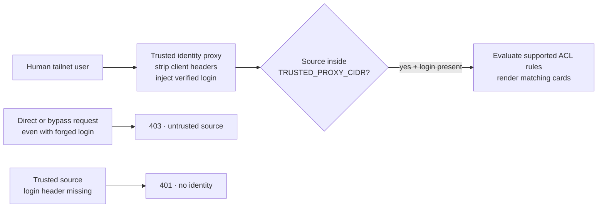

# Tailscale identity headers

Velociportal uses a small, fixed header contract to identify a human viewer. A header is accepted only when the TCP source address is inside `TRUSTED_PROXY_CIDR`.

Trusted source + login: evaluated
Untrusted source: 403
Trusted source without login: 401

## Supported headers

| Header | Required | Purpose |
|---|---:|---|
| `Tailscale-User-Login` | Yes | Stable login used for policy and group matching |
| `Tailscale-User-Name` | No | Display name |
| `Tailscale-User-Profile-Pic` | No | Optional profile URL; accepted but not currently rendered |

The runtime does not accept `X-Webauth-*`, `Remote-User`, or IdP-specific identity headers.

## Trusted route versus rejected bypass

Outcomes are written in each node and edge. Red or green styling is not the only way to distinguish accepted and rejected requests.

!!! danger "The proxy path is the security boundary"
    If a client can bypass the trusted proxy and connect to Velociportal directly, it can attempt to forge `Tailscale-User-Login`. Keep the host publication loopback-only or behind an equivalent private network boundary, and use the narrowest trusted source CIDR.

## What Tailscale Serve guarantees

Tailscale documents that Serve removes incoming client-supplied versions of the `Tailscale-User-*` headers before adding values derived from the tailnet identity. It does not populate them for tagged devices or Funnel traffic. Tailscale also recommends binding the backend to localhost to prevent bypass.

Source: [Tailscale Serve documentation](https://tailscale.com/docs/features/tailscale-serve).

## What Velociportal additionally checks

A correctly named header is still rejected unless the request source is inside `TRUSTED_PROXY_CIDR`.

Determine the source from the actual deployment path:

- Host Serve to a host-native process commonly appears as `127.0.0.1`.
- Host Serve reaching a loopback-published **bridged container** commonly appears inside that container as the Docker bridge gateway, not `127.0.0.1`.
- A proxy container may appear as its container IP or bridge gateway.
- Host networking and chained proxies can change the observed source.

Use the exact `/32` where practical. If a subnet is necessary, use the smallest subnet that contains only trusted proxy instances.

The [guided setup](../getting-started/setup.md) puts `make observe-proxy` before preflight and startup so the operator must make this trust decision explicitly.

## Headscale HTTPS Serve limitation

Tailscale's automatic HTTPS Serve uses its `*.ts.net` DNS and certificate-provisioning flow. Headscale tracks HTTPS Serve support as an open feature gap: [headscale#1921](https://github.com/juanfont/headscale/issues/1921). TLS on the Headscale control-server URL is a separate concern and does not provide per-node Serve certificates.

Safe documented alternatives are:

1. Tailnet-only HTTP Serve, with the browser origin remaining HTTP while the tailnet transport stays WireGuard-encrypted.
2. An identity-aware HTTPS proxy you operate, which derives the caller from a trusted Tailscale identity source, strips client headers, and injects only the supported contract.

See the [TrueNAS deployment guide](../guides/truenas-scale.md#identity-publication) for the operational commands and limitations.
