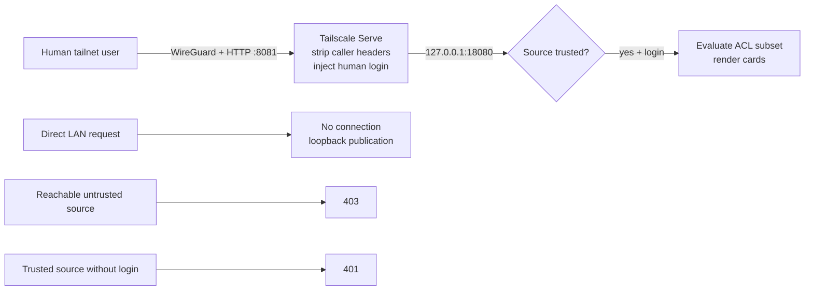

# Tailscale identity headers

Velociportal uses a fixed header contract for a human viewer. A header is accepted only when the immediate TCP source is inside `TRUSTED_PROXY_CIDR`.

<div class="vp-chip-row" aria-label="Identity request outcomes">
<span class="vp-chip vp-chip--supported">Trusted source + login: evaluated</span>
<span class="vp-chip vp-chip--security">Untrusted source: 403</span>
<span class="vp-chip vp-chip--validation">Trusted source without login: 401</span>
</div>

## Supported headers

| Header | Required | Purpose |
|---|---:|---|
| `Tailscale-User-Login` | Yes | Stable login used for policy/group matching |
| `Tailscale-User-Name` | No | Display name |
| `Tailscale-User-Profile-Pic` | No | Optional profile URL; not currently rendered |

The runtime does not accept `X-Webauth-*`, `Remote-User`, Authentik, Authelia, or other IdP-specific identity headers.

## Canonical browser route

The existing TrueNAS Tailscale app is the identity-aware publisher:

1. Headscale policy allows intended humans to reach the TrueNAS Tailscale IP on TCP `8081`.
2. The Tailscale app uses host networking.
3. A read-only `serve.json` is mounted and loaded through `TS_SERVE_CONFIG`.
4. Serve listens on tailnet HTTP port `8081`.
5. Serve proxies to `http://127.0.0.1:18080`.
6. Docker Engine 28+ keeps the Velociportal host publication loopback-only.
7. Velociportal accepts the injected login only from the exact configured immediate source.



The browser origin is intentionally HTTP, but client-to-NAS transport remains inside WireGuard. This prevents ordinary on-path LAN/router/ISP interception. It does not protect against compromised clients, TrueNAS, NPM, Tailscale/Headscale control components, or trusted host workloads.

NPM is not part of this browser identity path. It cannot derive the caller's human Tailscale identity.

## What Tailscale Serve must provide

Tailscale documents that Serve removes incoming caller-supplied `Tailscale-User-*` headers before adding values derived from tailnet identity. It does not populate human identity for tagged devices or Funnel traffic.

Source: [Tailscale Serve documentation](https://tailscale.com/docs/features/tailscale-serve).

This behavior still requires real acceptance under Headscale. Fixtures cannot prove that the TrueNAS app loaded the declarative configuration, replaced caller headers, or retained the route after restarts.

## Source trust remains mandatory

A correctly named header is rejected unless the immediate peer is inside `TRUSTED_PROXY_CIDR`.

The production bundle defaults to:

```text
subnet: 172.31.255.0/24
gateway: 172.31.255.1
TRUSTED_PROXY_CIDR: 172.31.255.1/32
```

If the subnet conflicts, change subnet, gateway, and trusted CIDR together and verify the actual source. Do not trust a whole Docker, LAN, or tailnet range as a troubleshooting shortcut.

The host-loopback topology has a residual boundary: another trusted host process or host-network container that can reach loopback may appear from the same Docker-gateway source. Keep the host and its local workloads trusted.

## Separate Headscale control and runtime paths

Identity transport must not be confused with Headscale control transport:

- Brand-new clients and workstation-only `headscale-ops` use the trusted NPM HTTPS Headscale endpoint.
- Existing NPM proxies to Headscale over `velociportal-upstreams` and can observe operator Bearer API keys.
- Runtime Velociportal bypasses NPM and reads Headscale directly through `http://headscale.velociportal.internal:8080`.
- NPM provides neither portal identity nor card authorization.

## HTTPS Serve status

Official Tailscale can automate `*.ts.net` certificates. Headscale automatic HTTPS Serve remains upstream work tracked by [issue #2527](https://github.com/juanfont/headscale/issues/2527) and [PR #3300](https://github.com/juanfont/headscale/pull/3300).

The approved path is tailnet-only HTTP Serve over WireGuard. It is not a release blocker. A future upstream implementation may permit native HTTPS Serve, but it does not change Velociportal's trusted-source and header-replacement requirements.

## Required acceptance

- Two real human identities receive intentionally different card sets.
- A caller-supplied `Tailscale-User-Login` is stripped or replaced.
- The raw Velociportal port is unreachable through the LAN address.
- A deliberately reachable untrusted source receives `403`.
- A trusted source without a login receives `401`.
- Serve returns after restarting Velociportal, Tailscale, NPM, Headscale, and TrueNAS.

No public support claim is warranted until these checks and the full [validation worksheet](../getting-started/validation.md) pass.
